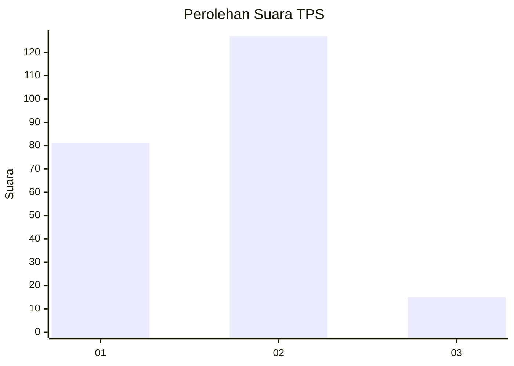
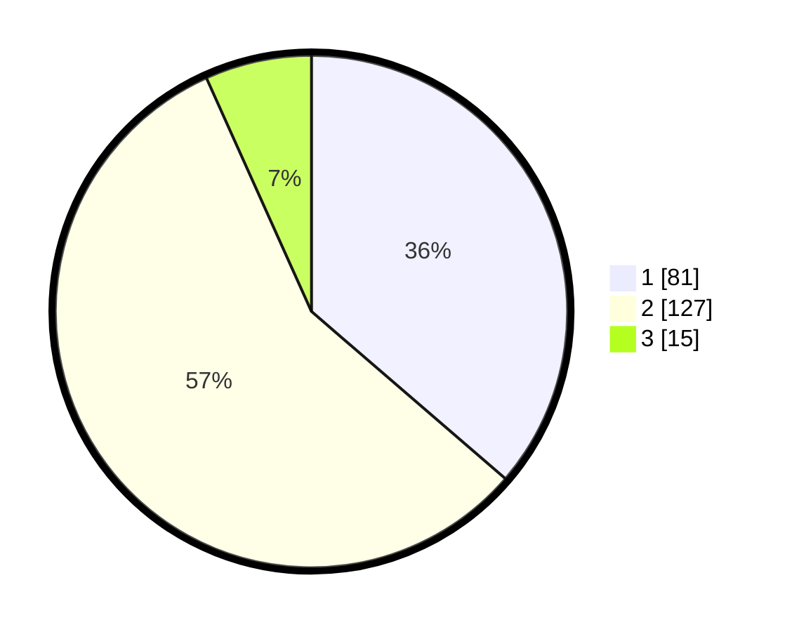

# Hasil

## Grafik

## Tabel

| No. | Nama Paslon    | Suara | Suara (raw) | Persentase |
|:--- |:-------------- | -----:| -----------:| ----------:|
| 1   | ANIES MUHAIMIN | 81    | [81][p-1]   | 36,32      |
| 2   | PRABOWO GIBRAN | 127   | [127][p-2]  | 56,95      |
| 3   | GANJAR MAHFUD  | 15    | [15][p-3]   | 6,73       |

[p-1]: https://github.com/gigit-pemilu/pemilu-2024-21-kepulauan-riau/blob/main/pilpres/hitung-suara/sub/21-kepulauan-riau/sub/01-bintan/sub/04-gunung-kijang/sub/1005-kawal/sub/001-tps/sub/paslon-1.txt
[p-2]: https://github.com/gigit-pemilu/pemilu-2024-21-kepulauan-riau/blob/main/pilpres/hitung-suara/sub/21-kepulauan-riau/sub/01-bintan/sub/04-gunung-kijang/sub/1005-kawal/sub/001-tps/sub/paslon-2.txt
[p-3]: https://github.com/gigit-pemilu/pemilu-2024-21-kepulauan-riau/blob/main/pilpres/hitung-suara/sub/21-kepulauan-riau/sub/01-bintan/sub/04-gunung-kijang/sub/1005-kawal/sub/001-tps/sub/paslon-3.txt

## Foto C Plano

https://sirekap-obj-formc.kpu.go.id/ce57/pemilu/ppwp/21/01/04/10/05/2101041005001-20240215-204254--baa1222c-fe78-43bc-971d-01e21b01f3ed.jpg

https://sirekap-obj-formc.kpu.go.id/ce57/pemilu/ppwp/21/01/04/10/05/2101041005001-20240215-204255--ff4963f1-df60-4205-8d1e-e1b132009575.jpg

https://sirekap-obj-formc.kpu.go.id/ce57/pemilu/ppwp/21/01/04/10/05/2101041005001-20240215-204254--f85eb74b-954c-4c32-93ed-06782139b781.jpg

## Metadata

| Key        | Value               |
| ---------- | ------------------- |
| Time Stamp | 2024-02-15 21:01:18 |

## DATA PEMILIH TETAP

Jumlah pemilih dalam DPT: **270**.
 * L: **139**.
 * P: **131**.

## DATA PENGGUNA HAK PILIH

Jumlah pengguna hak pilih dalam DPT: **219**.
 * L: **113**.
 * P: **106**.

Jumlah pengguna hak pilih dalam DPTb: **5**.
 * L: **3**.
 * P: **2**.

Jumlah pengguna hak pilih dalam DPK: **3**.
 * L: **1**.
 * P: **2**.

Jumlah pengguna hak pilih: **227**.
 * L: **117**.
 * P: **110**.

## JUMLAH SUARA SAH DAN TIDAK SAH

JUMLAH SELURUH SUARA SAH: **223**.

JUMLAH SUARA TIDAK SAH: **4**.

JUMLAH SELURUH SUARA SAH DAN SUARA TIDAK SAH: **227**.

