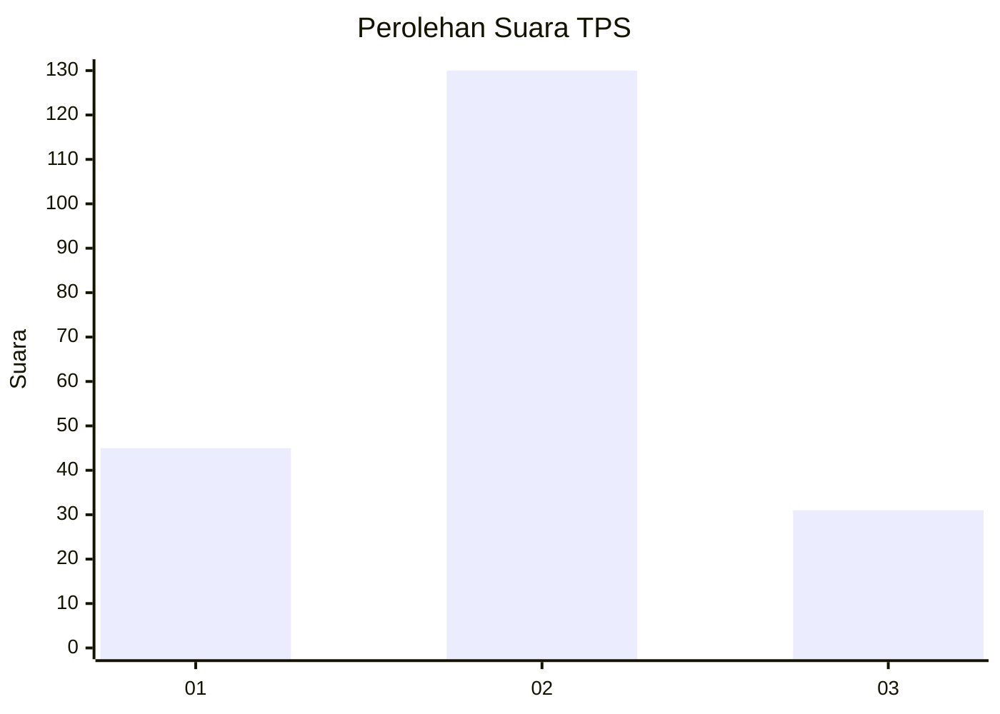
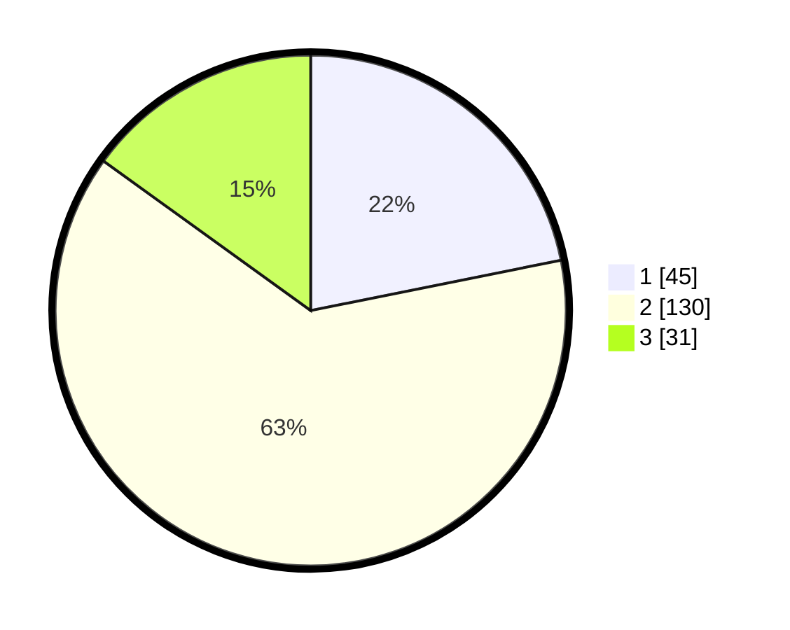

# Hasil

## Grafik

## Tabel

| No. | Nama Paslon    | Suara | Suara (raw) | Persentase |
|:--- |:-------------- | -----:| -----------:| ----------:|
| 1   | ANIES MUHAIMIN | 45    | [45][p-1]   | 21,84      |
| 2   | PRABOWO GIBRAN | 130   | [130][p-2]  | 63,11      |
| 3   | GANJAR MAHFUD  | 31    | [31][p-3]   | 15,05      |

[p-1]: https://github.com/gigit-pemilu/pemilu-2024-21-kepulauan-riau/blob/main/pilpres/hitung-suara/sub/21-kepulauan-riau/sub/01-bintan/sub/04-gunung-kijang/sub/1005-kawal/sub/002-tps/sub/paslon-1.txt
[p-2]: https://github.com/gigit-pemilu/pemilu-2024-21-kepulauan-riau/blob/main/pilpres/hitung-suara/sub/21-kepulauan-riau/sub/01-bintan/sub/04-gunung-kijang/sub/1005-kawal/sub/002-tps/sub/paslon-2.txt
[p-3]: https://github.com/gigit-pemilu/pemilu-2024-21-kepulauan-riau/blob/main/pilpres/hitung-suara/sub/21-kepulauan-riau/sub/01-bintan/sub/04-gunung-kijang/sub/1005-kawal/sub/002-tps/sub/paslon-3.txt

## Foto C Plano

https://sirekap-obj-formc.kpu.go.id/8d9f/pemilu/ppwp/21/01/04/10/05/2101041005002-20240220-112133--d5718569-a505-4be6-aafa-abc34359f3bc.jpg

https://sirekap-obj-formc.kpu.go.id/8d9f/pemilu/ppwp/21/01/04/10/05/2101041005002-20240220-112135--8ef7620d-2683-4a79-82bc-376389383d7a.jpg

https://sirekap-obj-formc.kpu.go.id/8d9f/pemilu/ppwp/21/01/04/10/05/2101041005002-20240220-112134--cc36769e-728a-4ef0-b7bf-a8d052f9ce3b.jpg

## Metadata

| Key        | Value               |
| ---------- | ------------------- |
| Time Stamp | 2024-02-20 12:00:00 |

## DATA PEMILIH TETAP

Jumlah pemilih dalam DPT: **259**.
 * L: **134**.
 * P: **125**.

## DATA PENGGUNA HAK PILIH

Jumlah pengguna hak pilih dalam DPT: **200**.
 * L: **97**.
 * P: **103**.

Jumlah pengguna hak pilih dalam DPTb: **7**.
 * L: **3**.
 * P: **4**.

Jumlah pengguna hak pilih dalam DPK: **6**.
 * L: **3**.
 * P: **3**.

Jumlah pengguna hak pilih: **213**.
 * L: **103**.
 * P: **110**.

## JUMLAH SUARA SAH DAN TIDAK SAH

JUMLAH SELURUH SUARA SAH: **206**.

JUMLAH SUARA TIDAK SAH: **7**.

JUMLAH SELURUH SUARA SAH DAN SUARA TIDAK SAH: **213**.

