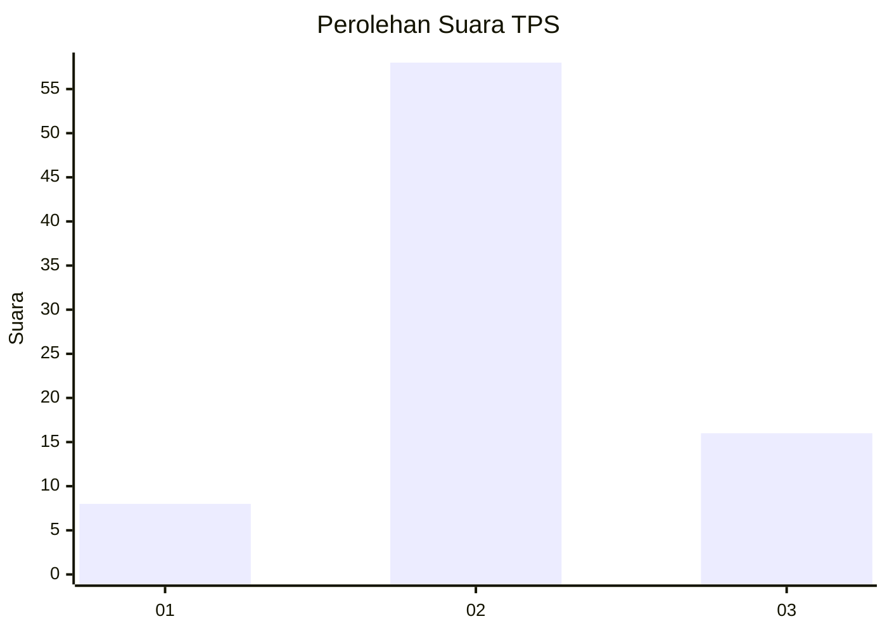
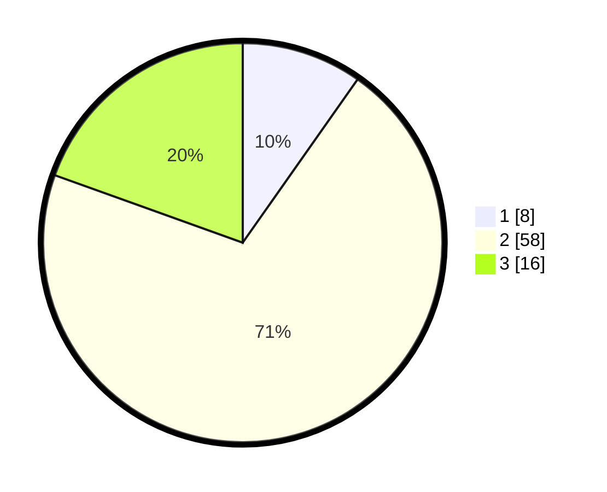

# Hasil

## Grafik

## Tabel

| No. | Nama Paslon    | Suara | Suara (raw) | Persentase |
|:--- |:-------------- | -----:| -----------:| ----------:|
| 1   | ANIES MUHAIMIN | 8     | [8][p-1]    | 9,76       |
| 2   | PRABOWO GIBRAN | 58    | [58][p-2]   | 70,73      |
| 3   | GANJAR MAHFUD  | 16    | [16][p-3]   | 19,51      |

[p-1]: https://github.com/gigit-pemilu/pemilu-2024-21-kepulauan-riau/blob/main/pilpres/hitung-suara/sub/21-kepulauan-riau/sub/01-bintan/sub/04-gunung-kijang/sub/1005-kawal/sub/004-tps/sub/paslon-1.txt
[p-2]: https://github.com/gigit-pemilu/pemilu-2024-21-kepulauan-riau/blob/main/pilpres/hitung-suara/sub/21-kepulauan-riau/sub/01-bintan/sub/04-gunung-kijang/sub/1005-kawal/sub/004-tps/sub/paslon-2.txt
[p-3]: https://github.com/gigit-pemilu/pemilu-2024-21-kepulauan-riau/blob/main/pilpres/hitung-suara/sub/21-kepulauan-riau/sub/01-bintan/sub/04-gunung-kijang/sub/1005-kawal/sub/004-tps/sub/paslon-3.txt

## Foto C Plano

https://sirekap-obj-formc.kpu.go.id/2d63/pemilu/ppwp/21/01/04/10/05/2101041005004-20240220-161544--5b8462ad-76b2-4ae7-a7cd-45b7e5dd0fc6.jpg

https://sirekap-obj-formc.kpu.go.id/2d63/pemilu/ppwp/21/01/04/10/05/2101041005004-20240220-161545--a1a101c5-339f-44dd-af10-b26b5a90aa01.jpg

https://sirekap-obj-formc.kpu.go.id/2d63/pemilu/ppwp/21/01/04/10/05/2101041005004-20240220-161544--acb28ce2-1a97-4f42-8bb0-1dc7eef59218.jpg

## Metadata

| Key        | Value               |
| ---------- | ------------------- |
| Time Stamp | 2024-02-21 15:00:00 |

## DATA PEMILIH TETAP

Jumlah pemilih dalam DPT: **0**.
 * L: **0**.
 * P: **0**.

## DATA PENGGUNA HAK PILIH

Jumlah pengguna hak pilih dalam DPT: **0**.
 * L: **0**.
 * P: **0**.

Jumlah pengguna hak pilih dalam DPTb: **0**.
 * L: **0**.
 * P: **0**.

Jumlah pengguna hak pilih dalam DPK: **0**.
 * L: **0**.
 * P: **0**.

Jumlah pengguna hak pilih: **0**.
 * L: **0**.
 * P: **0**.

## JUMLAH SUARA SAH DAN TIDAK SAH

JUMLAH SELURUH SUARA SAH: **82**.

JUMLAH SUARA TIDAK SAH: **6**.

JUMLAH SELURUH SUARA SAH DAN SUARA TIDAK SAH: **88**.

