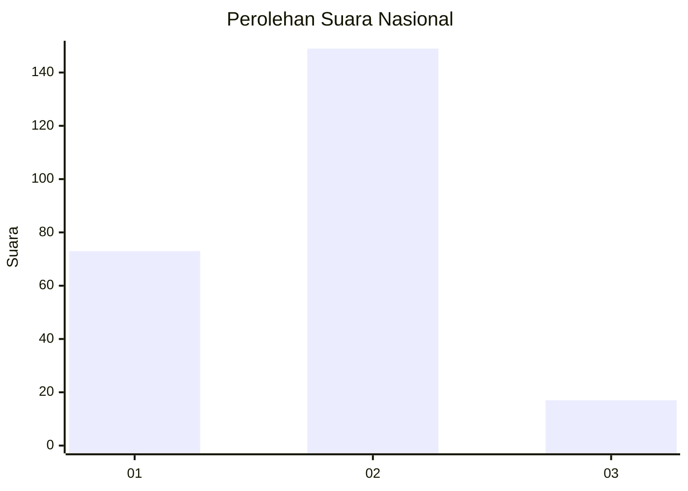
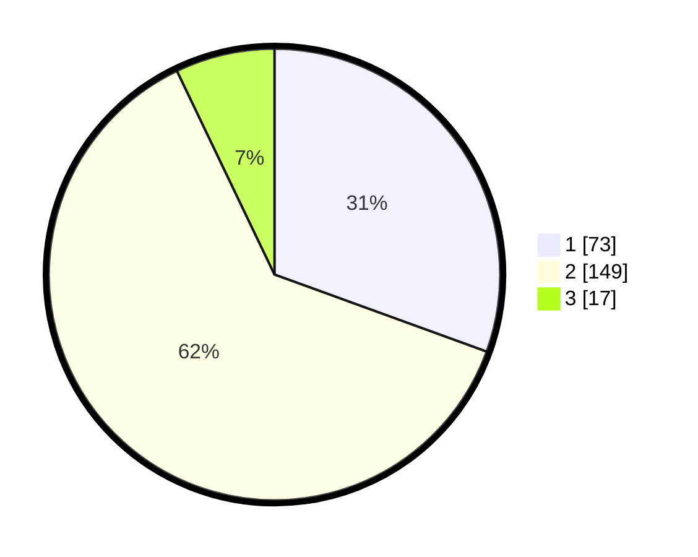

# Hasil

## Grafik

## Tabel

| No. | Nama Paslon    | Suara | Suara (raw) | Persentase |
|:--- |:-------------- | -----:| -----------:| ----------:|
| 1   | ANIES MUHAIMIN | 73    | [73][p-1]   | 30,54      |
| 2   | PRABOWO GIBRAN | 149   | [149][p-2]  | 62,34      |
| 3   | GANJAR MAHFUD  | 17    | [17][p-3]   | 7,11       |

[p-1]: https://github.com/gigit-pemilu/pemilu-2024/blob/main/pilpres/hitung-suara/sub/21-kepulauan-riau/sub/01-bintan/sub/06-bintan-timur/sub/1008-kijang-kota/sub/005-tps/sub/paslon-1.txt
[p-2]: https://github.com/gigit-pemilu/pemilu-2024/blob/main/pilpres/hitung-suara/sub/21-kepulauan-riau/sub/01-bintan/sub/06-bintan-timur/sub/1008-kijang-kota/sub/005-tps/sub/paslon-2.txt
[p-3]: https://github.com/gigit-pemilu/pemilu-2024/blob/main/pilpres/hitung-suara/sub/21-kepulauan-riau/sub/01-bintan/sub/06-bintan-timur/sub/1008-kijang-kota/sub/005-tps/sub/paslon-3.txt

## Foto C Plano

https://sirekap-obj-formc.kpu.go.id/1410/pemilu/ppwp/21/01/06/10/08/2101061008005-20240214-214550--38a9dcaf-0e20-4f44-acb0-cb43a0a3e54f.jpg

https://sirekap-obj-formc.kpu.go.id/1410/pemilu/ppwp/21/01/06/10/08/2101061008005-20240214-214802--501f2c13-8a4a-4d62-92a2-b1ca52c3d8f4.jpg

https://sirekap-obj-formc.kpu.go.id/1410/pemilu/ppwp/21/01/06/10/08/2101061008005-20240214-214904--28275fc5-36cb-4af4-a48d-e223f4303ac5.jpg

## Metadata

| Key        | Value               |
| ---------- | ------------------- |
| Time Stamp | 2024-02-15 15:00:29 |

