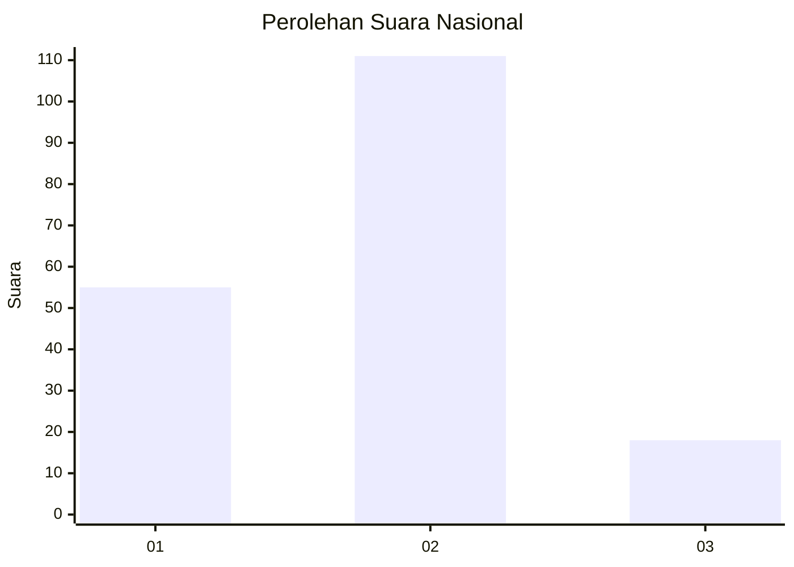
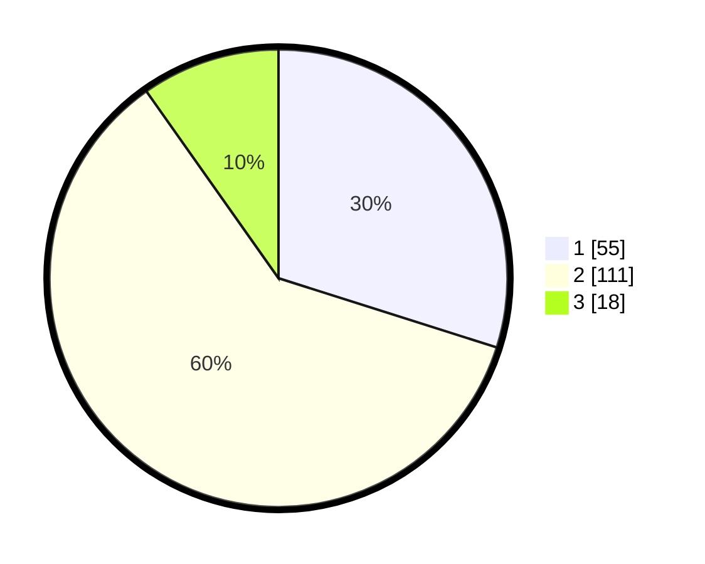

# Hasil

## Grafik

## Tabel

| No. | Nama Paslon    | Suara | Suara (raw) | Persentase |
|:--- |:-------------- | -----:| -----------:| ----------:|
| 1   | ANIES MUHAIMIN | 55    | [55][p-1]   | 29,89      |
| 2   | PRABOWO GIBRAN | 111   | [111][p-2]  | 60,33      |
| 3   | GANJAR MAHFUD  | 18    | [18][p-3]   | 9,78       |

[p-1]: https://github.com/gigit-pemilu/pemilu-2024/blob/main/pilpres/hitung-suara/sub/21-kepulauan-riau/sub/01-bintan/sub/06-bintan-timur/sub/1011-sungai-enam/sub/002-tps/sub/paslon-1.txt
[p-2]: https://github.com/gigit-pemilu/pemilu-2024/blob/main/pilpres/hitung-suara/sub/21-kepulauan-riau/sub/01-bintan/sub/06-bintan-timur/sub/1011-sungai-enam/sub/002-tps/sub/paslon-2.txt
[p-3]: https://github.com/gigit-pemilu/pemilu-2024/blob/main/pilpres/hitung-suara/sub/21-kepulauan-riau/sub/01-bintan/sub/06-bintan-timur/sub/1011-sungai-enam/sub/002-tps/sub/paslon-3.txt

## Foto C Plano

https://sirekap-obj-formc.kpu.go.id/b7ea/pemilu/ppwp/21/01/06/10/11/2101061011002-20240215-042133--b04641c0-221e-40ed-8aa6-13f497f567df.jpg

https://sirekap-obj-formc.kpu.go.id/b7ea/pemilu/ppwp/21/01/06/10/11/2101061011002-20240214-214430--64799d78-0b47-4fc8-8d33-a6e6c93c362e.jpg

https://sirekap-obj-formc.kpu.go.id/b7ea/pemilu/ppwp/21/01/06/10/11/2101061011002-20240214-214548--45bc390a-d7c8-4ae9-a414-8e639ee0e444.jpg

## Metadata

| Key        | Value               |
| ---------- | ------------------- |
| Time Stamp | 2024-02-15 15:00:29 |

