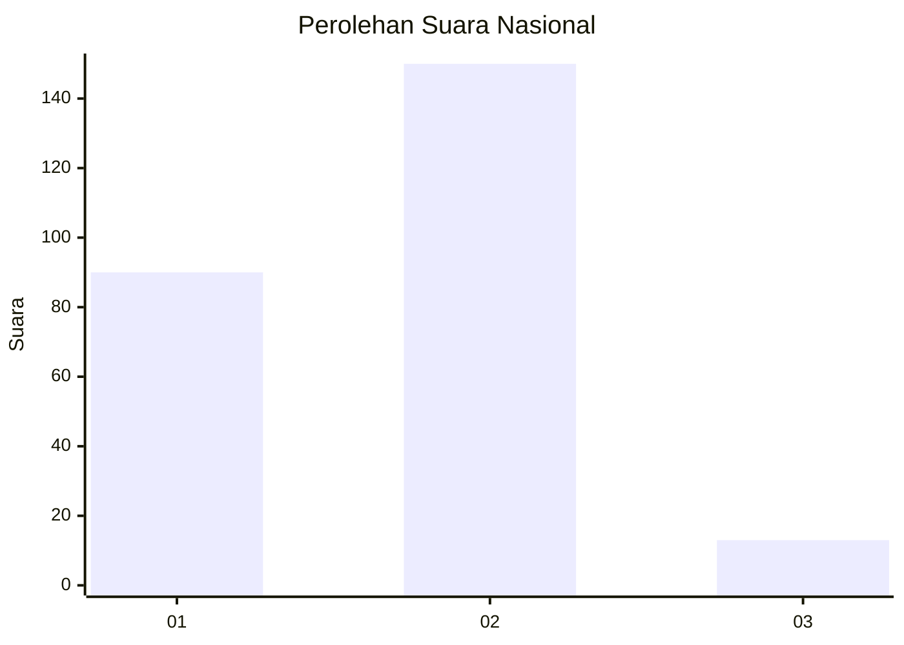
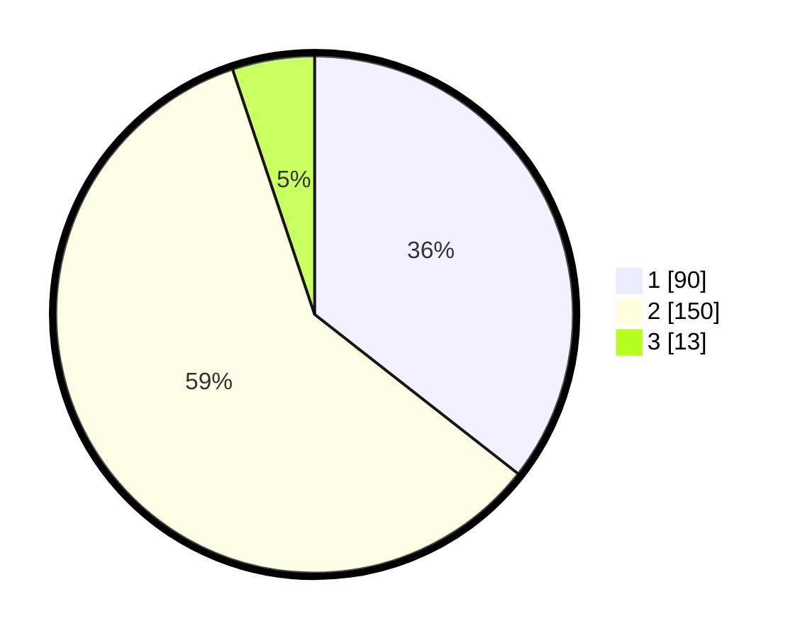

# Hasil

## Grafik

## Tabel

| No. | Nama Paslon    | Suara | Suara (raw) | Persentase |
|:--- |:-------------- | -----:| -----------:| ----------:|
| 1   | ANIES MUHAIMIN | 90    | [90][p-1]   | 35,57      |
| 2   | PRABOWO GIBRAN | 150   | [150][p-2]  | 59,29      |
| 3   | GANJAR MAHFUD  | 13    | [13][p-3]   | 5,14       |

[p-1]: https://github.com/gigit-pemilu/pemilu-2024/blob/main/pilpres/hitung-suara/sub/21-kepulauan-riau/sub/01-bintan/sub/08-teluk-bintan/sub/1006-tembeling-tanjung/sub/001-tps/sub/paslon-1.txt
[p-2]: https://github.com/gigit-pemilu/pemilu-2024/blob/main/pilpres/hitung-suara/sub/21-kepulauan-riau/sub/01-bintan/sub/08-teluk-bintan/sub/1006-tembeling-tanjung/sub/001-tps/sub/paslon-2.txt
[p-3]: https://github.com/gigit-pemilu/pemilu-2024/blob/main/pilpres/hitung-suara/sub/21-kepulauan-riau/sub/01-bintan/sub/08-teluk-bintan/sub/1006-tembeling-tanjung/sub/001-tps/sub/paslon-3.txt

## Foto C Plano

https://sirekap-obj-formc.kpu.go.id/7161/pemilu/ppwp/21/01/08/10/06/2101081006001-20240215-013726--f6d21431-5c95-4c65-bdb4-38e8ff453647.jpg

https://sirekap-obj-formc.kpu.go.id/7161/pemilu/ppwp/21/01/08/10/06/2101081006001-20240215-020759--c6424d7a-a27b-451d-ae9e-61a8a8205735.jpg

https://sirekap-obj-formc.kpu.go.id/7161/pemilu/ppwp/21/01/08/10/06/2101081006001-20240215-020953--b4b61bf6-a851-4129-b8e8-cdca88441139.jpg

## Metadata

| Key        | Value               |
| ---------- | ------------------- |
| Time Stamp | 2024-02-15 15:00:29 |

