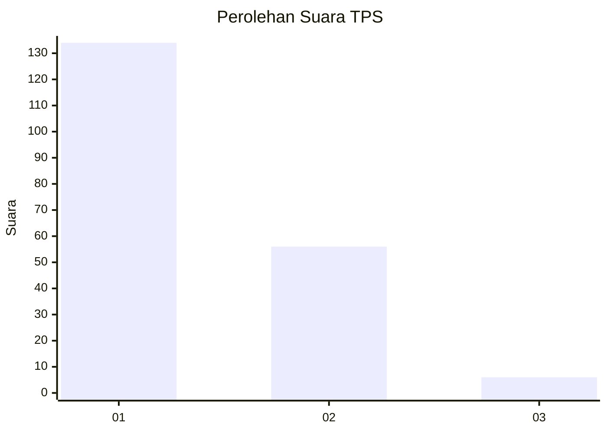
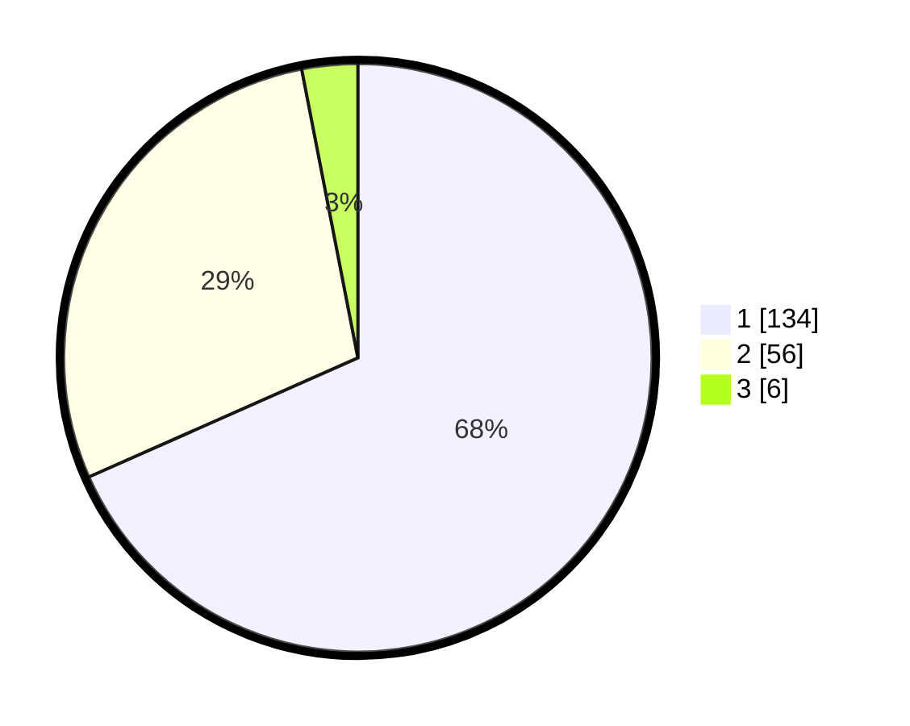

# Hasil

## Grafik

## Tabel

| No. | Nama Paslon    | Suara | Suara (raw) | Persentase |
|:--- |:-------------- | -----:| -----------:| ----------:|
| 1   | ANIES MUHAIMIN | 134   | [134][p-1]  | 68,37      |
| 2   | PRABOWO GIBRAN | 56    | [56][p-2]   | 28,57      |
| 3   | GANJAR MAHFUD  | 6     | [6][p-3]    | 3,06       |

[p-1]: https://github.com/gigit-pemilu/pemilu-2024-21-kepulauan-riau/blob/main/pilpres/hitung-suara/sub/21-kepulauan-riau/sub/01-bintan/sub/08-teluk-bintan/sub/2002-pangkil/sub/001-tps/sub/paslon-1.txt
[p-2]: https://github.com/gigit-pemilu/pemilu-2024-21-kepulauan-riau/blob/main/pilpres/hitung-suara/sub/21-kepulauan-riau/sub/01-bintan/sub/08-teluk-bintan/sub/2002-pangkil/sub/001-tps/sub/paslon-2.txt
[p-3]: https://github.com/gigit-pemilu/pemilu-2024-21-kepulauan-riau/blob/main/pilpres/hitung-suara/sub/21-kepulauan-riau/sub/01-bintan/sub/08-teluk-bintan/sub/2002-pangkil/sub/001-tps/sub/paslon-3.txt

## Foto C Plano

https://sirekap-obj-formc.kpu.go.id/418d/pemilu/ppwp/21/01/08/20/02/2101082002001-20240215-060703--7e8f3300-9953-449a-bf90-3016c0656476.jpg

https://sirekap-obj-formc.kpu.go.id/418d/pemilu/ppwp/21/01/08/20/02/2101082002001-20240215-060729--24f0bb82-ae2b-4a70-a50e-c5da4d198a48.jpg

https://sirekap-obj-formc.kpu.go.id/418d/pemilu/ppwp/21/01/08/20/02/2101082002001-20240215-060745--1fe06ddd-2838-41f5-8ae4-bd0f9bdf07b0.jpg

## Metadata

| Key        | Value               |
| ---------- | ------------------- |
| Time Stamp | 2024-02-16 12:51:22 |

