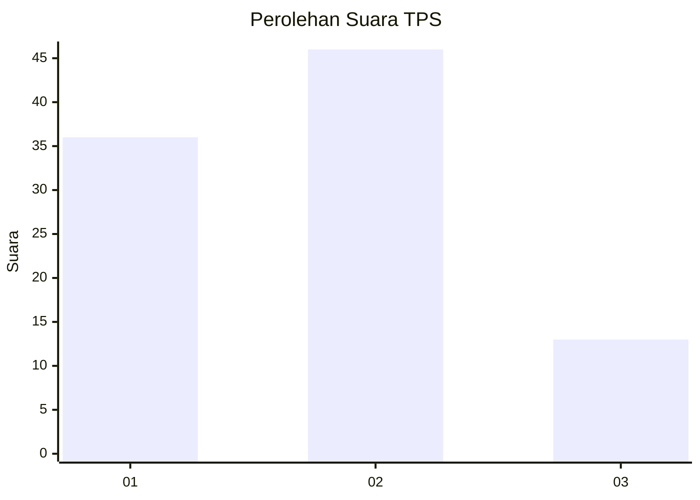
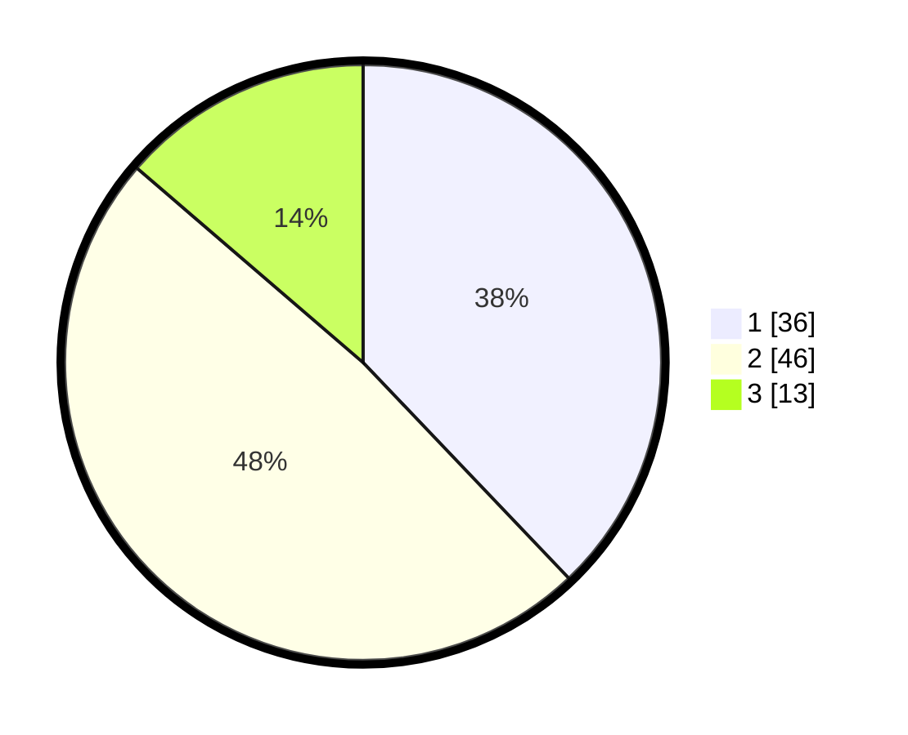

# Hasil

## Grafik

## Tabel

| No. | Nama Paslon    | Suara | Suara (raw) | Persentase |
|:--- |:-------------- | -----:| -----------:| ----------:|
| 1   | ANIES MUHAIMIN | 36    | [36][p-1]   | 37,89      |
| 2   | PRABOWO GIBRAN | 46    | [46][p-2]   | 48,42      |
| 3   | GANJAR MAHFUD  | 13    | [13][p-3]   | 13,68      |

[p-1]: https://github.com/gigit-pemilu/pemilu-2024-21-kepulauan-riau/blob/main/pilpres/hitung-suara/sub/21-kepulauan-riau/sub/01-bintan/sub/09-tambelan/sub/1001-teluk-sekuni/sub/002-tps/sub/paslon-1.txt
[p-2]: https://github.com/gigit-pemilu/pemilu-2024-21-kepulauan-riau/blob/main/pilpres/hitung-suara/sub/21-kepulauan-riau/sub/01-bintan/sub/09-tambelan/sub/1001-teluk-sekuni/sub/002-tps/sub/paslon-2.txt
[p-3]: https://github.com/gigit-pemilu/pemilu-2024-21-kepulauan-riau/blob/main/pilpres/hitung-suara/sub/21-kepulauan-riau/sub/01-bintan/sub/09-tambelan/sub/1001-teluk-sekuni/sub/002-tps/sub/paslon-3.txt

## Foto C Plano

https://sirekap-obj-formc.kpu.go.id/797b/pemilu/ppwp/21/01/09/10/01/2101091001002-20240216-140447--f57edb5b-a4b0-40ab-a72f-6fc891efe26e.jpg

https://sirekap-obj-formc.kpu.go.id/797b/pemilu/ppwp/21/01/09/10/01/2101091001002-20240216-140448--b47b051d-db05-4836-abeb-d3dba1385d27.jpg

https://sirekap-obj-formc.kpu.go.id/797b/pemilu/ppwp/21/01/09/10/01/2101091001002-20240216-140447--73d0fb4c-e0bb-4aac-84d7-0f2fcdb788e3.jpg

## Metadata

| Key        | Value               |
| ---------- | ------------------- |
| Time Stamp | 2024-02-16 16:25:10 |

## DATA PEMILIH TETAP

Jumlah pemilih dalam DPT: **112**.
 * L: **57**.
 * P: **55**.

## DATA PENGGUNA HAK PILIH

Jumlah pengguna hak pilih dalam DPT: **90**.
 * L: **45**.
 * P: **45**.

Jumlah pengguna hak pilih dalam DPTb: **5**.
 * L: **4**.
 * P: **1**.

Jumlah pengguna hak pilih dalam DPK: **1**.
 * L: **1**.
 * P: **0**.

Jumlah pengguna hak pilih: **96**.
 * L: **50**.
 * P: **46**.

## JUMLAH SUARA SAH DAN TIDAK SAH

JUMLAH SELURUH SUARA SAH: **95**.

JUMLAH SUARA TIDAK SAH: **1**.

JUMLAH SELURUH SUARA SAH DAN SUARA TIDAK SAH: **96**.

