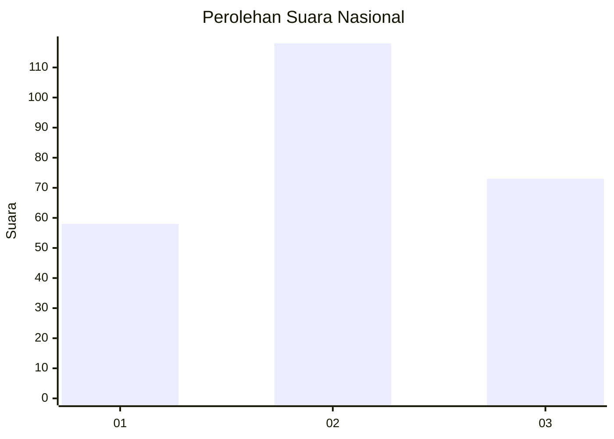
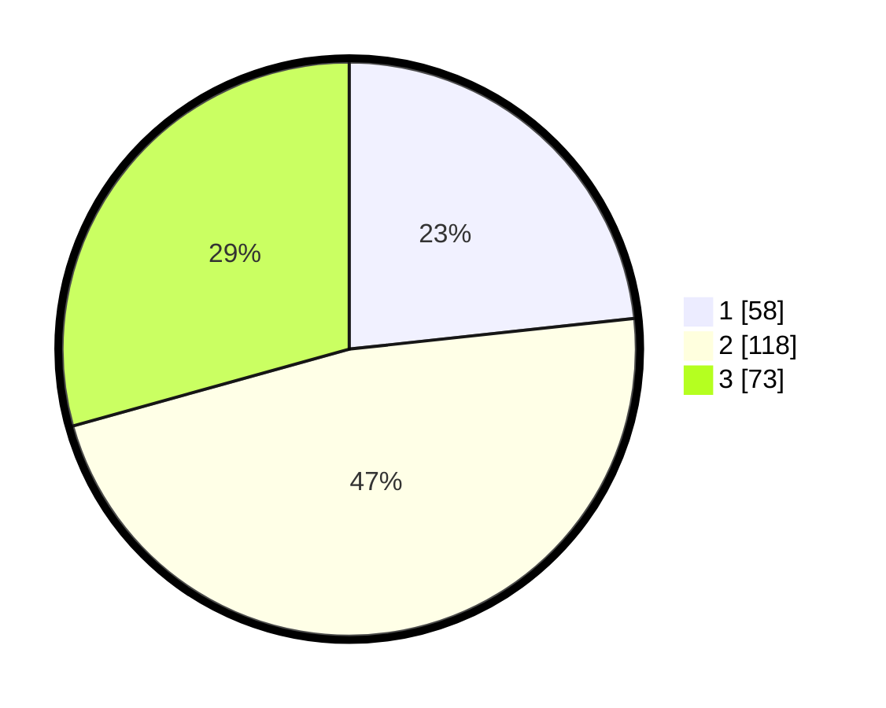

# Hasil

## Grafik

## Tabel

| No. | Nama Paslon    | Suara | Suara (raw) | Persentase |
|:--- |:-------------- | -----:| -----------:| ----------:|
| 1   | ANIES MUHAIMIN | 58    | [58][p-1]   | 23,29      |
| 2   | PRABOWO GIBRAN | 118   | [118][p-2]  | 47,39      |
| 3   | GANJAR MAHFUD  | 73    | [73][p-3]   | 29,32      |

[p-1]: https://github.com/gigit-pemilu/pemilu-2024/blob/main/pilpres/hitung-suara/sub/21-kepulauan-riau/sub/01-bintan/sub/15-seri-kuala-lobam/sub/2002-teluk-sasah/sub/006-tps/sub/paslon-1.txt
[p-2]: https://github.com/gigit-pemilu/pemilu-2024/blob/main/pilpres/hitung-suara/sub/21-kepulauan-riau/sub/01-bintan/sub/15-seri-kuala-lobam/sub/2002-teluk-sasah/sub/006-tps/sub/paslon-2.txt
[p-3]: https://github.com/gigit-pemilu/pemilu-2024/blob/main/pilpres/hitung-suara/sub/21-kepulauan-riau/sub/01-bintan/sub/15-seri-kuala-lobam/sub/2002-teluk-sasah/sub/006-tps/sub/paslon-3.txt

## Foto C Plano

https://sirekap-obj-formc.kpu.go.id/7b5a/pemilu/ppwp/21/01/15/20/02/2101152002006-20240214-222314--98d4d869-b5e5-462d-9c18-c91ef6c12234.jpg

https://sirekap-obj-formc.kpu.go.id/7b5a/pemilu/ppwp/21/01/15/20/02/2101152002006-20240214-203130--c731b8e2-8a9e-4c9a-a62f-475a0235d61e.jpg

https://sirekap-obj-formc.kpu.go.id/7b5a/pemilu/ppwp/21/01/15/20/02/2101152002006-20240214-203245--15d22c33-f46e-42db-9bcd-101c82459a3b.jpg

## Metadata

| Key        | Value               |
| ---------- | ------------------- |
| Time Stamp | 2024-02-15 15:00:29 |

