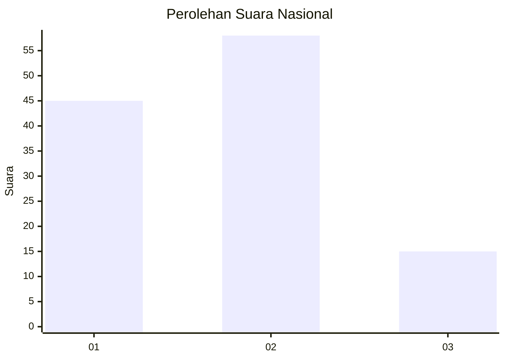
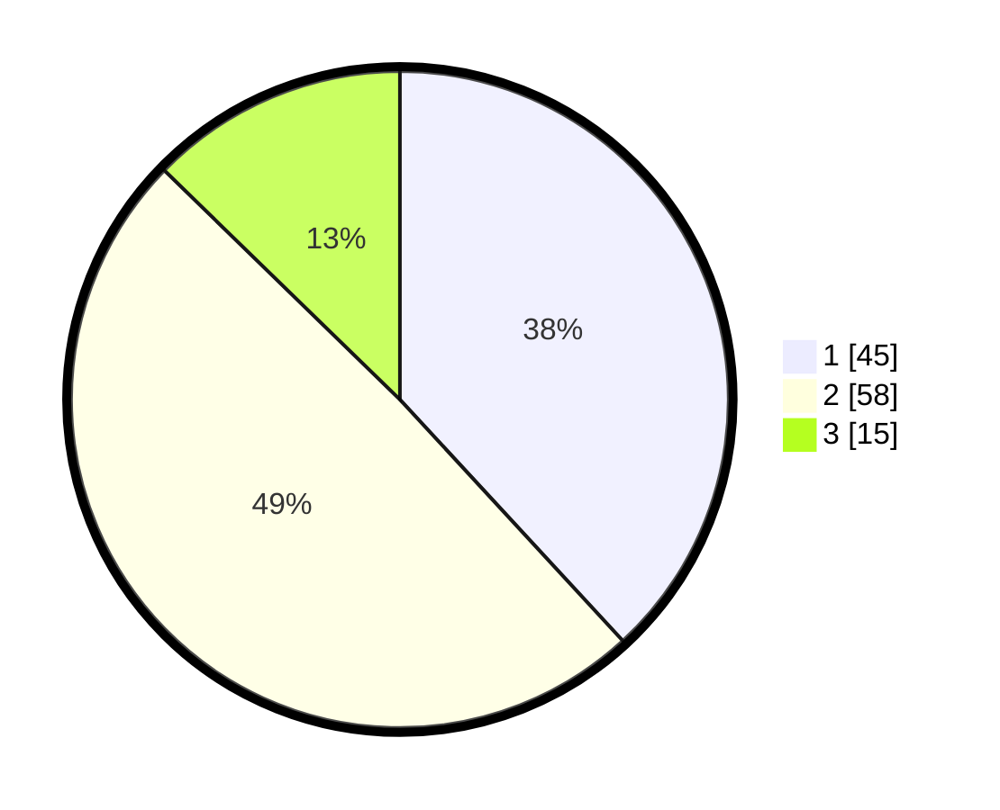

# Hasil

## Grafik

## Tabel

| No. | Nama Paslon    | Suara | Suara (raw) | Persentase |
|:--- |:-------------- | -----:| -----------:| ----------:|
| 1   | ANIES MUHAIMIN | 45    | [45][p-1]   | 38,14      |
| 2   | PRABOWO GIBRAN | 58    | [58][p-2]   | 49,15      |
| 3   | GANJAR MAHFUD  | 15    | [15][p-3]   | 12,71      |

[p-1]: https://github.com/gigit-pemilu/pemilu-2024/blob/main/pilpres/hitung-suara/sub/21-kepulauan-riau/sub/02-karimun/sub/01-moro/sub/1003-moro/sub/001-tps/sub/paslon-1.txt
[p-2]: https://github.com/gigit-pemilu/pemilu-2024/blob/main/pilpres/hitung-suara/sub/21-kepulauan-riau/sub/02-karimun/sub/01-moro/sub/1003-moro/sub/001-tps/sub/paslon-2.txt
[p-3]: https://github.com/gigit-pemilu/pemilu-2024/blob/main/pilpres/hitung-suara/sub/21-kepulauan-riau/sub/02-karimun/sub/01-moro/sub/1003-moro/sub/001-tps/sub/paslon-3.txt

## Foto C Plano

https://sirekap-obj-formc.kpu.go.id/0a06/pemilu/ppwp/21/02/01/10/03/2102011003001-20240214-194344--694ce7d8-147f-415d-b3c6-577a28b69f28.jpg

https://sirekap-obj-formc.kpu.go.id/0a06/pemilu/ppwp/21/02/01/10/03/2102011003001-20240214-201253--6afe5167-5359-455b-ad1d-416878cea1a2.jpg

https://sirekap-obj-formc.kpu.go.id/0a06/pemilu/ppwp/21/02/01/10/03/2102011003001-20240214-194801--2ee39d76-13b5-4831-8bc6-bbdab883a959.jpg

## Metadata

| Key        | Value               |
| ---------- | ------------------- |
| Time Stamp | 2024-02-14 21:46:01 |

## DATA PEMILIH TETAP

Jumlah pemilih dalam DPT: **184**.
 * L: **90**.
 * P: **94**.

## DATA PENGGUNA HAK PILIH

Jumlah pengguna hak pilih dalam DPT: **117**.
 * L: **58**.
 * P: **59**.

Jumlah pengguna hak pilih dalam DPTb: **5**.
 * L: **3**.
 * P: **2**.

Jumlah pengguna hak pilih dalam DPK: **1**.
 * L: **1**.
 * P: **0**.

Jumlah pengguna hak pilih: **123**.
 * L: **62**.
 * P: **61**.

## JUMLAH SUARA SAH DAN TIDAK SAH

JUMLAH SELURUH SUARA SAH: **118**.

JUMLAH SUARA TIDAK SAH: **5**.

JUMLAH SELURUH SUARA SAH DAN SUARA TIDAK SAH: **123**.

