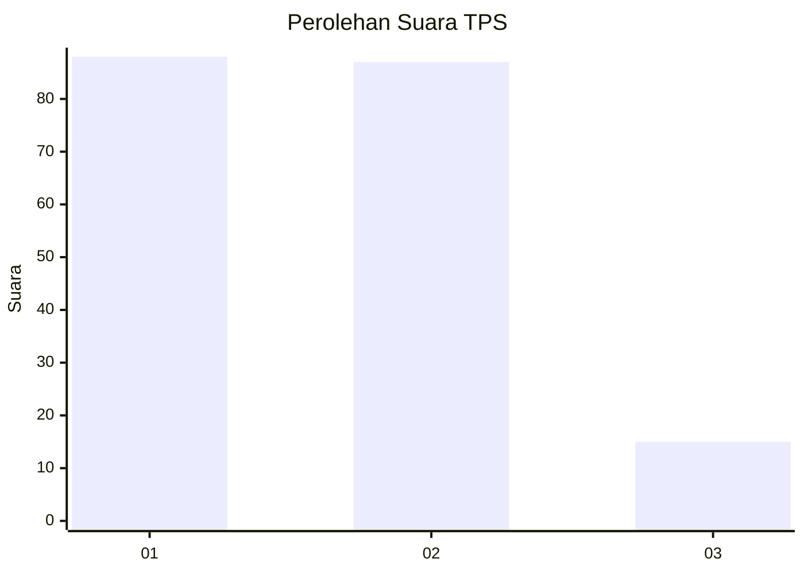
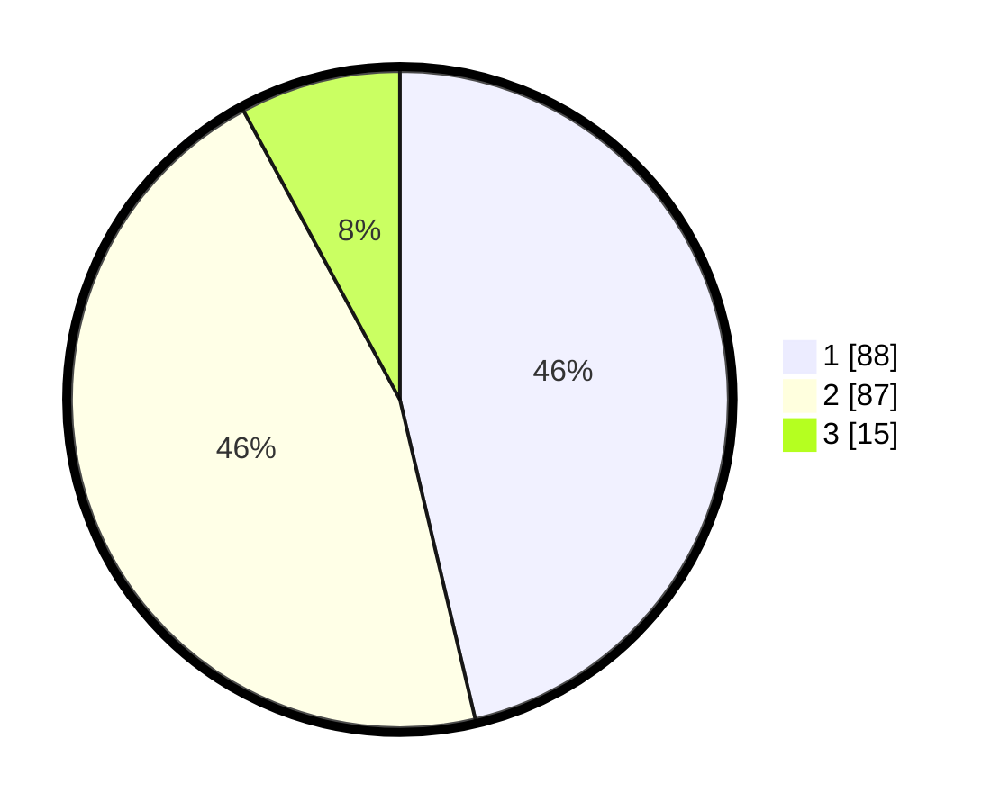

# Hasil

## Grafik

## Tabel

| No. | Nama Paslon    | Suara | Suara (raw) | Persentase |
|:--- |:-------------- | -----:| -----------:| ----------:|
| 1   | ANIES MUHAIMIN | 88    | [88][p-1]   | 46,32      |
| 2   | PRABOWO GIBRAN | 87    | [87][p-2]   | 45,79      |
| 3   | GANJAR MAHFUD  | 15    | [15][p-3]   | 7,89       |

[p-1]: https://github.com/gigit-pemilu/pemilu-2024-21-kepulauan-riau/blob/main/pilpres/hitung-suara/sub/21-kepulauan-riau/sub/02-karimun/sub/03-karimun/sub/1001-tanjung-balai/sub/001-tps/sub/paslon-1.txt
[p-2]: https://github.com/gigit-pemilu/pemilu-2024-21-kepulauan-riau/blob/main/pilpres/hitung-suara/sub/21-kepulauan-riau/sub/02-karimun/sub/03-karimun/sub/1001-tanjung-balai/sub/001-tps/sub/paslon-2.txt
[p-3]: https://github.com/gigit-pemilu/pemilu-2024-21-kepulauan-riau/blob/main/pilpres/hitung-suara/sub/21-kepulauan-riau/sub/02-karimun/sub/03-karimun/sub/1001-tanjung-balai/sub/001-tps/sub/paslon-3.txt

## Foto C Plano

https://sirekap-obj-formc.kpu.go.id/0694/pemilu/ppwp/21/02/03/10/01/2102031001001-20240214-203955--2ce41044-e152-41a2-977c-ffec0226cce9.jpg

https://sirekap-obj-formc.kpu.go.id/0694/pemilu/ppwp/21/02/03/10/01/2102031001001-20240214-230506--71385ac3-8b41-4a9d-9318-ffbd0d301a06.jpg

https://sirekap-obj-formc.kpu.go.id/0694/pemilu/ppwp/21/02/03/10/01/2102031001001-20240214-230738--a2ebaa79-39e9-495e-8dc7-e63aa7946ea1.jpg

## Metadata

| Key        | Value               |
| ---------- | ------------------- |
| Time Stamp | 2024-02-16 10:30:29 |

