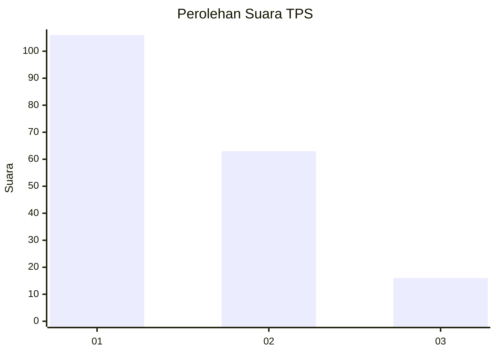
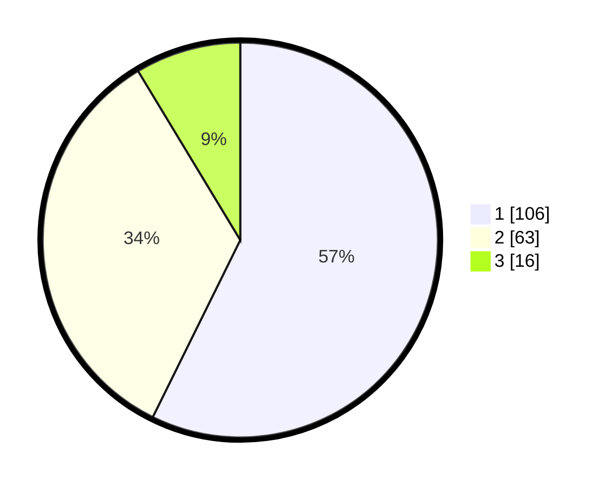

# Hasil

## Grafik

## Tabel

| No. | Nama Paslon    | Suara | Suara (raw) | Persentase |
|:--- |:-------------- | -----:| -----------:| ----------:|
| 1   | ANIES MUHAIMIN | 106   | [106][p-1]  | 57,30      |
| 2   | PRABOWO GIBRAN | 63    | [63][p-2]   | 34,05      |
| 3   | GANJAR MAHFUD  | 16    | [16][p-3]   | 8,65       |

[p-1]: https://github.com/gigit-pemilu/pemilu-2024-21-kepulauan-riau/blob/main/pilpres/hitung-suara/sub/21-kepulauan-riau/sub/02-karimun/sub/03-karimun/sub/1001-tanjung-balai/sub/005-tps/sub/paslon-1.txt
[p-2]: https://github.com/gigit-pemilu/pemilu-2024-21-kepulauan-riau/blob/main/pilpres/hitung-suara/sub/21-kepulauan-riau/sub/02-karimun/sub/03-karimun/sub/1001-tanjung-balai/sub/005-tps/sub/paslon-2.txt
[p-3]: https://github.com/gigit-pemilu/pemilu-2024-21-kepulauan-riau/blob/main/pilpres/hitung-suara/sub/21-kepulauan-riau/sub/02-karimun/sub/03-karimun/sub/1001-tanjung-balai/sub/005-tps/sub/paslon-3.txt

## Foto C Plano

https://sirekap-obj-formc.kpu.go.id/f1b1/pemilu/ppwp/21/02/03/10/01/2102031001005-20240214-185425--f95dc59f-54f4-47bc-9c5c-1e37e30173fb.jpg

https://sirekap-obj-formc.kpu.go.id/f1b1/pemilu/ppwp/21/02/03/10/01/2102031001005-20240214-185543--b3c0751d-7d3a-432e-aa3c-316eed6f83c4.jpg

https://sirekap-obj-formc.kpu.go.id/f1b1/pemilu/ppwp/21/02/03/10/01/2102031001005-20240214-185619--4fcc2ad4-81e0-4995-87e3-b1e57694b83c.jpg

## Metadata

| Key        | Value               |
| ---------- | ------------------- |
| Time Stamp | 2024-02-15 21:01:18 |

