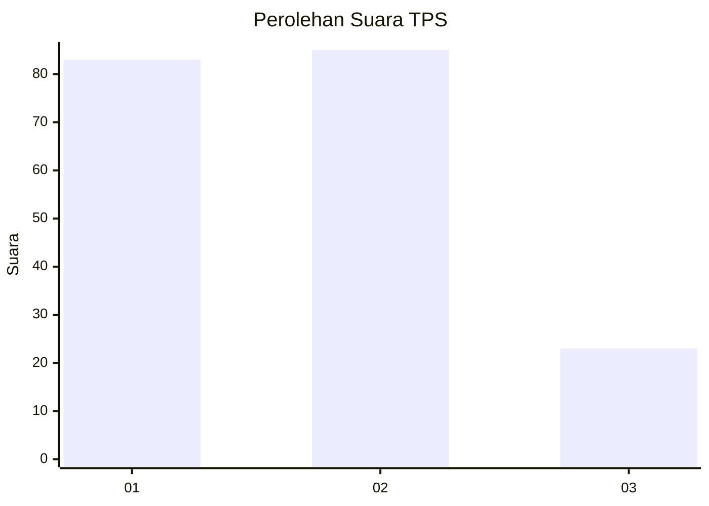
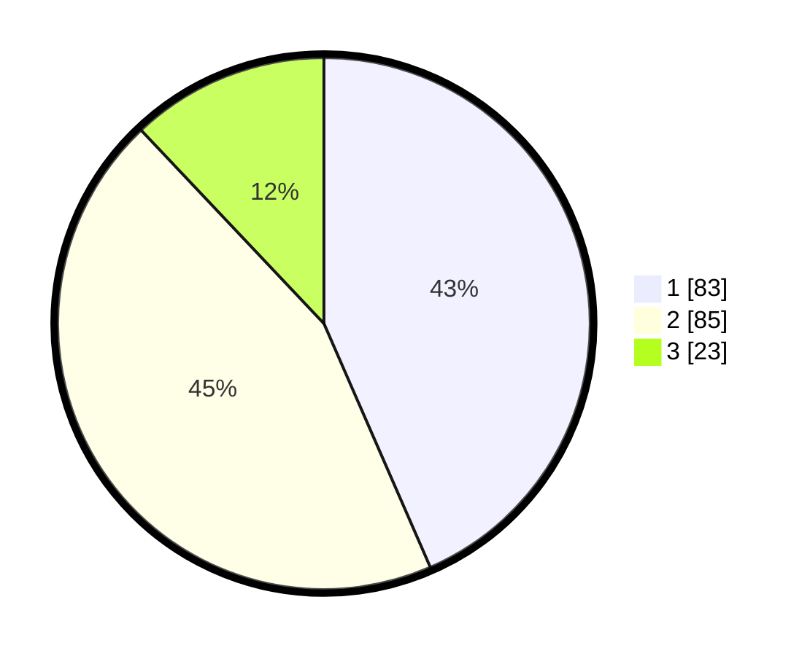

# Hasil

## Grafik

## Tabel

| No. | Nama Paslon    | Suara | Suara (raw) | Persentase |
|:--- |:-------------- | -----:| -----------:| ----------:|
| 1   | ANIES MUHAIMIN | 83    | [83][p-1]   | 43,46      |
| 2   | PRABOWO GIBRAN | 85    | [85][p-2]   | 44,50      |
| 3   | GANJAR MAHFUD  | 23    | [23][p-3]   | 12,04      |

[p-1]: https://github.com/gigit-pemilu/pemilu-2024-21-kepulauan-riau/blob/main/pilpres/hitung-suara/sub/21-kepulauan-riau/sub/02-karimun/sub/03-karimun/sub/1006-lubuk-semut/sub/006-tps/sub/paslon-1.txt
[p-2]: https://github.com/gigit-pemilu/pemilu-2024-21-kepulauan-riau/blob/main/pilpres/hitung-suara/sub/21-kepulauan-riau/sub/02-karimun/sub/03-karimun/sub/1006-lubuk-semut/sub/006-tps/sub/paslon-2.txt
[p-3]: https://github.com/gigit-pemilu/pemilu-2024-21-kepulauan-riau/blob/main/pilpres/hitung-suara/sub/21-kepulauan-riau/sub/02-karimun/sub/03-karimun/sub/1006-lubuk-semut/sub/006-tps/sub/paslon-3.txt

## Foto C Plano

https://sirekap-obj-formc.kpu.go.id/93a7/pemilu/ppwp/21/02/03/10/06/2102031006006-20240226-153817--5516c6c5-d387-4087-843b-cfbbc1f1a6b4.jpg

https://sirekap-obj-formc.kpu.go.id/93a7/pemilu/ppwp/21/02/03/10/06/2102031006006-20240226-153912--2f0584eb-4d94-4101-bcf0-98cae196936c.jpg

https://sirekap-obj-formc.kpu.go.id/93a7/pemilu/ppwp/21/02/03/10/06/2102031006006-20240226-153949--180f3182-db08-477f-9c1e-d74edec80bd5.jpg

## Metadata

| Key        | Value               |
| ---------- | ------------------- |
| Time Stamp | 2024-02-26 17:00:04 |

## DATA PEMILIH TETAP

Jumlah pemilih dalam DPT: **255**.
 * L: **553**.
 * P: **553**.

## DATA PENGGUNA HAK PILIH

Jumlah pengguna hak pilih dalam DPT: **577**.
 * L: **785**.
 * P: **535**.

Jumlah pengguna hak pilih dalam DPTb: **777**.
 * L: **557**.
 * P: **557**.

Jumlah pengguna hak pilih dalam DPK: **225**.
 * L: **323**.
 * P: **332**.

Jumlah pengguna hak pilih: **232**.
 * L: **572**.
 * P: **202**.

## JUMLAH SUARA SAH DAN TIDAK SAH

JUMLAH SELURUH SUARA SAH: **191**.

JUMLAH SUARA TIDAK SAH: **3**.

JUMLAH SELURUH SUARA SAH DAN SUARA TIDAK SAH: **194**.

