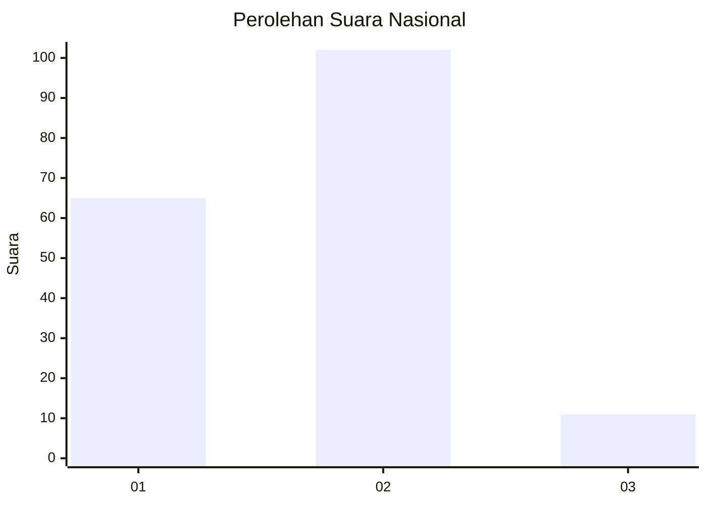
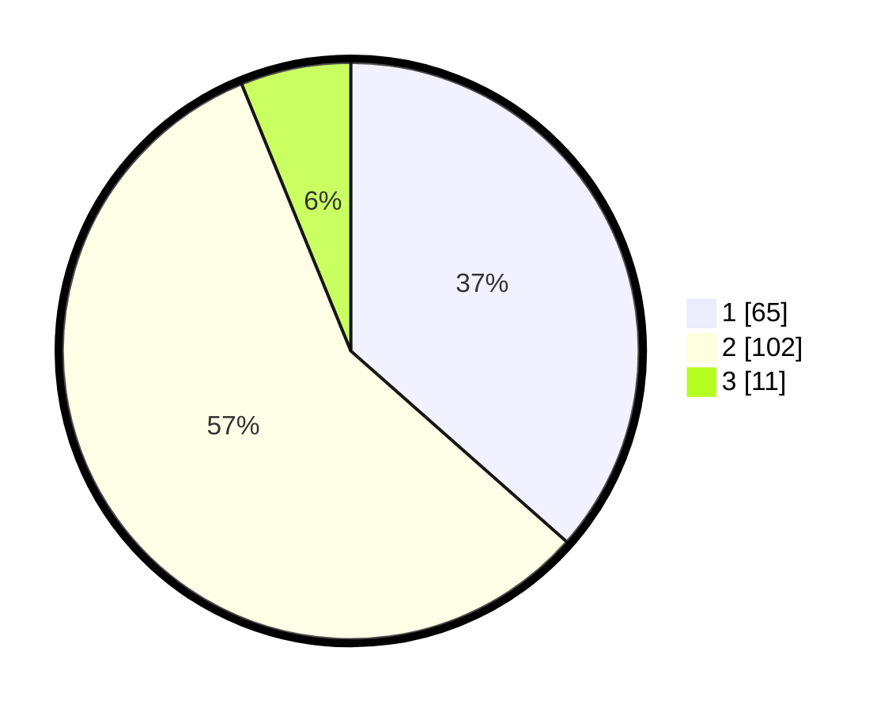

# Hasil

## Grafik

## Tabel

| No. | Nama Paslon    | Suara | Suara (raw) | Persentase |
|:--- |:-------------- | -----:| -----------:| ----------:|
| 1   | ANIES MUHAIMIN | 65    | [65][p-1]   | 36,52      |
| 2   | PRABOWO GIBRAN | 102   | [102][p-2]  | 57,30      |
| 3   | GANJAR MAHFUD  | 11    | [11][p-3]   | 6,18       |

[p-1]: https://github.com/gigit-pemilu/pemilu-2024/blob/main/pilpres/hitung-suara/sub/21-kepulauan-riau/sub/02-karimun/sub/03-karimun/sub/1008-sungai-lakam-barat/sub/003-tps/sub/paslon-1.txt
[p-2]: https://github.com/gigit-pemilu/pemilu-2024/blob/main/pilpres/hitung-suara/sub/21-kepulauan-riau/sub/02-karimun/sub/03-karimun/sub/1008-sungai-lakam-barat/sub/003-tps/sub/paslon-2.txt
[p-3]: https://github.com/gigit-pemilu/pemilu-2024/blob/main/pilpres/hitung-suara/sub/21-kepulauan-riau/sub/02-karimun/sub/03-karimun/sub/1008-sungai-lakam-barat/sub/003-tps/sub/paslon-3.txt

## Foto C Plano

https://sirekap-obj-formc.kpu.go.id/fa12/pemilu/ppwp/21/02/03/10/08/2102031008003-20240214-214643--11cc1dab-b3f7-42b5-a7b2-0e9d45aa52fe.jpg

https://sirekap-obj-formc.kpu.go.id/fa12/pemilu/ppwp/21/02/03/10/08/2102031008003-20240214-214914--e8af2abc-3694-454f-bf73-1e6c3b14a800.jpg

https://sirekap-obj-formc.kpu.go.id/fa12/pemilu/ppwp/21/02/03/10/08/2102031008003-20240214-215129--2fa49651-c754-4551-bcd0-413402693b35.jpg

## Metadata

| Key        | Value               |
| ---------- | ------------------- |
| Time Stamp | 2024-02-15 21:30:27 |

