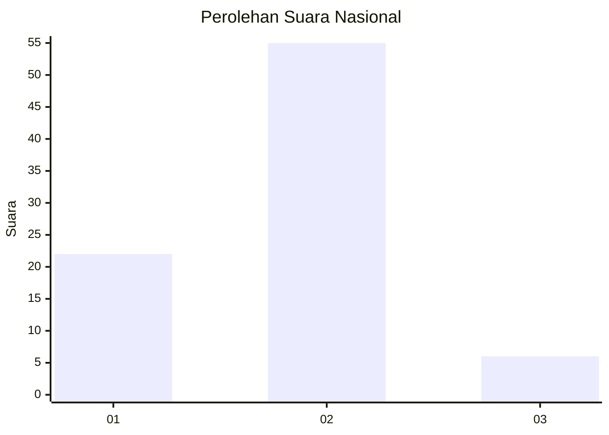
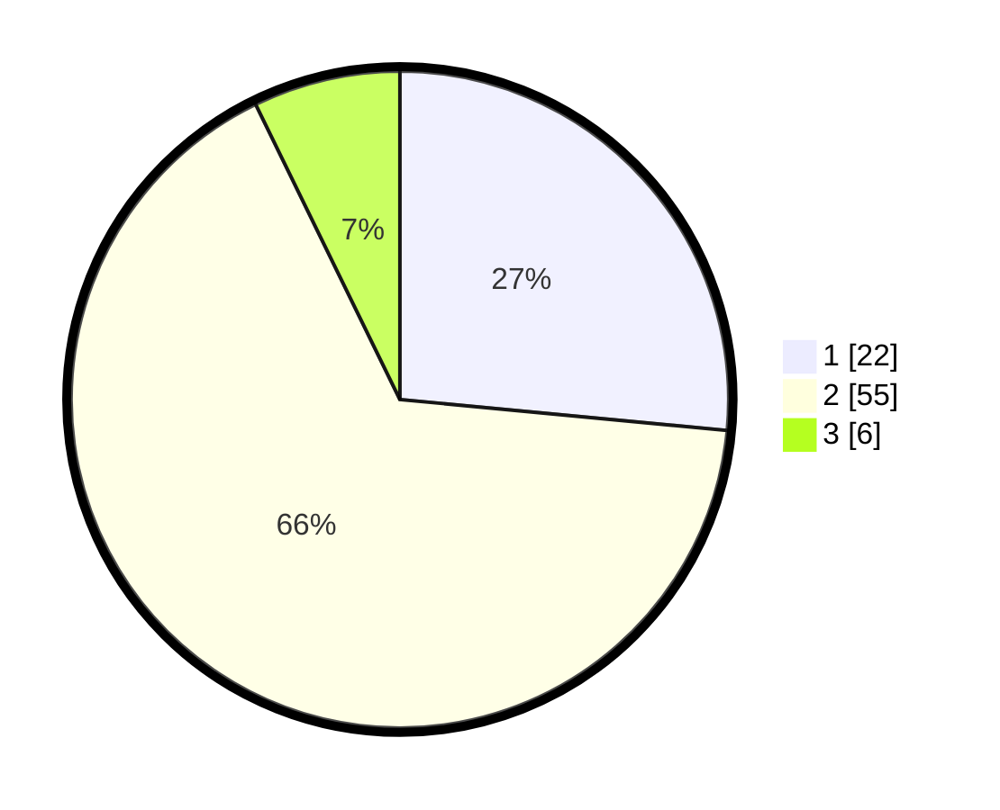

# Hasil

## Grafik

## Tabel

| No. | Nama Paslon    | Suara | Suara (raw) | Persentase |
|:--- |:-------------- | -----:| -----------:| ----------:|
| 1   | ANIES MUHAIMIN | 22    | [22][p-1]   | 26,51      |
| 2   | PRABOWO GIBRAN | 55    | [55][p-2]   | 66,27      |
| 3   | GANJAR MAHFUD  | 6     | [6][p-3]    | 7,23       |

[p-1]: https://github.com/gigit-pemilu/pemilu-2024/blob/main/pilpres/hitung-suara/sub/21-kepulauan-riau/sub/02-karimun/sub/09-durai/sub/2002-sanglar/sub/006-tps/sub/paslon-1.txt
[p-2]: https://github.com/gigit-pemilu/pemilu-2024/blob/main/pilpres/hitung-suara/sub/21-kepulauan-riau/sub/02-karimun/sub/09-durai/sub/2002-sanglar/sub/006-tps/sub/paslon-2.txt
[p-3]: https://github.com/gigit-pemilu/pemilu-2024/blob/main/pilpres/hitung-suara/sub/21-kepulauan-riau/sub/02-karimun/sub/09-durai/sub/2002-sanglar/sub/006-tps/sub/paslon-3.txt

## Foto C Plano

https://sirekap-obj-formc.kpu.go.id/bf96/pemilu/ppwp/21/02/09/20/02/2102092002006-20240215-041131--ab222cbe-3bd9-40f9-bf3c-57ab2353eaaa.jpg

https://sirekap-obj-formc.kpu.go.id/bf96/pemilu/ppwp/21/02/09/20/02/2102092002006-20240215-055149--c9c66da4-30df-4b77-818d-9fdc743dd3ac.jpg

https://sirekap-obj-formc.kpu.go.id/bf96/pemilu/ppwp/21/02/09/20/02/2102092002006-20240215-060244--be475c00-915d-44ad-8e04-a31727cfd2fd.jpg

## Metadata

| Key        | Value               |
| ---------- | ------------------- |
| Time Stamp | 2024-02-16 11:00:29 |

## DATA PEMILIH TETAP

Jumlah pemilih dalam DPT: **98**.
 * L: **53**.
 * P: **45**.

## DATA PENGGUNA HAK PILIH

Jumlah pengguna hak pilih dalam DPT: **82**.
 * L: **42**.
 * P: **40**.

Jumlah pengguna hak pilih dalam DPTb: **1**.
 * L: **1**.
 * P: **0**.

Jumlah pengguna hak pilih dalam DPK: **3**.
 * L: **2**.
 * P: **1**.

Jumlah pengguna hak pilih: **86**.
 * L: **45**.
 * P: **41**.

## JUMLAH SUARA SAH DAN TIDAK SAH

JUMLAH SELURUH SUARA SAH: **83**.

JUMLAH SUARA TIDAK SAH: **3**.

JUMLAH SELURUH SUARA SAH DAN SUARA TIDAK SAH: **86**.

