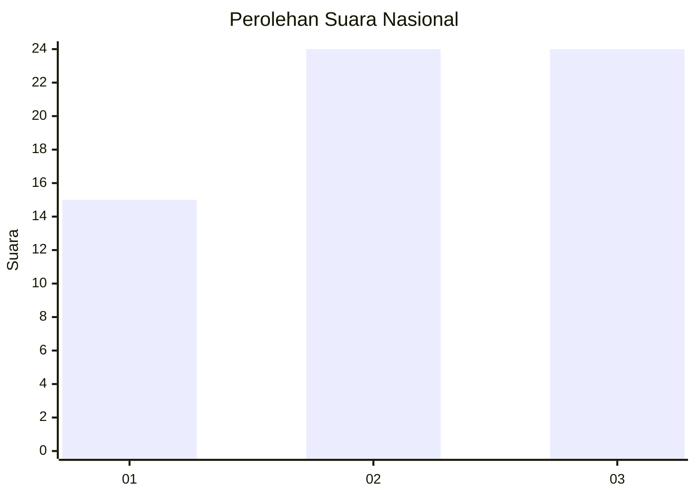
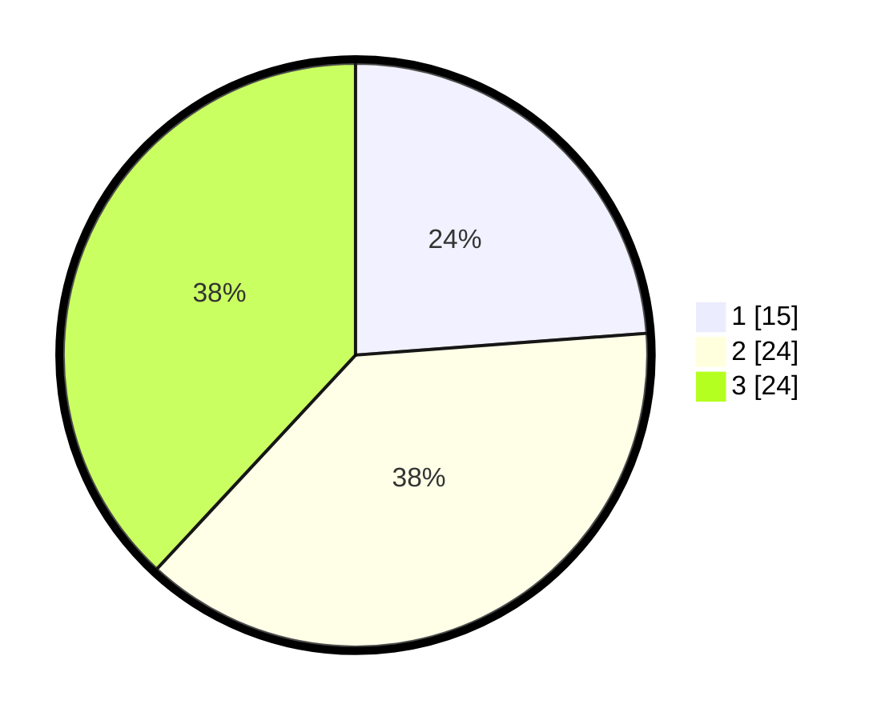

# Hasil

## Grafik

## Tabel

| No. | Nama Paslon    | Suara | Suara (raw) | Persentase |
|:--- |:-------------- | -----:| -----------:| ----------:|
| 1   | ANIES MUHAIMIN | 15    | [15][p-1]   | 23,81      |
| 2   | PRABOWO GIBRAN | 24    | [24][p-2]   | 38,10      |
| 3   | GANJAR MAHFUD  | 24    | [24][p-3]   | 38,10      |

[p-1]: https://github.com/gigit-pemilu/pemilu-2024/blob/main/pilpres/hitung-suara/sub/21-kepulauan-riau/sub/02-karimun/sub/14-sugie-besar/sub/2001-sugie/sub/005-tps/sub/paslon-1.txt
[p-2]: https://github.com/gigit-pemilu/pemilu-2024/blob/main/pilpres/hitung-suara/sub/21-kepulauan-riau/sub/02-karimun/sub/14-sugie-besar/sub/2001-sugie/sub/005-tps/sub/paslon-2.txt
[p-3]: https://github.com/gigit-pemilu/pemilu-2024/blob/main/pilpres/hitung-suara/sub/21-kepulauan-riau/sub/02-karimun/sub/14-sugie-besar/sub/2001-sugie/sub/005-tps/sub/paslon-3.txt

## Foto C Plano

https://sirekap-obj-formc.kpu.go.id/9747/pemilu/ppwp/21/02/14/20/01/2102142001005-20240223-174434--d02bbe05-6a71-435e-a7bc-ddfc9ae067e8.jpg

https://sirekap-obj-formc.kpu.go.id/9747/pemilu/ppwp/21/02/14/20/01/2102142001005-20240223-174436--98b63b05-065a-4db0-9eca-704e0651dd47.jpg

https://sirekap-obj-formc.kpu.go.id/9747/pemilu/ppwp/21/02/14/20/01/2102142001005-20240223-174435--56600da1-d8b6-49db-b165-fdbbedd911b5.jpg

## Metadata

| Key        | Value               |
| ---------- | ------------------- |
| Time Stamp | 2024-02-24 22:31:28 |

## DATA PEMILIH TETAP

Jumlah pemilih dalam DPT: **81**.
 * L: **41**.
 * P: **40**.

## DATA PENGGUNA HAK PILIH

Jumlah pengguna hak pilih dalam DPT: **63**.
 * L: **30**.
 * P: **33**.

Jumlah pengguna hak pilih dalam DPTb: **0**.
 * L: **0**.
 * P: **0**.

Jumlah pengguna hak pilih dalam DPK: **0**.
 * L: **0**.
 * P: **0**.

Jumlah pengguna hak pilih: **63**.
 * L: **30**.
 * P: **33**.

## JUMLAH SUARA SAH DAN TIDAK SAH

JUMLAH SELURUH SUARA SAH: **63**.

JUMLAH SUARA TIDAK SAH: **0**.

JUMLAH SELURUH SUARA SAH DAN SUARA TIDAK SAH: **63**.

