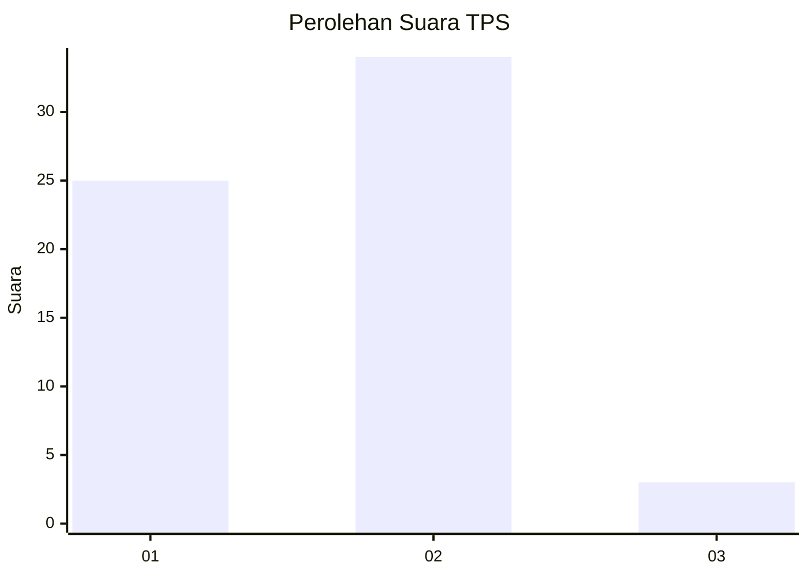
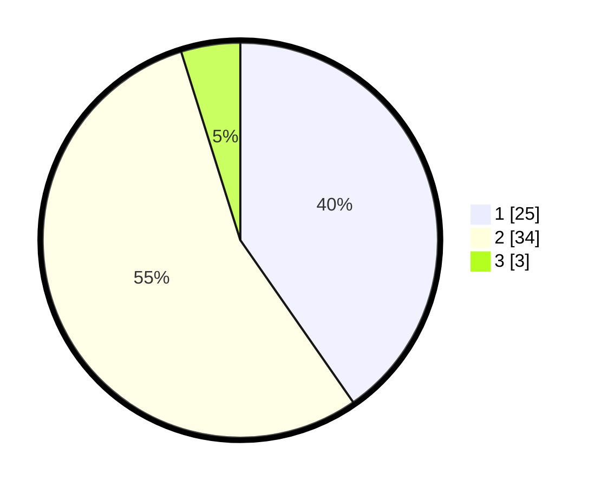

# Hasil

## Grafik

## Tabel

| No. | Nama Paslon    | Suara | Suara (raw) | Persentase |
|:--- |:-------------- | -----:| -----------:| ----------:|
| 1   | ANIES MUHAIMIN | 25    | [25][p-1]   | 40,32      |
| 2   | PRABOWO GIBRAN | 34    | [34][p-2]   | 54,84      |
| 3   | GANJAR MAHFUD  | 3     | [3][p-3]    | 4,84       |

[p-1]: https://github.com/gigit-pemilu/pemilu-2024-21-kepulauan-riau/blob/main/pilpres/hitung-suara/sub/21-kepulauan-riau/sub/03-natuna/sub/05-bunguran-barat/sub/1008-sedanau/sub/015-tps/sub/paslon-1.txt
[p-2]: https://github.com/gigit-pemilu/pemilu-2024-21-kepulauan-riau/blob/main/pilpres/hitung-suara/sub/21-kepulauan-riau/sub/03-natuna/sub/05-bunguran-barat/sub/1008-sedanau/sub/015-tps/sub/paslon-2.txt
[p-3]: https://github.com/gigit-pemilu/pemilu-2024-21-kepulauan-riau/blob/main/pilpres/hitung-suara/sub/21-kepulauan-riau/sub/03-natuna/sub/05-bunguran-barat/sub/1008-sedanau/sub/015-tps/sub/paslon-3.txt

## Foto C Plano

https://sirekap-obj-formc.kpu.go.id/3652/pemilu/ppwp/21/03/05/10/08/2103051008015-20240214-205808--227d624a-b75f-4258-bed5-2fcac6865bac.jpg

https://sirekap-obj-formc.kpu.go.id/3652/pemilu/ppwp/21/03/05/10/08/2103051008015-20240214-155758--1f989b5b-60b5-42dd-8c31-50d9d8285787.jpg

https://sirekap-obj-formc.kpu.go.id/3652/pemilu/ppwp/21/03/05/10/08/2103051008015-20240214-155835--b9ff7af8-1aca-4ca9-9b57-a165714dcdf1.jpg

## Metadata

| Key        | Value               |
| ---------- | ------------------- |
| Time Stamp | 2024-02-14 21:46:01 |

