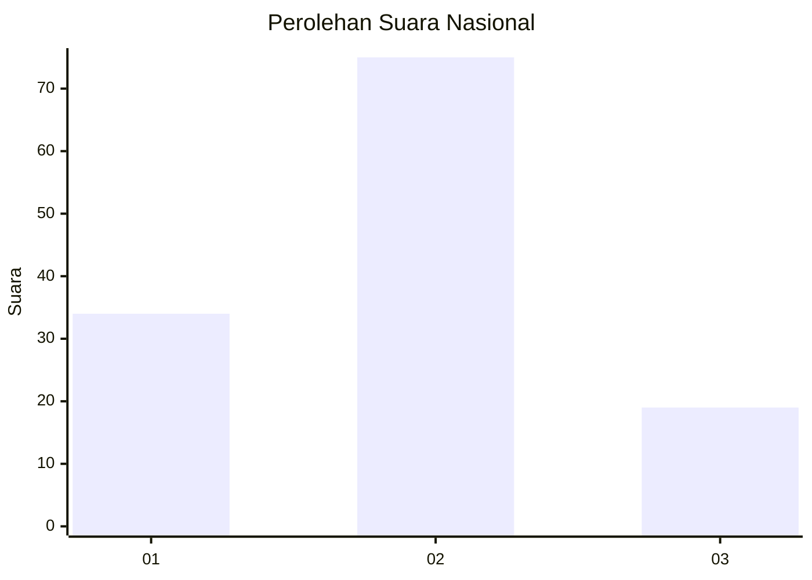
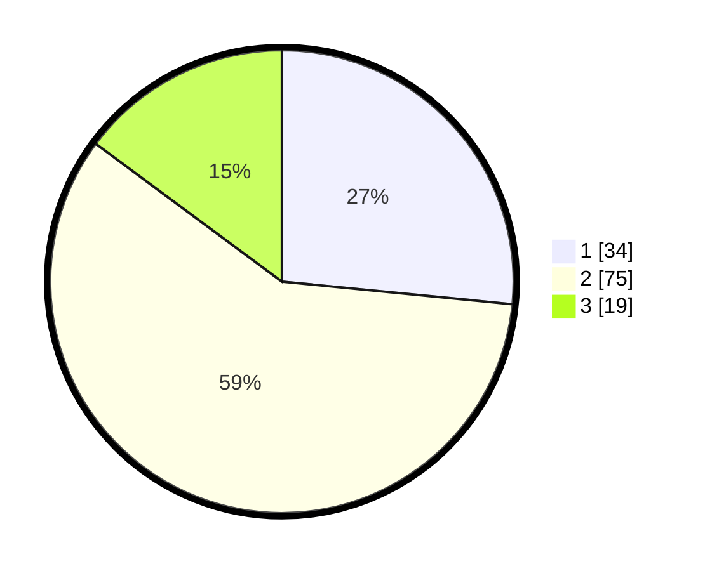

# Hasil

## Grafik

## Tabel

| No. | Nama Paslon    | Suara | Suara (raw) | Persentase |
|:--- |:-------------- | -----:| -----------:| ----------:|
| 1   | ANIES MUHAIMIN | 34    | [34][p-1]   | 26,56      |
| 2   | PRABOWO GIBRAN | 75    | [75][p-2]   | 58,59      |
| 3   | GANJAR MAHFUD  | 19    | [19][p-3]   | 14,84      |

[p-1]: https://github.com/gigit-pemilu/pemilu-2024/blob/main/pilpres/hitung-suara/sub/21-kepulauan-riau/sub/03-natuna/sub/06-serasan/sub/2007-tanjung-balau/sub/002-tps/sub/paslon-1.txt
[p-2]: https://github.com/gigit-pemilu/pemilu-2024/blob/main/pilpres/hitung-suara/sub/21-kepulauan-riau/sub/03-natuna/sub/06-serasan/sub/2007-tanjung-balau/sub/002-tps/sub/paslon-2.txt
[p-3]: https://github.com/gigit-pemilu/pemilu-2024/blob/main/pilpres/hitung-suara/sub/21-kepulauan-riau/sub/03-natuna/sub/06-serasan/sub/2007-tanjung-balau/sub/002-tps/sub/paslon-3.txt

## Foto C Plano

https://sirekap-obj-formc.kpu.go.id/2a0c/pemilu/ppwp/21/03/06/20/07/2103062007002-20240215-075618--03445d01-ab16-4232-90fe-366546c1c8b5.jpg

https://sirekap-obj-formc.kpu.go.id/2a0c/pemilu/ppwp/21/03/06/20/07/2103062007002-20240215-075631--14bf603b-4c2c-499f-acad-dfb25856fe5a.jpg

https://sirekap-obj-formc.kpu.go.id/2a0c/pemilu/ppwp/21/03/06/20/07/2103062007002-20240215-075705--1670a3cd-b00c-4140-a1fc-5c279b43ef05.jpg

## Metadata

| Key        | Value               |
| ---------- | ------------------- |
| Time Stamp | 2024-02-25 22:00:00 |

