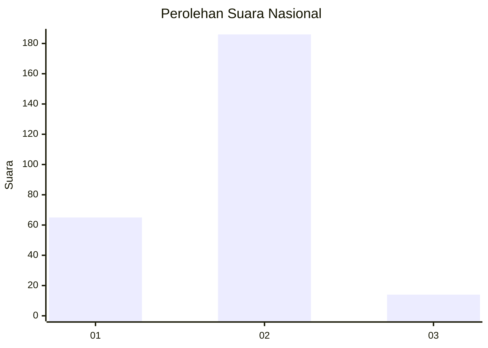
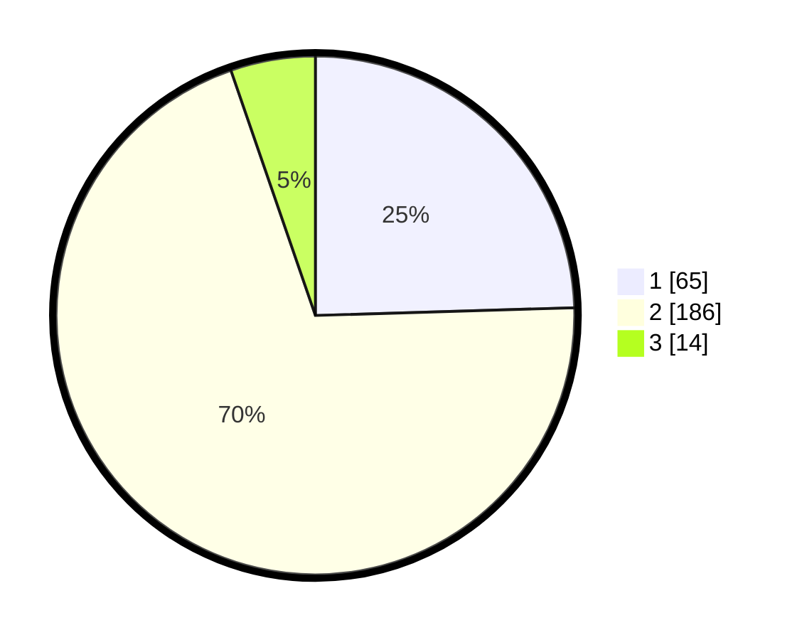

# Hasil

## Grafik

## Tabel

| No. | Nama Paslon    | Suara | Suara (raw) | Persentase |
|:--- |:-------------- | -----:| -----------:| ----------:|
| 1   | ANIES MUHAIMIN | 65    | [65][p-1]   | 24,53      |
| 2   | PRABOWO GIBRAN | 186   | [186][p-2]  | 70,19      |
| 3   | GANJAR MAHFUD  | 14    | [14][p-3]   | 5,28       |

[p-1]: https://github.com/gigit-pemilu/pemilu-2024/blob/main/pilpres/hitung-suara/sub/21-kepulauan-riau/sub/03-natuna/sub/07-bunguran-timur/sub/2002-sungai-ulu/sub/001-tps/sub/paslon-1.txt
[p-2]: https://github.com/gigit-pemilu/pemilu-2024/blob/main/pilpres/hitung-suara/sub/21-kepulauan-riau/sub/03-natuna/sub/07-bunguran-timur/sub/2002-sungai-ulu/sub/001-tps/sub/paslon-2.txt
[p-3]: https://github.com/gigit-pemilu/pemilu-2024/blob/main/pilpres/hitung-suara/sub/21-kepulauan-riau/sub/03-natuna/sub/07-bunguran-timur/sub/2002-sungai-ulu/sub/001-tps/sub/paslon-3.txt

## Foto C Plano

https://sirekap-obj-formc.kpu.go.id/37ce/pemilu/ppwp/21/03/07/20/02/2103072002001-20240214-213842--7789190b-b4d3-4bf1-bb62-14749c0d5798.jpg

https://sirekap-obj-formc.kpu.go.id/37ce/pemilu/ppwp/21/03/07/20/02/2103072002001-20240214-214035--63de6f9d-3c00-43c3-82d4-0a768e0cd514.jpg

https://sirekap-obj-formc.kpu.go.id/37ce/pemilu/ppwp/21/03/07/20/02/2103072002001-20240214-235339--8c83db99-6166-46b0-a7c2-5f286e52d70a.jpg

## Metadata

| Key        | Value               |
| ---------- | ------------------- |
| Time Stamp | 2024-02-17 02:30:03 |

