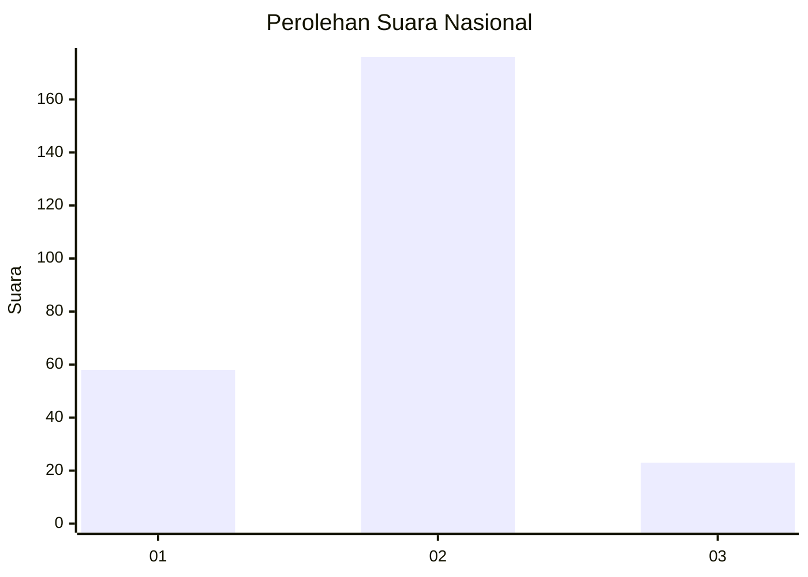

# Hasil

## Grafik

## Tabel

| No. | Nama Paslon    | Suara | Suara (raw) | Persentase |
|:--- |:-------------- | -----:| -----------:| ----------:|
| 1   | ANIES MUHAIMIN | 58    | [58][p-1]   | 22,57      |
| 2   | PRABOWO GIBRAN | 176   | [176][p-2]  | 68,48      |
| 3   | GANJAR MAHFUD  | 23    | [23][p-3]   | 8,95       |

[p-1]: https://github.com/gigit-pemilu/pemilu-2024/blob/main/pilpres/hitung-suara/sub/21-kepulauan-riau/sub/03-natuna/sub/07-bunguran-timur/sub/2002-sungai-ulu/sub/003-tps/sub/paslon-1.txt
[p-2]: https://github.com/gigit-pemilu/pemilu-2024/blob/main/pilpres/hitung-suara/sub/21-kepulauan-riau/sub/03-natuna/sub/07-bunguran-timur/sub/2002-sungai-ulu/sub/003-tps/sub/paslon-2.txt
[p-3]: https://github.com/gigit-pemilu/pemilu-2024/blob/main/pilpres/hitung-suara/sub/21-kepulauan-riau/sub/03-natuna/sub/07-bunguran-timur/sub/2002-sungai-ulu/sub/003-tps/sub/paslon-3.txt

## Foto C Plano

https://sirekap-obj-formc.kpu.go.id/a0d7/pemilu/ppwp/21/03/07/20/02/2103072002003-20240214-192049--3fd26a63-a3e3-4c79-a1a3-a17a3d1fe6e2.jpg

https://sirekap-obj-formc.kpu.go.id/a0d7/pemilu/ppwp/21/03/07/20/02/2103072002003-20240214-192654--d2a04c19-e657-4a1c-bce5-c5d2e5067c24.jpg

https://sirekap-obj-formc.kpu.go.id/a0d7/pemilu/ppwp/21/03/07/20/02/2103072002003-20240214-192738--7cae0fe8-d9ce-4b82-9b18-1e3118394c28.jpg

## Metadata

| Key        | Value               |
| ---------- | ------------------- |
| Time Stamp | 2024-02-14 21:46:01 |

