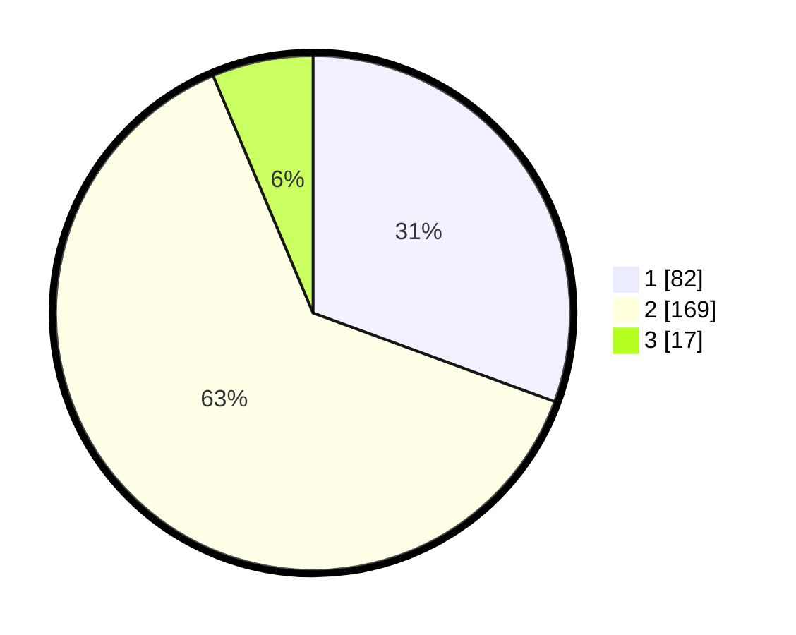

# Hasil

## Grafik

## Tabel

| No. | Nama Paslon    | Suara | Suara (raw) | Persentase |
|:--- |:-------------- | -----:| -----------:| ----------:|
| 1   | ANIES MUHAIMIN | 82    | [82][p-1]   | 30,60      |
| 2   | PRABOWO GIBRAN | 169   | [169][p-2]  | 63,06      |
| 3   | GANJAR MAHFUD  | 17    | [17][p-3]   | 6,34       |

[p-1]: https://github.com/gigit-pemilu/pemilu-2024-21-kepulauan-riau/blob/main/pilpres/hitung-suara/sub/21-kepulauan-riau/sub/03-natuna/sub/07-bunguran-timur/sub/2002-sungai-ulu/sub/005-tps/sub/paslon-1.txt
[p-2]: https://github.com/gigit-pemilu/pemilu-2024-21-kepulauan-riau/blob/main/pilpres/hitung-suara/sub/21-kepulauan-riau/sub/03-natuna/sub/07-bunguran-timur/sub/2002-sungai-ulu/sub/005-tps/sub/paslon-2.txt
[p-3]: https://github.com/gigit-pemilu/pemilu-2024-21-kepulauan-riau/blob/main/pilpres/hitung-suara/sub/21-kepulauan-riau/sub/03-natuna/sub/07-bunguran-timur/sub/2002-sungai-ulu/sub/005-tps/sub/paslon-3.txt

## Foto C Plano

https://sirekap-obj-formc.kpu.go.id/ce97/pemilu/ppwp/21/03/07/20/02/2103072002005-20240215-031657--96a7af3f-3337-44a0-85ad-ade9fbf8cea0.jpg

https://sirekap-obj-formc.kpu.go.id/ce97/pemilu/ppwp/21/03/07/20/02/2103072002005-20240215-032337--01a26c93-539e-4b2d-a7a5-af245a1a0754.jpg

https://sirekap-obj-formc.kpu.go.id/ce97/pemilu/ppwp/21/03/07/20/02/2103072002005-20240215-032122--726106f3-14c0-4b01-bfc3-849745a9cba8.jpg

## Metadata

| Key        | Value               |
| ---------- | ------------------- |
| Time Stamp | 2024-02-25 12:00:00 |

