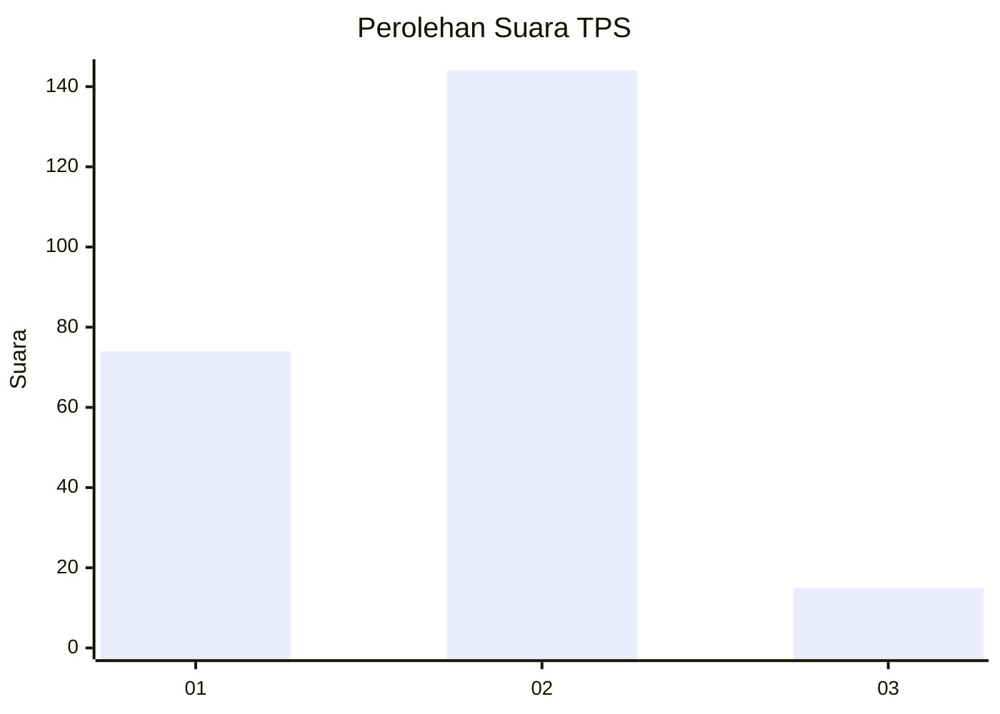
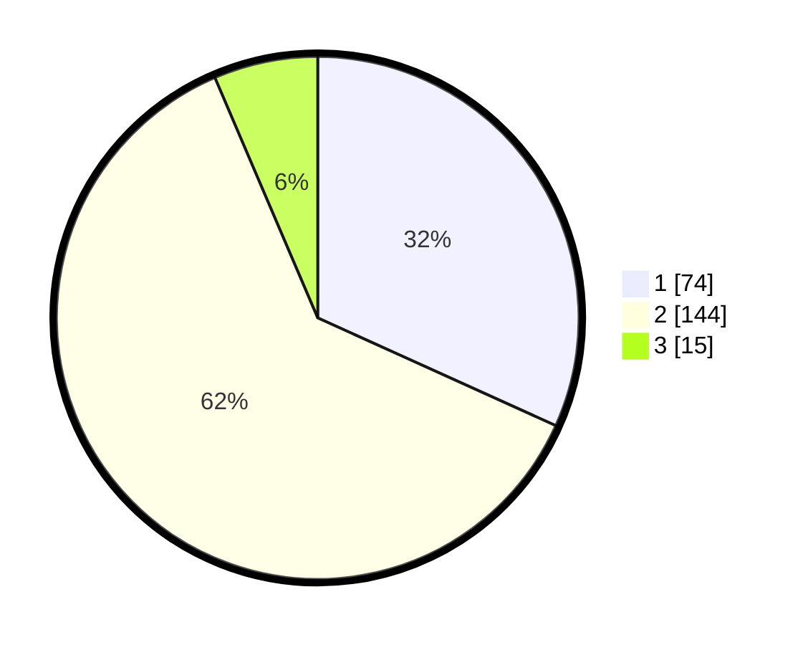

# Hasil

## Grafik

## Tabel

| No. | Nama Paslon    | Suara | Suara (raw) | Persentase |
|:--- |:-------------- | -----:| -----------:| ----------:|
| 1   | ANIES MUHAIMIN | 74    | [74][p-1]   | 31,76      |
| 2   | PRABOWO GIBRAN | 144   | [144][p-2]  | 61,80      |
| 3   | GANJAR MAHFUD  | 15    | [15][p-3]   | 6,44       |

[p-1]: https://github.com/gigit-pemilu/pemilu-2024-21-kepulauan-riau/blob/main/pilpres/hitung-suara/sub/21-kepulauan-riau/sub/03-natuna/sub/11-pulau-tiga/sub/2001-sabang-mawang/sub/002-tps/sub/paslon-1.txt
[p-2]: https://github.com/gigit-pemilu/pemilu-2024-21-kepulauan-riau/blob/main/pilpres/hitung-suara/sub/21-kepulauan-riau/sub/03-natuna/sub/11-pulau-tiga/sub/2001-sabang-mawang/sub/002-tps/sub/paslon-2.txt
[p-3]: https://github.com/gigit-pemilu/pemilu-2024-21-kepulauan-riau/blob/main/pilpres/hitung-suara/sub/21-kepulauan-riau/sub/03-natuna/sub/11-pulau-tiga/sub/2001-sabang-mawang/sub/002-tps/sub/paslon-3.txt

## Foto C Plano

https://sirekap-obj-formc.kpu.go.id/b75a/pemilu/ppwp/21/03/11/20/01/2103112001002-20240214-194125--907e1c7f-be05-4830-a7cc-a9207abc42a0.jpg

https://sirekap-obj-formc.kpu.go.id/b75a/pemilu/ppwp/21/03/11/20/01/2103112001002-20240214-194305--c2507c33-56d9-4cec-a256-8e50085e3db2.jpg

https://sirekap-obj-formc.kpu.go.id/b75a/pemilu/ppwp/21/03/11/20/01/2103112001002-20240214-194004--e0351d05-4d7f-41ce-81c1-ff56786264ca.jpg

## Metadata

| Key        | Value               |
| ---------- | ------------------- |
| Time Stamp | 2024-02-14 21:46:01 |

