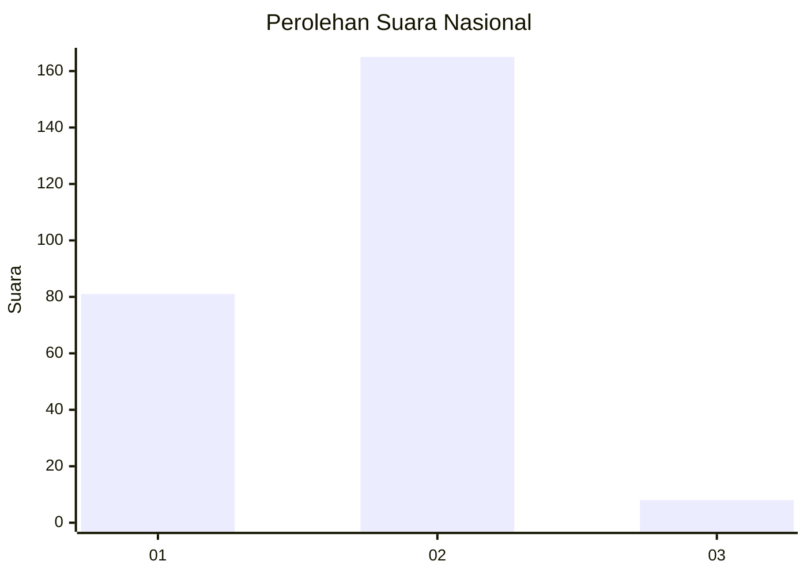
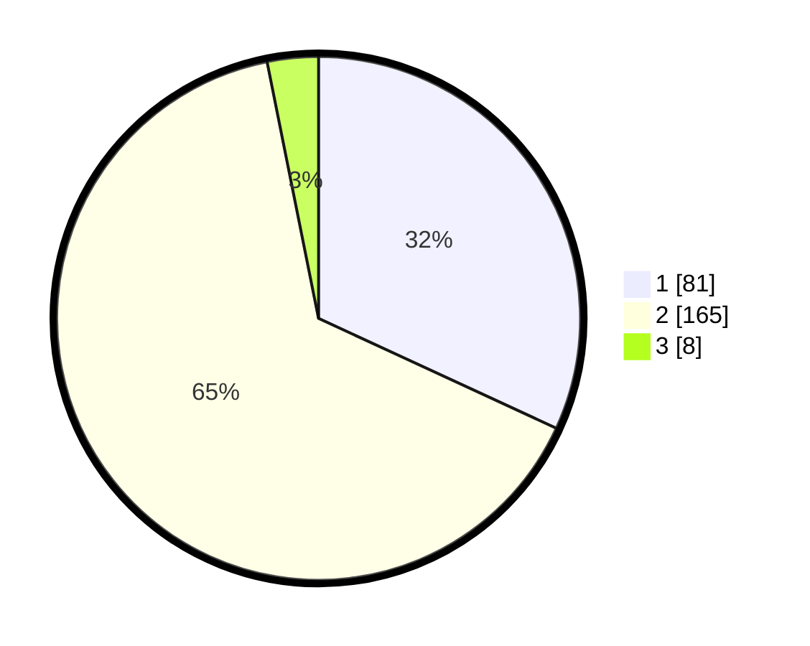

# Hasil

## Grafik

## Tabel

| No. | Nama Paslon    | Suara | Suara (raw) | Persentase |
|:--- |:-------------- | -----:| -----------:| ----------:|
| 1   | ANIES MUHAIMIN | 81    | [81][p-1]   | 31,89      |
| 2   | PRABOWO GIBRAN | 165   | [165][p-2]  | 64,96      |
| 3   | GANJAR MAHFUD  | 8     | [8][p-3]    | 3,15       |

[p-1]: https://github.com/gigit-pemilu/pemilu-2024/blob/main/pilpres/hitung-suara/sub/21-kepulauan-riau/sub/03-natuna/sub/15-bunguran-timur-laut/sub/2003-kelanga/sub/001-tps/sub/paslon-1.txt
[p-2]: https://github.com/gigit-pemilu/pemilu-2024/blob/main/pilpres/hitung-suara/sub/21-kepulauan-riau/sub/03-natuna/sub/15-bunguran-timur-laut/sub/2003-kelanga/sub/001-tps/sub/paslon-2.txt
[p-3]: https://github.com/gigit-pemilu/pemilu-2024/blob/main/pilpres/hitung-suara/sub/21-kepulauan-riau/sub/03-natuna/sub/15-bunguran-timur-laut/sub/2003-kelanga/sub/001-tps/sub/paslon-3.txt

## Foto C Plano

https://sirekap-obj-formc.kpu.go.id/e9f0/pemilu/ppwp/21/03/15/20/03/2103152003001-20240218-102632--9d9c5899-b86b-40ee-9b54-b49319eb98c5.jpg

https://sirekap-obj-formc.kpu.go.id/e9f0/pemilu/ppwp/21/03/15/20/03/2103152003001-20240218-103446--7f07e10e-9d98-4c39-a7a3-03183273a843.jpg

https://sirekap-obj-formc.kpu.go.id/e9f0/pemilu/ppwp/21/03/15/20/03/2103152003001-20240218-102925--56729908-7f6c-451f-8104-05e506b98beb.jpg

## Metadata

| Key        | Value               |
| ---------- | ------------------- |
| Time Stamp | 2024-02-19 10:00:00 |

