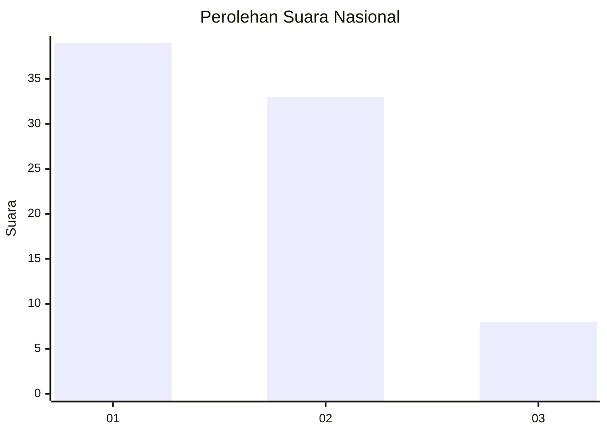
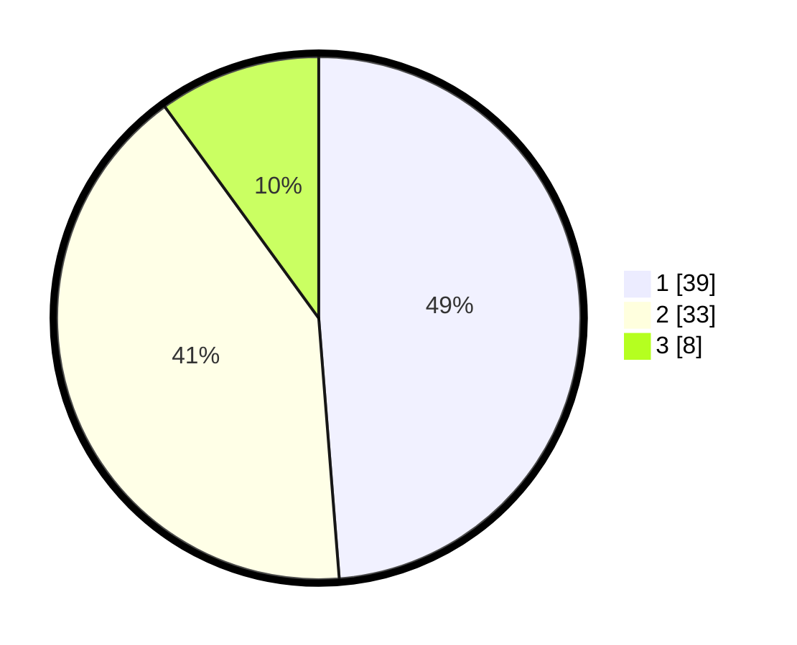

# Hasil

## Grafik

## Tabel

| No. | Nama Paslon    | Suara | Suara (raw) | Persentase |
|:--- |:-------------- | -----:| -----------:| ----------:|
| 1   | ANIES MUHAIMIN | 39    | [39][p-1]   | 48,75      |
| 2   | PRABOWO GIBRAN | 33    | [33][p-2]   | 41,25      |
| 3   | GANJAR MAHFUD  | 8     | [8][p-3]    | 10,00      |

[p-1]: https://github.com/gigit-pemilu/pemilu-2024/blob/main/pilpres/hitung-suara/sub/21-kepulauan-riau/sub/03-natuna/sub/18-bunguran-selatan/sub/2002-cemaga-selatan-(setengar)/sub/003-tps/sub/paslon-1.txt
[p-2]: https://github.com/gigit-pemilu/pemilu-2024/blob/main/pilpres/hitung-suara/sub/21-kepulauan-riau/sub/03-natuna/sub/18-bunguran-selatan/sub/2002-cemaga-selatan-(setengar)/sub/003-tps/sub/paslon-2.txt
[p-3]: https://github.com/gigit-pemilu/pemilu-2024/blob/main/pilpres/hitung-suara/sub/21-kepulauan-riau/sub/03-natuna/sub/18-bunguran-selatan/sub/2002-cemaga-selatan-(setengar)/sub/003-tps/sub/paslon-3.txt

## Foto C Plano

https://sirekap-obj-formc.kpu.go.id/e4ef/pemilu/ppwp/21/03/18/20/02/2103182002003-20240216-130659--131657da-f41a-442f-8338-72885d876fb0.jpg

https://sirekap-obj-formc.kpu.go.id/e4ef/pemilu/ppwp/21/03/18/20/02/2103182002003-20240216-130704--fb8e932a-ea2c-4ca5-9932-ec1ddafc9b4b.jpg

https://sirekap-obj-formc.kpu.go.id/e4ef/pemilu/ppwp/21/03/18/20/02/2103182002003-20240216-130702--94877bdb-1c62-4295-bcbc-63477264c278.jpg

## Metadata

| Key        | Value               |
| ---------- | ------------------- |
| Time Stamp | 2024-02-16 13:30:32 |

## DATA PEMILIH TETAP

Jumlah pemilih dalam DPT: **87**.
 * L: **44**.
 * P: **43**.

## DATA PENGGUNA HAK PILIH

Jumlah pengguna hak pilih dalam DPT: **87**.
 * L: **44**.
 * P: **43**.

Jumlah pengguna hak pilih dalam DPTb: **1**.
 * L: **0**.
 * P: **1**.

Jumlah pengguna hak pilih dalam DPK: **2**.
 * L: **2**.
 * P: **0**.

Jumlah pengguna hak pilih: **90**.
 * L: **46**.
 * P: **44**.

## JUMLAH SUARA SAH DAN TIDAK SAH

JUMLAH SELURUH SUARA SAH: **80**.

JUMLAH SUARA TIDAK SAH: **10**.

JUMLAH SELURUH SUARA SAH DAN SUARA TIDAK SAH: **90**.

