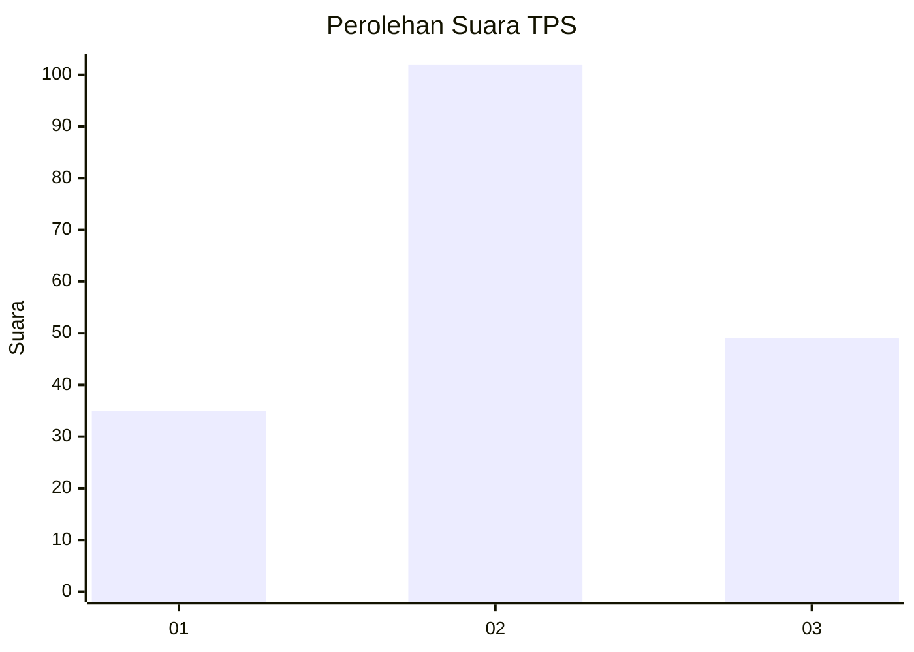
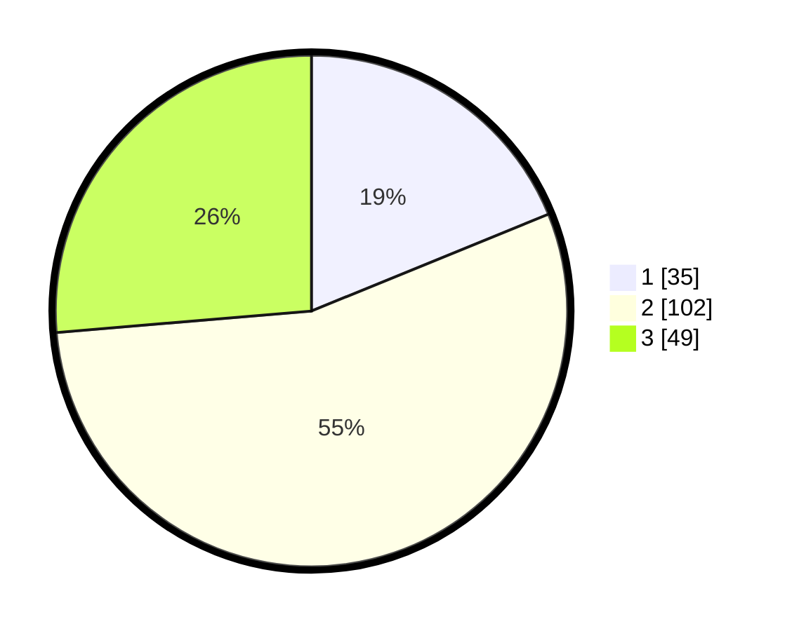

# Hasil

## Grafik

## Tabel

| No. | Nama Paslon    | Suara | Suara (raw) | Persentase |
|:--- |:-------------- | -----:| -----------:| ----------:|
| 1   | ANIES MUHAIMIN | 35    | [35][p-1]   | 18,82      |
| 2   | PRABOWO GIBRAN | 102   | [102][p-2]  | 54,84      |
| 3   | GANJAR MAHFUD  | 49    | [49][p-3]   | 26,34      |

[p-1]: https://github.com/gigit-pemilu/pemilu-2024-21-kepulauan-riau/blob/main/pilpres/hitung-suara/sub/21-kepulauan-riau/sub/04-lingga/sub/01-singkep/sub/1001-dabo/sub/005-tps/sub/paslon-1.txt
[p-2]: https://github.com/gigit-pemilu/pemilu-2024-21-kepulauan-riau/blob/main/pilpres/hitung-suara/sub/21-kepulauan-riau/sub/04-lingga/sub/01-singkep/sub/1001-dabo/sub/005-tps/sub/paslon-2.txt
[p-3]: https://github.com/gigit-pemilu/pemilu-2024-21-kepulauan-riau/blob/main/pilpres/hitung-suara/sub/21-kepulauan-riau/sub/04-lingga/sub/01-singkep/sub/1001-dabo/sub/005-tps/sub/paslon-3.txt

## Foto C Plano

https://sirekap-obj-formc.kpu.go.id/a4bb/pemilu/ppwp/21/04/01/10/01/2104011001005-20240215-001042--9c1b04d9-796e-435d-8052-9ed0bb343fbe.jpg

https://sirekap-obj-formc.kpu.go.id/a4bb/pemilu/ppwp/21/04/01/10/01/2104011001005-20240215-001512--697ec842-cc88-4422-be92-a0155f4c4849.jpg

https://sirekap-obj-formc.kpu.go.id/a4bb/pemilu/ppwp/21/04/01/10/01/2104011001005-20240215-002135--5b0e21da-b42d-4ea9-acb5-9b021e85e400.jpg

## Metadata

| Key        | Value               |
| ---------- | ------------------- |
| Time Stamp | 2024-02-15 21:30:27 |

