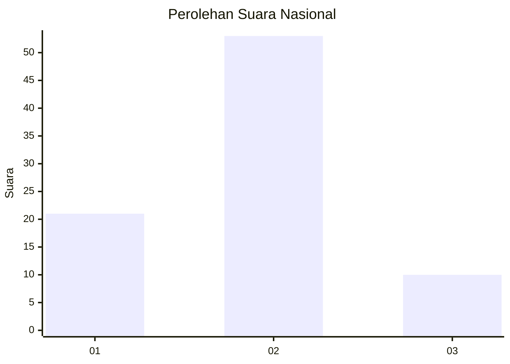
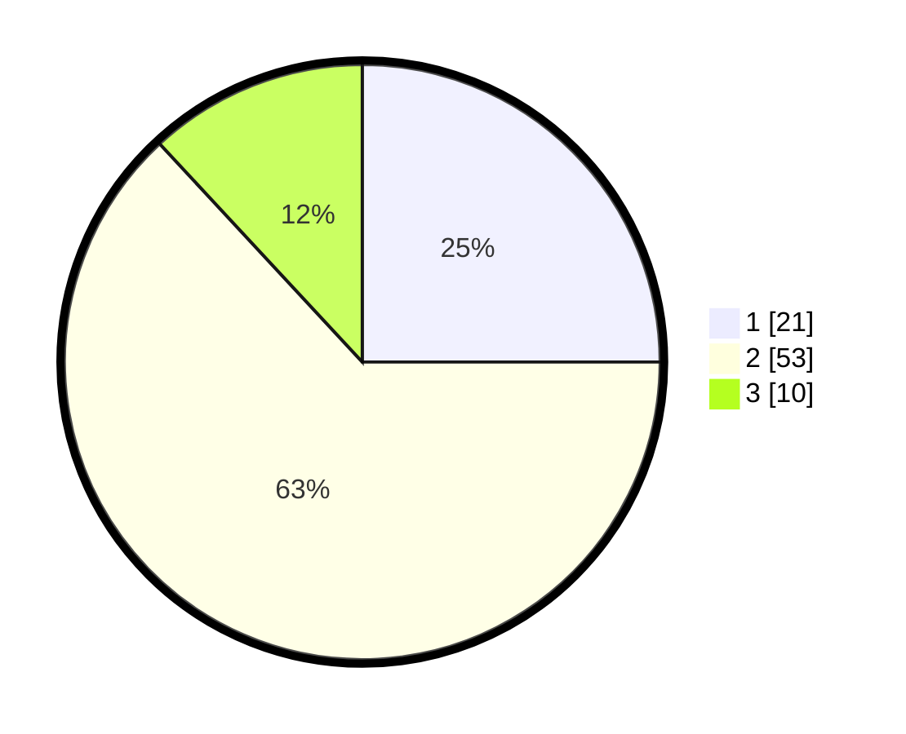

# Hasil

## Grafik

## Tabel

| No. | Nama Paslon    | Suara | Suara (raw) | Persentase |
|:--- |:-------------- | -----:| -----------:| ----------:|
| 1   | ANIES MUHAIMIN | 21    | [21][p-1]   | 25,00      |
| 2   | PRABOWO GIBRAN | 53    | [53][p-2]   | 63,10      |
| 3   | GANJAR MAHFUD  | 10    | [10][p-3]   | 11,90      |

[p-1]: https://github.com/gigit-pemilu/pemilu-2024/blob/main/pilpres/hitung-suara/sub/21-kepulauan-riau/sub/04-lingga/sub/01-singkep/sub/1001-dabo/sub/901-tps/sub/paslon-1.txt
[p-2]: https://github.com/gigit-pemilu/pemilu-2024/blob/main/pilpres/hitung-suara/sub/21-kepulauan-riau/sub/04-lingga/sub/01-singkep/sub/1001-dabo/sub/901-tps/sub/paslon-2.txt
[p-3]: https://github.com/gigit-pemilu/pemilu-2024/blob/main/pilpres/hitung-suara/sub/21-kepulauan-riau/sub/04-lingga/sub/01-singkep/sub/1001-dabo/sub/901-tps/sub/paslon-3.txt

## Foto C Plano

https://sirekap-obj-formc.kpu.go.id/ef9b/pemilu/ppwp/21/04/01/10/01/2104011001901-20240214-201122--31fb6a86-e699-493d-bcd1-14ac3acc564f.jpg

https://sirekap-obj-formc.kpu.go.id/ef9b/pemilu/ppwp/21/04/01/10/01/2104011001901-20240214-201205--020fe117-0c95-4f7d-96b3-863d54566a29.jpg

https://sirekap-obj-formc.kpu.go.id/ef9b/pemilu/ppwp/21/04/01/10/01/2104011001901-20240214-201250--fdc99dad-15fb-4c87-bbc6-bbaf91778b79.jpg

## Metadata

| Key        | Value               |
| ---------- | ------------------- |
| Time Stamp | 2024-02-15 00:41:44 |

## DATA PEMILIH TETAP

Jumlah pemilih dalam DPT: **49**.
 * L: **48**.
 * P: **1**.

## DATA PENGGUNA HAK PILIH

Jumlah pengguna hak pilih dalam DPT: **38**.
 * L: **37**.
 * P: **1**.

Jumlah pengguna hak pilih dalam DPTb: **49**.
 * L: **48**.
 * P: **1**.

Jumlah pengguna hak pilih dalam DPK: **0**.
 * L: **0**.
 * P: **0**.

Jumlah pengguna hak pilih: **87**.
 * L: **85**.
 * P: **2**.

## JUMLAH SUARA SAH DAN TIDAK SAH

JUMLAH SELURUH SUARA SAH: **84**.

JUMLAH SUARA TIDAK SAH: **3**.

JUMLAH SELURUH SUARA SAH DAN SUARA TIDAK SAH: **87**.

