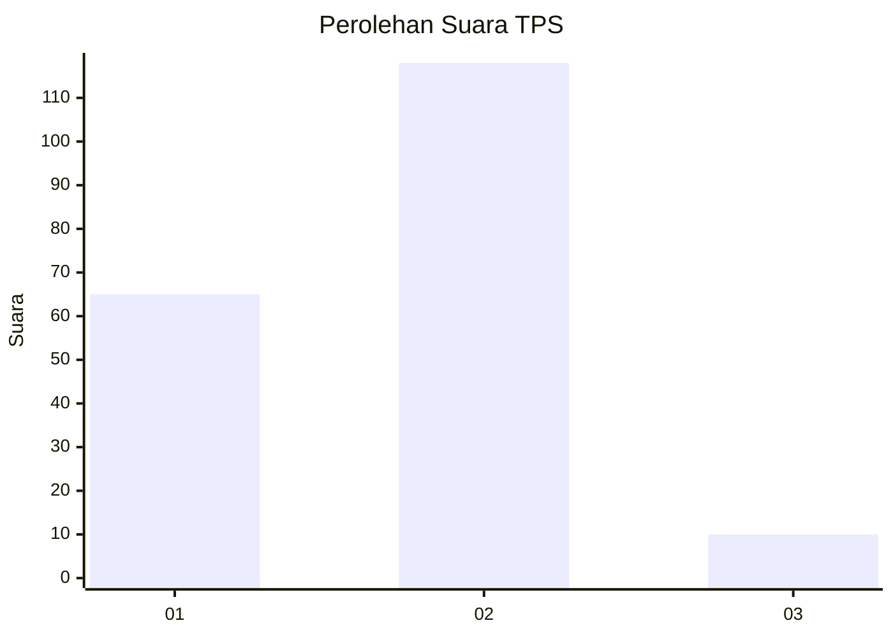
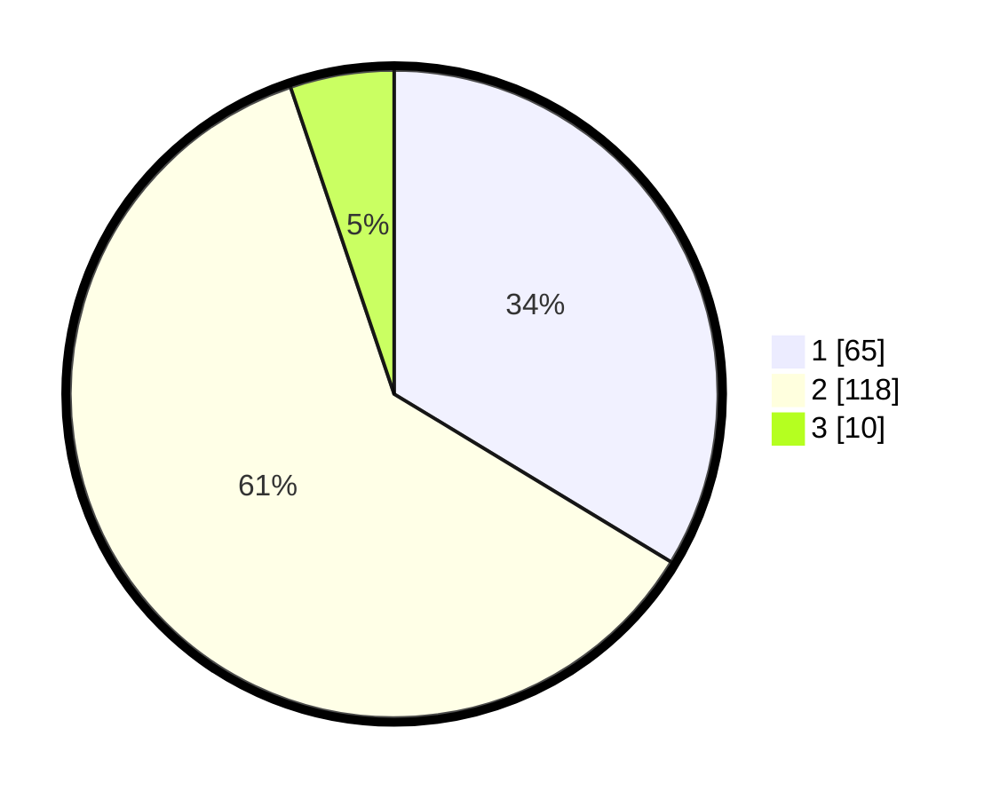

# Hasil

## Grafik

## Tabel

| No. | Nama Paslon    | Suara | Suara (raw) | Persentase |
|:--- |:-------------- | -----:| -----------:| ----------:|
| 1   | ANIES MUHAIMIN | 65    | [65][p-1]   | 33,68      |
| 2   | PRABOWO GIBRAN | 118   | [118][p-2]  | 61,14      |
| 3   | GANJAR MAHFUD  | 10    | [10][p-3]   | 5,18       |

[p-1]: https://github.com/gigit-pemilu/pemilu-2024-21-kepulauan-riau/blob/main/pilpres/hitung-suara/sub/21-kepulauan-riau/sub/04-lingga/sub/01-singkep/sub/1007-dabo-lama/sub/011-tps/sub/paslon-1.txt
[p-2]: https://github.com/gigit-pemilu/pemilu-2024-21-kepulauan-riau/blob/main/pilpres/hitung-suara/sub/21-kepulauan-riau/sub/04-lingga/sub/01-singkep/sub/1007-dabo-lama/sub/011-tps/sub/paslon-2.txt
[p-3]: https://github.com/gigit-pemilu/pemilu-2024-21-kepulauan-riau/blob/main/pilpres/hitung-suara/sub/21-kepulauan-riau/sub/04-lingga/sub/01-singkep/sub/1007-dabo-lama/sub/011-tps/sub/paslon-3.txt

## Foto C Plano

https://sirekap-obj-formc.kpu.go.id/9c21/pemilu/ppwp/21/04/01/10/07/2104011007011-20240215-044909--a3cefe35-e61b-49c2-9826-401edc1ac5e1.jpg

https://sirekap-obj-formc.kpu.go.id/9c21/pemilu/ppwp/21/04/01/10/07/2104011007011-20240215-103208--8ddac130-5177-44fe-95b0-925653ef5acd.jpg

https://sirekap-obj-formc.kpu.go.id/9c21/pemilu/ppwp/21/04/01/10/07/2104011007011-20240215-103556--df031f4b-3998-4ae8-9588-5cc486a8f9e7.jpg

## Metadata

| Key        | Value               |
| ---------- | ------------------- |
| Time Stamp | 2024-02-15 21:01:18 |

