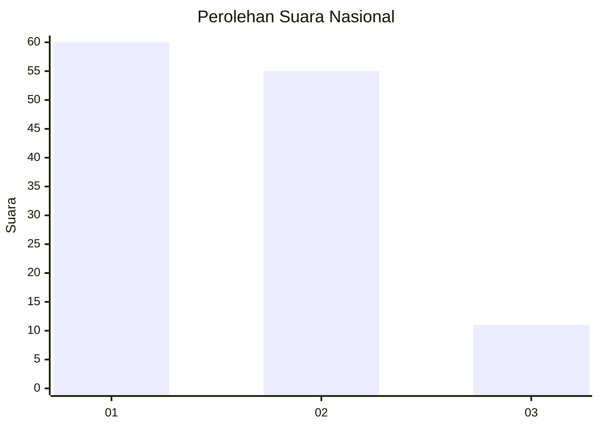
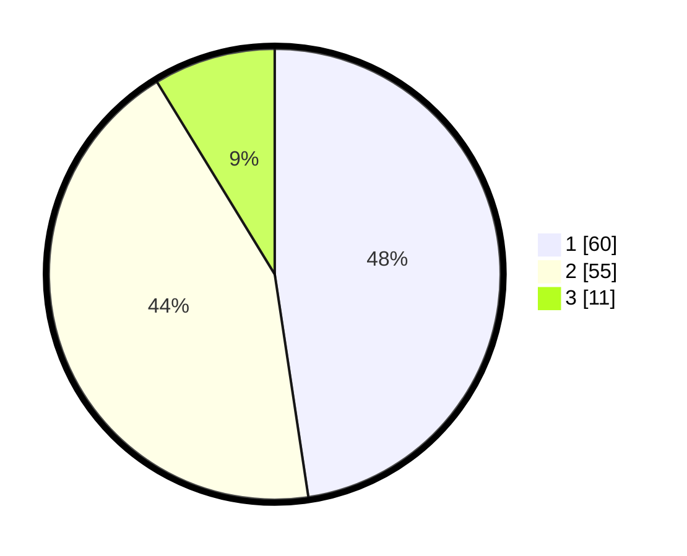

# Hasil

## Grafik

## Tabel

| No. | Nama Paslon    | Suara | Suara (raw) | Persentase |
|:--- |:-------------- | -----:| -----------:| ----------:|
| 1   | ANIES MUHAIMIN | 60    | [60][p-1]   | 47,62      |
| 2   | PRABOWO GIBRAN | 55    | [55][p-2]   | 43,65      |
| 3   | GANJAR MAHFUD  | 11    | [11][p-3]   | 8,73       |

[p-1]: https://github.com/gigit-pemilu/pemilu-2024/blob/main/pilpres/hitung-suara/sub/21-kepulauan-riau/sub/04-lingga/sub/01-singkep/sub/2009-tanjung-harapan/sub/002-tps/sub/paslon-1.txt
[p-2]: https://github.com/gigit-pemilu/pemilu-2024/blob/main/pilpres/hitung-suara/sub/21-kepulauan-riau/sub/04-lingga/sub/01-singkep/sub/2009-tanjung-harapan/sub/002-tps/sub/paslon-2.txt
[p-3]: https://github.com/gigit-pemilu/pemilu-2024/blob/main/pilpres/hitung-suara/sub/21-kepulauan-riau/sub/04-lingga/sub/01-singkep/sub/2009-tanjung-harapan/sub/002-tps/sub/paslon-3.txt

## Foto C Plano

https://sirekap-obj-formc.kpu.go.id/a24b/pemilu/ppwp/21/04/01/20/09/2104012009002-20240214-232029--4e9f4a5c-113c-4123-8d82-b3bc8235f1b3.jpg

https://sirekap-obj-formc.kpu.go.id/a24b/pemilu/ppwp/21/04/01/20/09/2104012009002-20240214-232134--4cd3f1f5-9661-4788-88f4-754ddd08e2dc.jpg

https://sirekap-obj-formc.kpu.go.id/a24b/pemilu/ppwp/21/04/01/20/09/2104012009002-20240214-232254--d9ed12fc-f6a7-4d87-931d-c1f1d89442b8.jpg

## Metadata

| Key        | Value               |
| ---------- | ------------------- |
| Time Stamp | 2024-02-15 06:00:23 |

