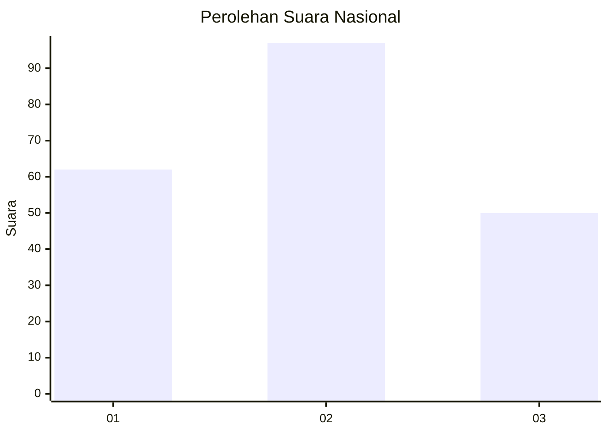
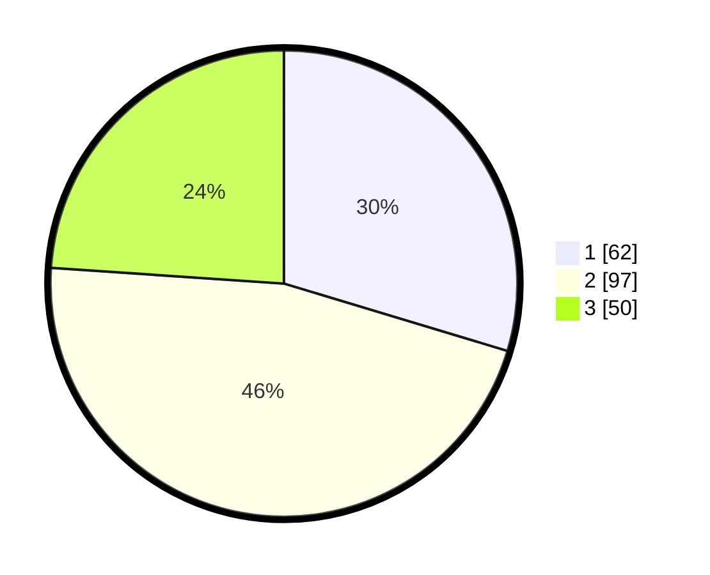

# Hasil

## Grafik

## Tabel

| No. | Nama Paslon    | Suara | Suara (raw) | Persentase |
|:--- |:-------------- | -----:| -----------:| ----------:|
| 1   | ANIES MUHAIMIN | 62    | [62][p-1]   | 29,67      |
| 2   | PRABOWO GIBRAN | 97    | [97][p-2]   | 46,41      |
| 3   | GANJAR MAHFUD  | 50    | [50][p-3]   | 23,92      |

[p-1]: https://github.com/gigit-pemilu/pemilu-2024/blob/main/pilpres/hitung-suara/sub/21-kepulauan-riau/sub/04-lingga/sub/01-singkep/sub/2010-batu-kacang/sub/001-tps/sub/paslon-1.txt
[p-2]: https://github.com/gigit-pemilu/pemilu-2024/blob/main/pilpres/hitung-suara/sub/21-kepulauan-riau/sub/04-lingga/sub/01-singkep/sub/2010-batu-kacang/sub/001-tps/sub/paslon-2.txt
[p-3]: https://github.com/gigit-pemilu/pemilu-2024/blob/main/pilpres/hitung-suara/sub/21-kepulauan-riau/sub/04-lingga/sub/01-singkep/sub/2010-batu-kacang/sub/001-tps/sub/paslon-3.txt

## Foto C Plano

https://sirekap-obj-formc.kpu.go.id/caa4/pemilu/ppwp/21/04/01/20/10/2104012010001-20240218-102521--5bdc6a48-89c4-4d22-b98a-6f1fb20b53a5.jpg

https://sirekap-obj-formc.kpu.go.id/caa4/pemilu/ppwp/21/04/01/20/10/2104012010001-20240218-102617--9daa7060-81b9-4b69-8c47-47380c08d429.jpg

https://sirekap-obj-formc.kpu.go.id/caa4/pemilu/ppwp/21/04/01/20/10/2104012010001-20240218-103627--a9a4dc22-f004-4fc1-a062-9e0c319617fe.jpg

## Metadata

| Key        | Value               |
| ---------- | ------------------- |
| Time Stamp | 2024-02-19 06:16:00 |

