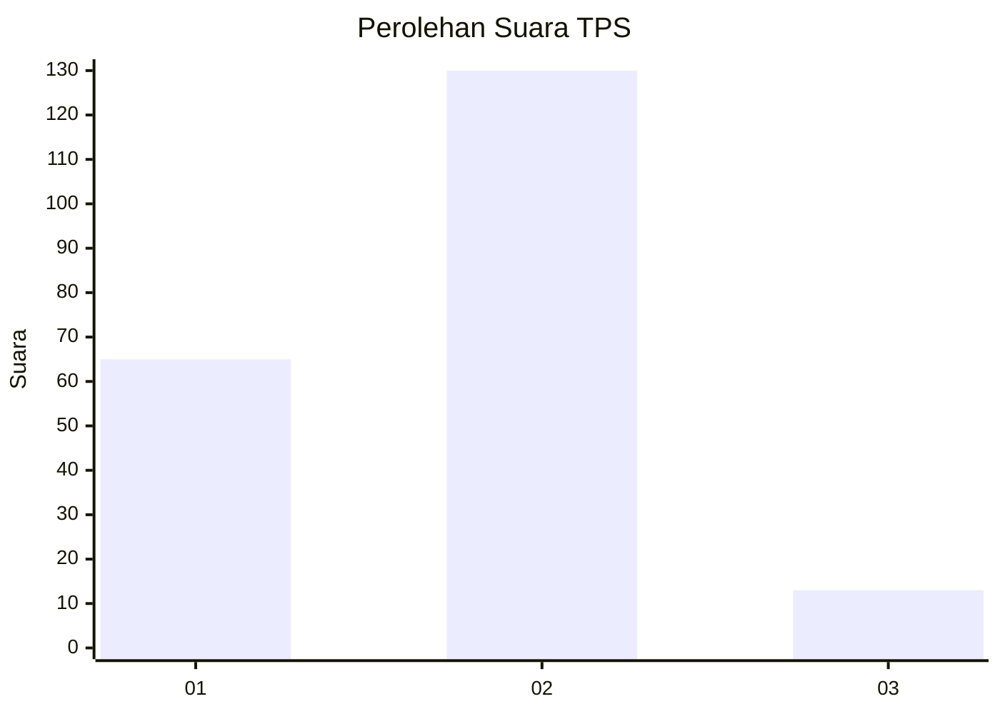
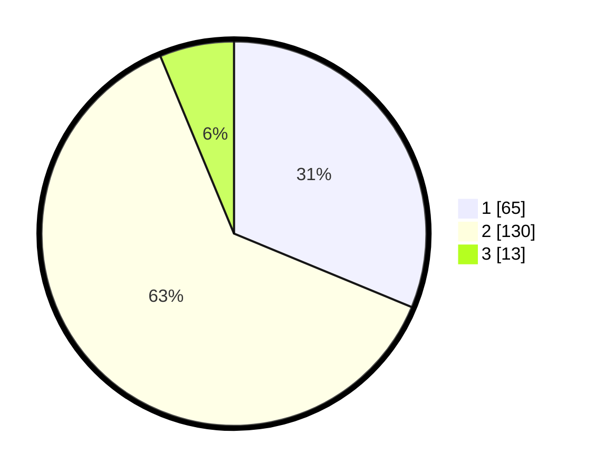

# Hasil

## Grafik

## Tabel

| No. | Nama Paslon    | Suara | Suara (raw) | Persentase |
|:--- |:-------------- | -----:| -----------:| ----------:|
| 1   | ANIES MUHAIMIN | 65    | [65][p-1]   | 31,25      |
| 2   | PRABOWO GIBRAN | 130   | [130][p-2]  | 62,50      |
| 3   | GANJAR MAHFUD  | 13    | [13][p-3]   | 6,25       |

[p-1]: https://github.com/gigit-pemilu/pemilu-2024-21-kepulauan-riau/blob/main/pilpres/hitung-suara/sub/21-kepulauan-riau/sub/04-lingga/sub/03-senayang/sub/1001-senayang/sub/005-tps/sub/paslon-1.txt
[p-2]: https://github.com/gigit-pemilu/pemilu-2024-21-kepulauan-riau/blob/main/pilpres/hitung-suara/sub/21-kepulauan-riau/sub/04-lingga/sub/03-senayang/sub/1001-senayang/sub/005-tps/sub/paslon-2.txt
[p-3]: https://github.com/gigit-pemilu/pemilu-2024-21-kepulauan-riau/blob/main/pilpres/hitung-suara/sub/21-kepulauan-riau/sub/04-lingga/sub/03-senayang/sub/1001-senayang/sub/005-tps/sub/paslon-3.txt

## Foto C Plano

https://sirekap-obj-formc.kpu.go.id/2001/pemilu/ppwp/21/04/03/10/01/2104031001005-20240215-004101--4c0de33b-0b35-49a0-a3cf-82739724d3c9.jpg

https://sirekap-obj-formc.kpu.go.id/2001/pemilu/ppwp/21/04/03/10/01/2104031001005-20240215-004159--061cf850-ed01-4be0-802e-0df02c859cb1.jpg

https://sirekap-obj-formc.kpu.go.id/2001/pemilu/ppwp/21/04/03/10/01/2104031001005-20240215-004220--189b334b-6d17-4823-be85-3705bfa4e474.jpg

## Metadata

| Key        | Value               |
| ---------- | ------------------- |
| Time Stamp | 2024-02-15 15:00:29 |

