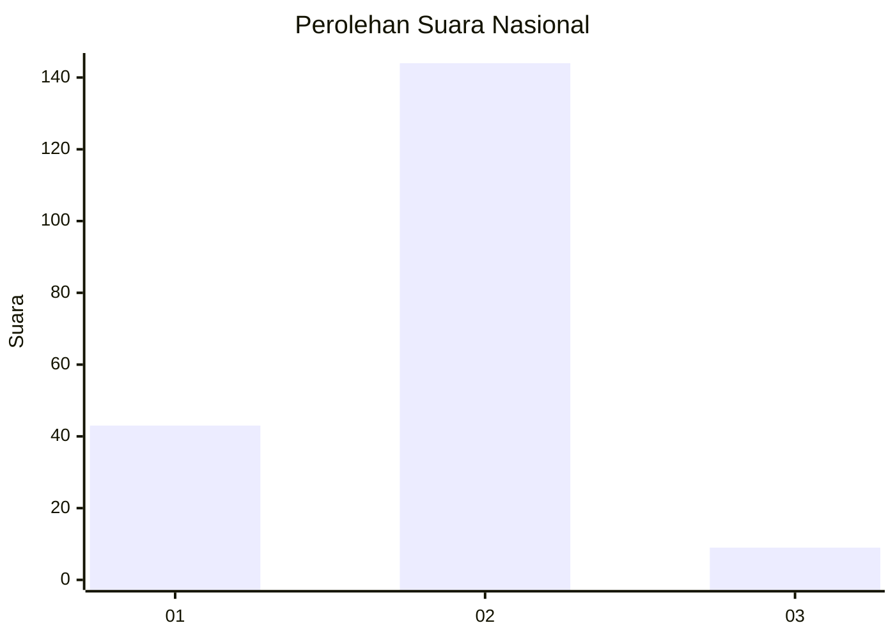
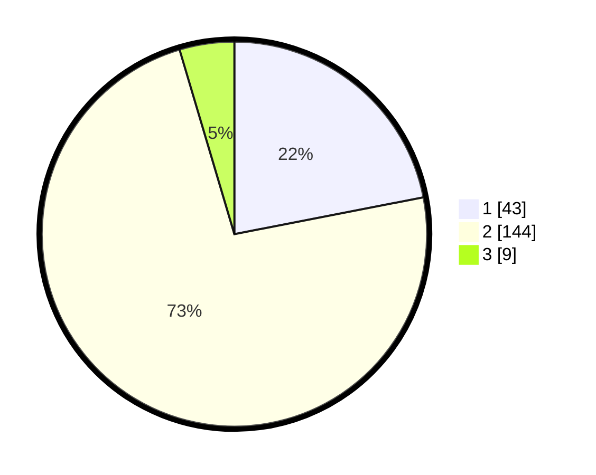

# Hasil

## Grafik

## Tabel

| No. | Nama Paslon    | Suara | Suara (raw) | Persentase |
|:--- |:-------------- | -----:| -----------:| ----------:|
| 1   | ANIES MUHAIMIN | 43    | [43][p-1]   | 21,94      |
| 2   | PRABOWO GIBRAN | 144   | [144][p-2]  | 73,47      |
| 3   | GANJAR MAHFUD  | 9     | [9][p-3]    | 4,59       |

[p-1]: https://github.com/gigit-pemilu/pemilu-2024/blob/main/pilpres/hitung-suara/sub/21-kepulauan-riau/sub/04-lingga/sub/04-singkep-barat/sub/2001-bakong/sub/001-tps/sub/paslon-1.txt
[p-2]: https://github.com/gigit-pemilu/pemilu-2024/blob/main/pilpres/hitung-suara/sub/21-kepulauan-riau/sub/04-lingga/sub/04-singkep-barat/sub/2001-bakong/sub/001-tps/sub/paslon-2.txt
[p-3]: https://github.com/gigit-pemilu/pemilu-2024/blob/main/pilpres/hitung-suara/sub/21-kepulauan-riau/sub/04-lingga/sub/04-singkep-barat/sub/2001-bakong/sub/001-tps/sub/paslon-3.txt

## Foto C Plano

https://sirekap-obj-formc.kpu.go.id/45f6/pemilu/ppwp/21/04/04/20/01/2104042001001-20240215-015903--d23463b7-1db8-4a4a-9276-b33108ad22a8.jpg

https://sirekap-obj-formc.kpu.go.id/45f6/pemilu/ppwp/21/04/04/20/01/2104042001001-20240215-015908--775d107f-a4ec-4642-a304-d2a7caf4bf86.jpg

https://sirekap-obj-formc.kpu.go.id/45f6/pemilu/ppwp/21/04/04/20/01/2104042001001-20240215-015914--efb016d8-2133-4cf7-be39-c7b5e132d171.jpg

## Metadata

| Key        | Value               |
| ---------- | ------------------- |
| Time Stamp | 2024-02-15 12:00:28 |

