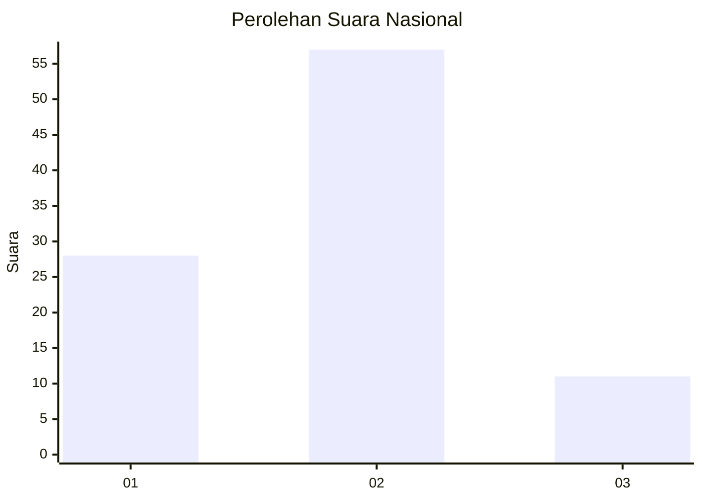
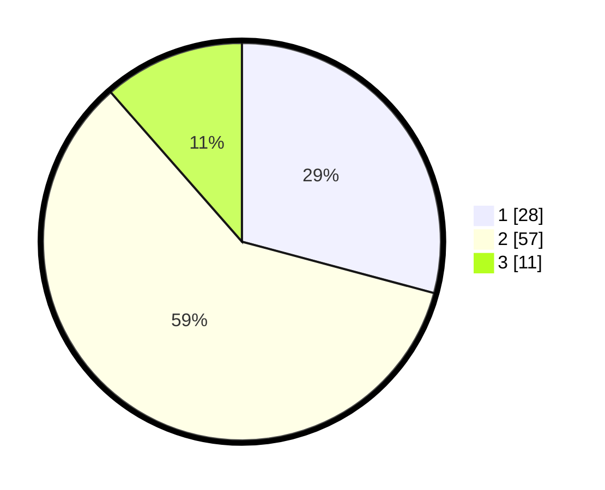

# Hasil

## Grafik

## Tabel

| No. | Nama Paslon    | Suara | Suara (raw) | Persentase |
|:--- |:-------------- | -----:| -----------:| ----------:|
| 1   | ANIES MUHAIMIN | 28    | [28][p-1]   | 29,17      |
| 2   | PRABOWO GIBRAN | 57    | [57][p-2]   | 59,38      |
| 3   | GANJAR MAHFUD  | 11    | [11][p-3]   | 11,46      |

[p-1]: https://github.com/gigit-pemilu/pemilu-2024/blob/main/pilpres/hitung-suara/sub/21-kepulauan-riau/sub/04-lingga/sub/04-singkep-barat/sub/2001-bakong/sub/002-tps/sub/paslon-1.txt
[p-2]: https://github.com/gigit-pemilu/pemilu-2024/blob/main/pilpres/hitung-suara/sub/21-kepulauan-riau/sub/04-lingga/sub/04-singkep-barat/sub/2001-bakong/sub/002-tps/sub/paslon-2.txt
[p-3]: https://github.com/gigit-pemilu/pemilu-2024/blob/main/pilpres/hitung-suara/sub/21-kepulauan-riau/sub/04-lingga/sub/04-singkep-barat/sub/2001-bakong/sub/002-tps/sub/paslon-3.txt

## Foto C Plano

https://sirekap-obj-formc.kpu.go.id/3321/pemilu/ppwp/21/04/04/20/01/2104042001002-20240215-211947--751ce243-ae08-4f44-8814-25335f02db08.jpg

https://sirekap-obj-formc.kpu.go.id/3321/pemilu/ppwp/21/04/04/20/01/2104042001002-20240215-211949--9716e384-141f-47c8-8c16-97ee2625bb2d.jpg

https://sirekap-obj-formc.kpu.go.id/3321/pemilu/ppwp/21/04/04/20/01/2104042001002-20240215-211948--fef93f23-320c-47a7-bfe4-a6a674bdb981.jpg

## Metadata

| Key        | Value               |
| ---------- | ------------------- |
| Time Stamp | 2024-02-15 21:30:27 |

## DATA PEMILIH TETAP

Jumlah pemilih dalam DPT: **110**.
 * L: **60**.
 * P: **50**.

## DATA PENGGUNA HAK PILIH

Jumlah pengguna hak pilih dalam DPT: **93**.
 * L: **49**.
 * P: **44**.

Jumlah pengguna hak pilih dalam DPTb: **3**.
 * L: **1**.
 * P: **2**.

Jumlah pengguna hak pilih dalam DPK: **1**.
 * L: **0**.
 * P: **1**.

Jumlah pengguna hak pilih: **97**.
 * L: **50**.
 * P: **47**.

## JUMLAH SUARA SAH DAN TIDAK SAH

JUMLAH SELURUH SUARA SAH: **96**.

JUMLAH SUARA TIDAK SAH: **1**.

JUMLAH SELURUH SUARA SAH DAN SUARA TIDAK SAH: **97**.

