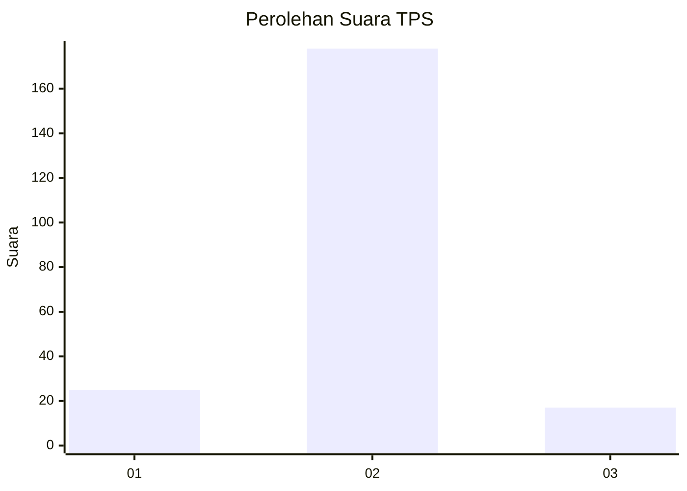
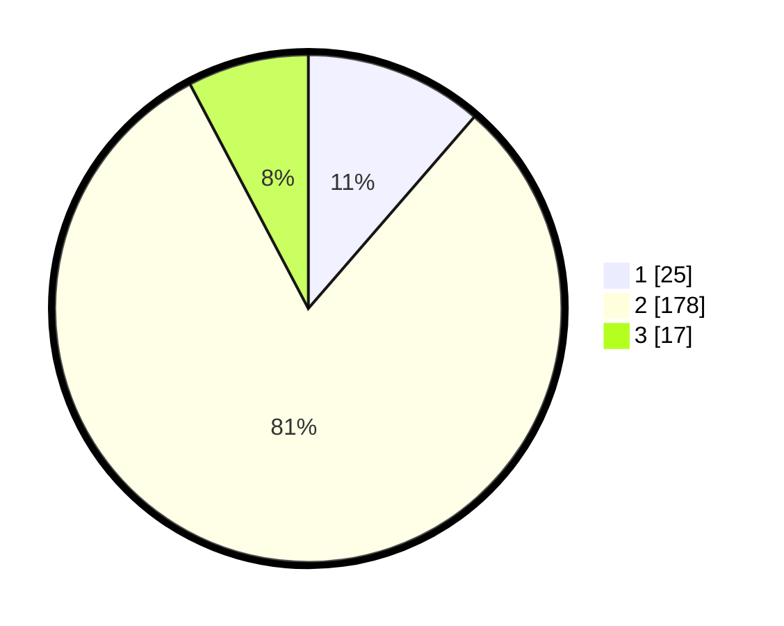

# Hasil

## Grafik

## Tabel

| No. | Nama Paslon    | Suara | Suara (raw) | Persentase |
|:--- |:-------------- | -----:| -----------:| ----------:|
| 1   | ANIES MUHAIMIN | 25    | [25][p-1]   | 11,36      |
| 2   | PRABOWO GIBRAN | 178   | [178][p-2]  | 80,91      |
| 3   | GANJAR MAHFUD  | 17    | [17][p-3]   | 7,73       |

[p-1]: https://github.com/gigit-pemilu/pemilu-2024-21-kepulauan-riau/blob/main/pilpres/hitung-suara/sub/21-kepulauan-riau/sub/04-lingga/sub/04-singkep-barat/sub/2001-bakong/sub/003-tps/sub/paslon-1.txt
[p-2]: https://github.com/gigit-pemilu/pemilu-2024-21-kepulauan-riau/blob/main/pilpres/hitung-suara/sub/21-kepulauan-riau/sub/04-lingga/sub/04-singkep-barat/sub/2001-bakong/sub/003-tps/sub/paslon-2.txt
[p-3]: https://github.com/gigit-pemilu/pemilu-2024-21-kepulauan-riau/blob/main/pilpres/hitung-suara/sub/21-kepulauan-riau/sub/04-lingga/sub/04-singkep-barat/sub/2001-bakong/sub/003-tps/sub/paslon-3.txt

## Foto C Plano

https://sirekap-obj-formc.kpu.go.id/bc50/pemilu/ppwp/21/04/04/20/01/2104042001003-20240214-210038--557c269f-5731-4b60-992a-a5ad5b1489d8.jpg

https://sirekap-obj-formc.kpu.go.id/bc50/pemilu/ppwp/21/04/04/20/01/2104042001003-20240214-210046--6178e155-e8e2-4ba1-bf2a-c7e6bd4009e4.jpg

https://sirekap-obj-formc.kpu.go.id/bc50/pemilu/ppwp/21/04/04/20/01/2104042001003-20240214-210051--3fdc3862-fd8c-4795-aa1a-82e37b72b86d.jpg

## Metadata

| Key        | Value               |
| ---------- | ------------------- |
| Time Stamp | 2024-02-15 12:00:28 |

