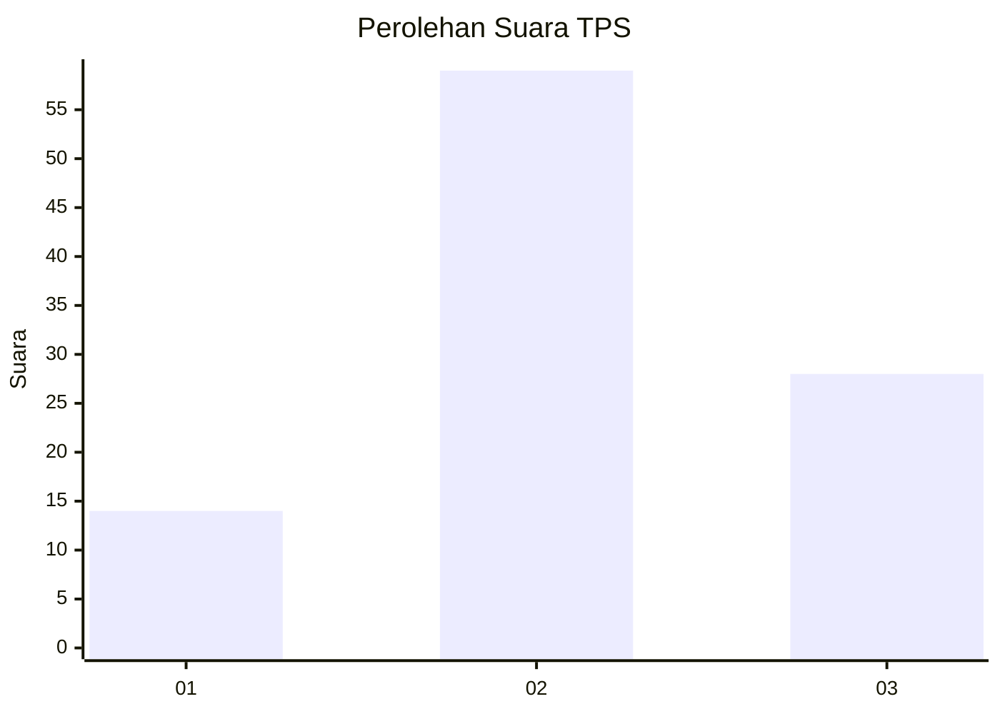
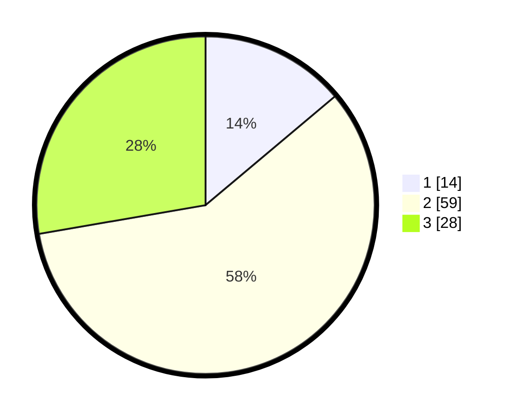

# Hasil

## Grafik

## Tabel

| No. | Nama Paslon    | Suara | Suara (raw) | Persentase |
|:--- |:-------------- | -----:| -----------:| ----------:|
| 1   | ANIES MUHAIMIN | 14    | [14][p-1]   | 13,86      |
| 2   | PRABOWO GIBRAN | 59    | [59][p-2]   | 58,42      |
| 3   | GANJAR MAHFUD  | 28    | [28][p-3]   | 27,72      |

[p-1]: https://github.com/gigit-pemilu/pemilu-2024-21-kepulauan-riau/blob/main/pilpres/hitung-suara/sub/21-kepulauan-riau/sub/04-lingga/sub/04-singkep-barat/sub/2003-marok-tua/sub/003-tps/sub/paslon-1.txt
[p-2]: https://github.com/gigit-pemilu/pemilu-2024-21-kepulauan-riau/blob/main/pilpres/hitung-suara/sub/21-kepulauan-riau/sub/04-lingga/sub/04-singkep-barat/sub/2003-marok-tua/sub/003-tps/sub/paslon-2.txt
[p-3]: https://github.com/gigit-pemilu/pemilu-2024-21-kepulauan-riau/blob/main/pilpres/hitung-suara/sub/21-kepulauan-riau/sub/04-lingga/sub/04-singkep-barat/sub/2003-marok-tua/sub/003-tps/sub/paslon-3.txt

## Foto C Plano

https://sirekap-obj-formc.kpu.go.id/6f82/pemilu/ppwp/21/04/04/20/03/2104042003003-20240214-141218--844f1a42-8f87-4eda-bd1e-166790c6ece4.jpg

https://sirekap-obj-formc.kpu.go.id/6f82/pemilu/ppwp/21/04/04/20/03/2104042003003-20240214-141206--67bde921-b8b5-490d-a4ed-471c412f84e8.jpg

https://sirekap-obj-formc.kpu.go.id/6f82/pemilu/ppwp/21/04/04/20/03/2104042003003-20240215-001023--108fc4b2-80e4-483b-b273-edc25440b2bb.jpg

## Metadata

| Key        | Value               |
| ---------- | ------------------- |
| Time Stamp | 2024-02-15 21:30:27 |

