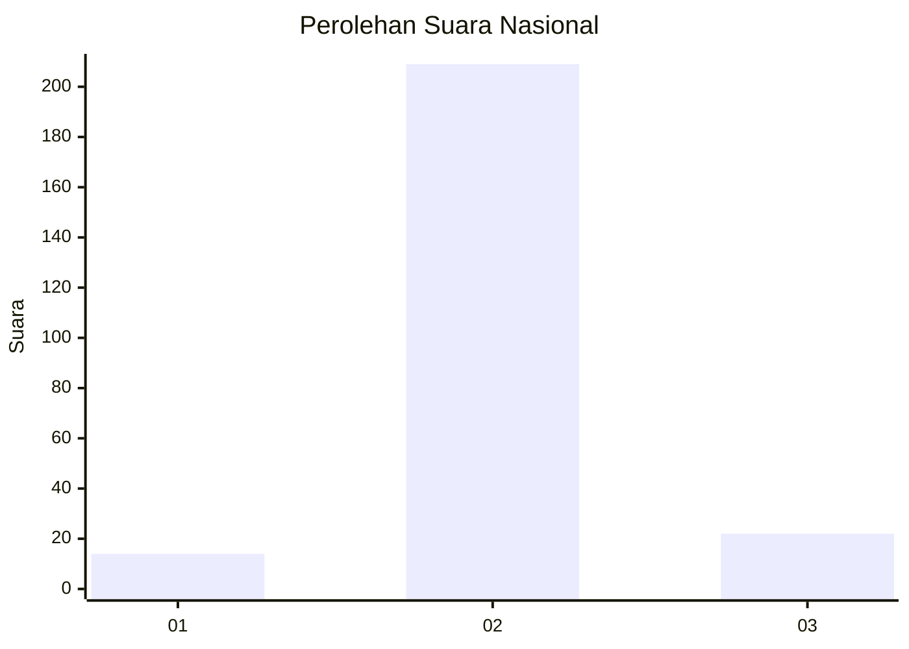
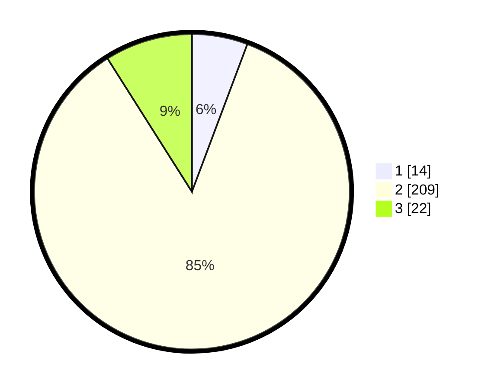

# Hasil

## Grafik

## Tabel

| No. | Nama Paslon    | Suara | Suara (raw) | Persentase |
|:--- |:-------------- | -----:| -----------:| ----------:|
| 1   | ANIES MUHAIMIN | 14    | [14][p-1]   | 5,71       |
| 2   | PRABOWO GIBRAN | 209   | [209][p-2]  | 85,31      |
| 3   | GANJAR MAHFUD  | 22    | [22][p-3]   | 8,98       |

[p-1]: https://github.com/gigit-pemilu/pemilu-2024/blob/main/pilpres/hitung-suara/sub/21-kepulauan-riau/sub/04-lingga/sub/04-singkep-barat/sub/2003-marok-tua/sub/005-tps/sub/paslon-1.txt
[p-2]: https://github.com/gigit-pemilu/pemilu-2024/blob/main/pilpres/hitung-suara/sub/21-kepulauan-riau/sub/04-lingga/sub/04-singkep-barat/sub/2003-marok-tua/sub/005-tps/sub/paslon-2.txt
[p-3]: https://github.com/gigit-pemilu/pemilu-2024/blob/main/pilpres/hitung-suara/sub/21-kepulauan-riau/sub/04-lingga/sub/04-singkep-barat/sub/2003-marok-tua/sub/005-tps/sub/paslon-3.txt

## Foto C Plano

https://sirekap-obj-formc.kpu.go.id/bc6a/pemilu/ppwp/21/04/04/20/03/2104042003005-20240216-180338--15f98350-aea9-4873-be7e-594726b44332.jpg

https://sirekap-obj-formc.kpu.go.id/bc6a/pemilu/ppwp/21/04/04/20/03/2104042003005-20240217-081646--09fb6577-aad9-4ab0-b96d-fb2fc7ca6d9f.jpg

https://sirekap-obj-formc.kpu.go.id/bc6a/pemilu/ppwp/21/04/04/20/03/2104042003005-20240217-081909--f1845416-1d8d-4638-bc73-49fe2e08885f.jpg

## Metadata

| Key        | Value               |
| ---------- | ------------------- |
| Time Stamp | 2024-02-20 15:00:00 |

