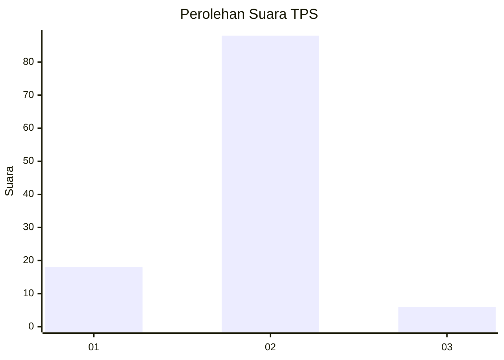
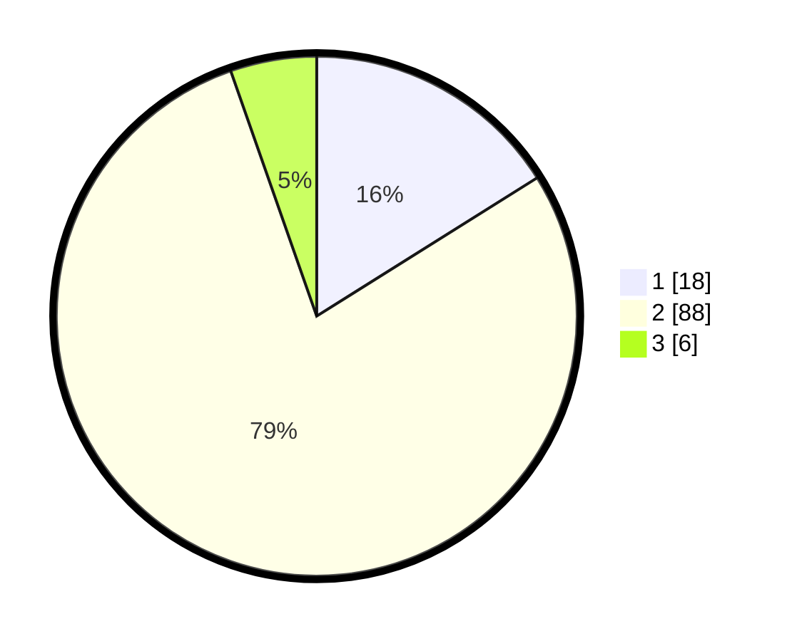

# Hasil

## Grafik

## Tabel

| No. | Nama Paslon    | Suara | Suara (raw) | Persentase |
|:--- |:-------------- | -----:| -----------:| ----------:|
| 1   | ANIES MUHAIMIN | 18    | [18][p-1]   | 16,07      |
| 2   | PRABOWO GIBRAN | 88    | [88][p-2]   | 78,57      |
| 3   | GANJAR MAHFUD  | 6     | [6][p-3]    | 5,36       |

[p-1]: https://github.com/gigit-pemilu/pemilu-2024-21-kepulauan-riau/blob/main/pilpres/hitung-suara/sub/21-kepulauan-riau/sub/04-lingga/sub/04-singkep-barat/sub/2014-tanjung-irat/sub/002-tps/sub/paslon-1.txt
[p-2]: https://github.com/gigit-pemilu/pemilu-2024-21-kepulauan-riau/blob/main/pilpres/hitung-suara/sub/21-kepulauan-riau/sub/04-lingga/sub/04-singkep-barat/sub/2014-tanjung-irat/sub/002-tps/sub/paslon-2.txt
[p-3]: https://github.com/gigit-pemilu/pemilu-2024-21-kepulauan-riau/blob/main/pilpres/hitung-suara/sub/21-kepulauan-riau/sub/04-lingga/sub/04-singkep-barat/sub/2014-tanjung-irat/sub/002-tps/sub/paslon-3.txt

## Foto C Plano

https://sirekap-obj-formc.kpu.go.id/c672/pemilu/ppwp/21/04/04/20/14/2104042014002-20240215-003049--165c1d23-e4b1-4fdd-aa9b-3c61d5b9515e.jpg

https://sirekap-obj-formc.kpu.go.id/c672/pemilu/ppwp/21/04/04/20/14/2104042014002-20240215-003108--d97ff72d-7c01-4e5d-9f8d-5320ef92f2fd.jpg

https://sirekap-obj-formc.kpu.go.id/c672/pemilu/ppwp/21/04/04/20/14/2104042014002-20240215-003125--2b86e988-edec-48b9-9c00-1173ac472bd7.jpg

## Metadata

| Key        | Value               |
| ---------- | ------------------- |
| Time Stamp | 2024-02-15 12:00:28 |

