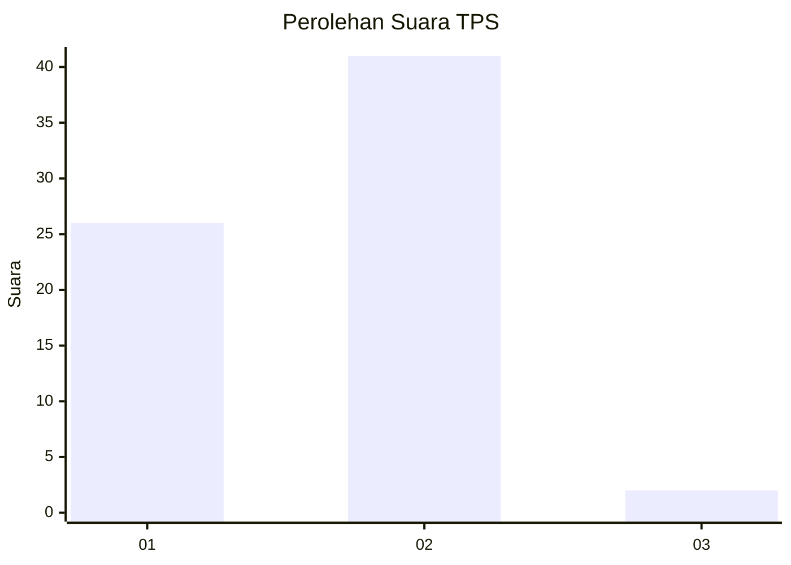
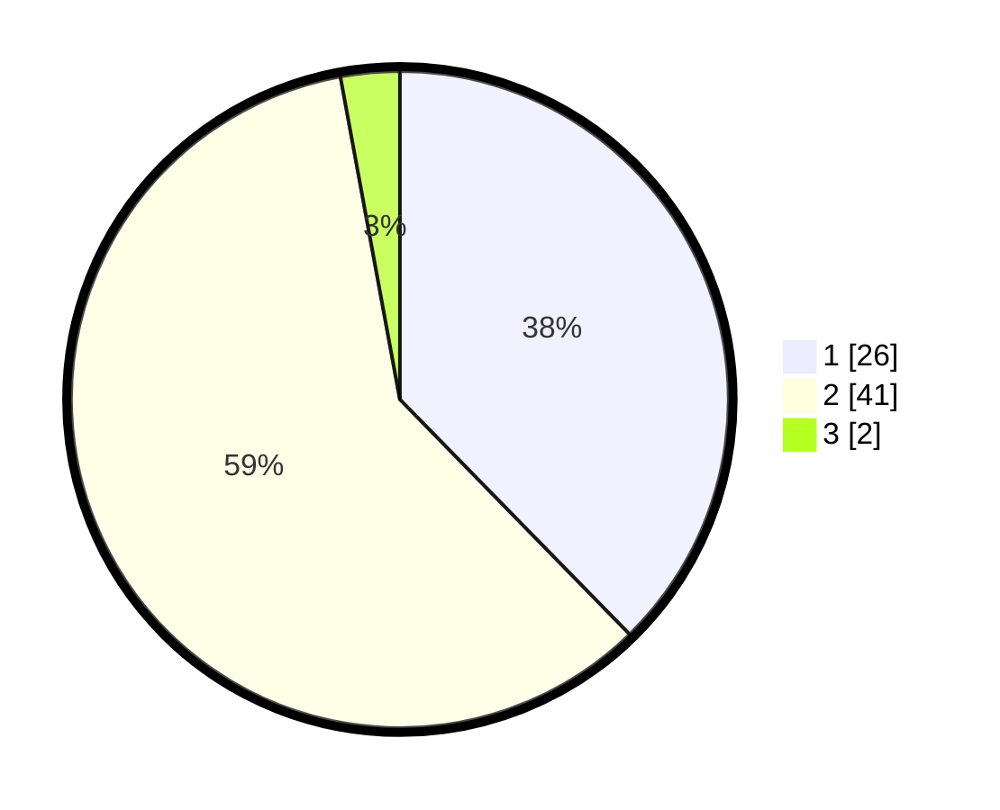

# Hasil

## Grafik

## Tabel

| No. | Nama Paslon    | Suara | Suara (raw) | Persentase |
|:--- |:-------------- | -----:| -----------:| ----------:|
| 1   | ANIES MUHAIMIN | 26    | [26][p-1]   | 37,68      |
| 2   | PRABOWO GIBRAN | 41    | [41][p-2]   | 59,42      |
| 3   | GANJAR MAHFUD  | 2     | [2][p-3]    | 2,90       |

[p-1]: https://github.com/gigit-pemilu/pemilu-2024-21-kepulauan-riau/blob/main/pilpres/hitung-suara/sub/21-kepulauan-riau/sub/04-lingga/sub/05-lingga-utara/sub/1007-pancur/sub/001-tps/sub/paslon-1.txt
[p-2]: https://github.com/gigit-pemilu/pemilu-2024-21-kepulauan-riau/blob/main/pilpres/hitung-suara/sub/21-kepulauan-riau/sub/04-lingga/sub/05-lingga-utara/sub/1007-pancur/sub/001-tps/sub/paslon-2.txt
[p-3]: https://github.com/gigit-pemilu/pemilu-2024-21-kepulauan-riau/blob/main/pilpres/hitung-suara/sub/21-kepulauan-riau/sub/04-lingga/sub/05-lingga-utara/sub/1007-pancur/sub/001-tps/sub/paslon-3.txt

## Foto C Plano

https://sirekap-obj-formc.kpu.go.id/efc3/pemilu/ppwp/21/04/05/10/07/2104051007001-20240214-203426--e9dcf9aa-3a05-46e7-9b2d-5e53e7a8b6d6.jpg

https://sirekap-obj-formc.kpu.go.id/efc3/pemilu/ppwp/21/04/05/10/07/2104051007001-20240214-230918--6a8bfaf1-3e80-4adc-abea-e1700f014c2a.jpg

https://sirekap-obj-formc.kpu.go.id/efc3/pemilu/ppwp/21/04/05/10/07/2104051007001-20240214-230948--5c07e057-14e0-4f18-bded-98f88ccac227.jpg

## Metadata

| Key        | Value               |
| ---------- | ------------------- |
| Time Stamp | 2024-02-15 23:29:50 |

