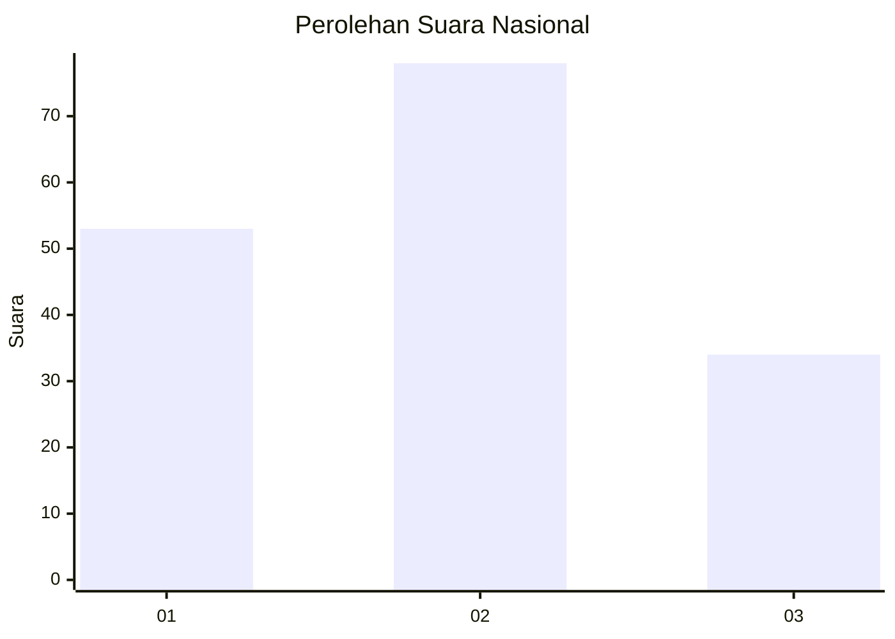
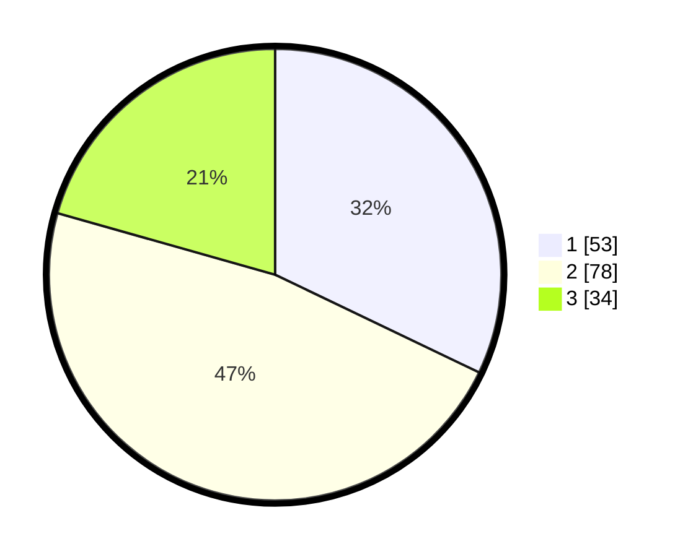

# Hasil

## Grafik

## Tabel

| No. | Nama Paslon    | Suara | Suara (raw) | Persentase |
|:--- |:-------------- | -----:| -----------:| ----------:|
| 1   | ANIES MUHAIMIN | 53    | [53][p-1]   | 32,12      |
| 2   | PRABOWO GIBRAN | 78    | [78][p-2]   | 47,27      |
| 3   | GANJAR MAHFUD  | 34    | [34][p-3]   | 20,61      |

[p-1]: https://github.com/gigit-pemilu/pemilu-2024/blob/main/pilpres/hitung-suara/sub/21-kepulauan-riau/sub/04-lingga/sub/07-lingga-timur/sub/2005-sungai-pinang/sub/004-tps/sub/paslon-1.txt
[p-2]: https://github.com/gigit-pemilu/pemilu-2024/blob/main/pilpres/hitung-suara/sub/21-kepulauan-riau/sub/04-lingga/sub/07-lingga-timur/sub/2005-sungai-pinang/sub/004-tps/sub/paslon-2.txt
[p-3]: https://github.com/gigit-pemilu/pemilu-2024/blob/main/pilpres/hitung-suara/sub/21-kepulauan-riau/sub/04-lingga/sub/07-lingga-timur/sub/2005-sungai-pinang/sub/004-tps/sub/paslon-3.txt

## Foto C Plano

https://sirekap-obj-formc.kpu.go.id/b12c/pemilu/ppwp/21/04/07/20/05/2104072005004-20240215-014813--d563faac-3fa3-4ddc-90a6-32a78c2f8cab.jpg

https://sirekap-obj-formc.kpu.go.id/b12c/pemilu/ppwp/21/04/07/20/05/2104072005004-20240216-143209--bc4dcb92-8fd7-4a5a-b041-64b9b60b4c05.jpg

https://sirekap-obj-formc.kpu.go.id/b12c/pemilu/ppwp/21/04/07/20/05/2104072005004-20240216-143208--8d3c461b-5cd6-4ecd-a24d-fd6cce5ab3b7.jpg

## Metadata

| Key        | Value               |
| ---------- | ------------------- |
| Time Stamp | 2024-02-16 16:25:10 |

