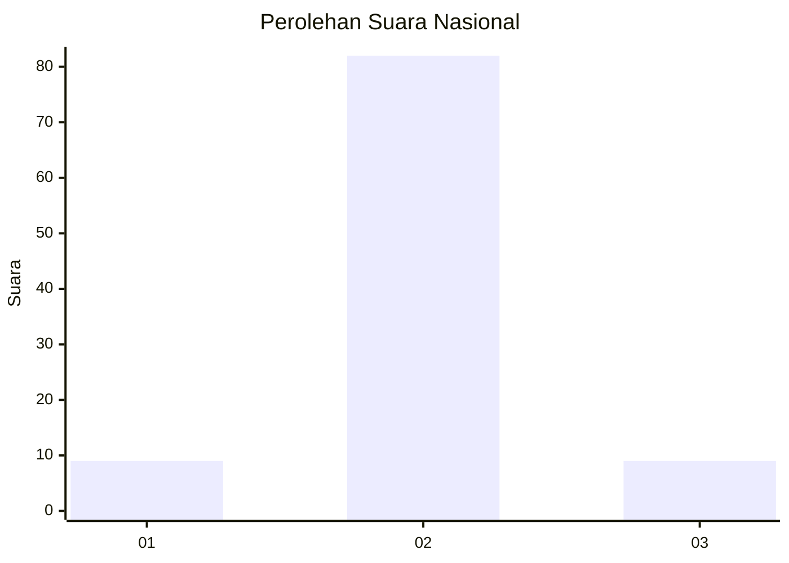
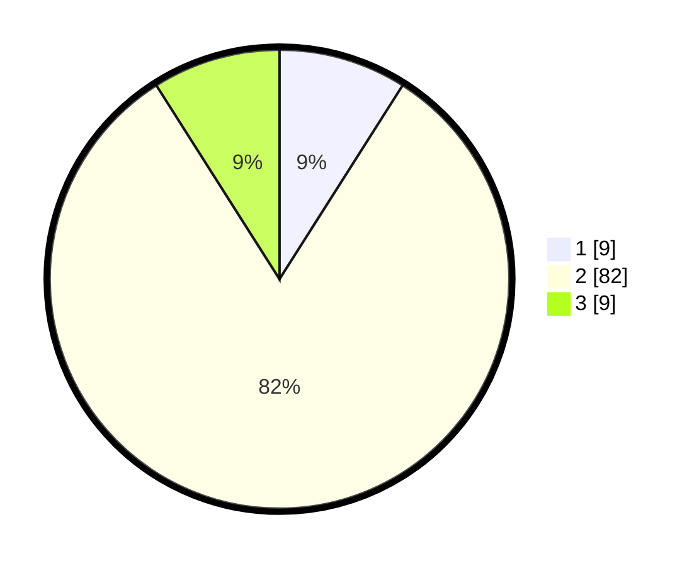

# Hasil

## Grafik

## Tabel

| No. | Nama Paslon    | Suara | Suara (raw) | Persentase |
|:--- |:-------------- | -----:| -----------:| ----------:|
| 1   | ANIES MUHAIMIN | 9     | [9][p-1]    | 9,00       |
| 2   | PRABOWO GIBRAN | 82    | [82][p-2]   | 82,00      |
| 3   | GANJAR MAHFUD  | 9     | [9][p-3]    | 9,00       |

[p-1]: https://github.com/gigit-pemilu/pemilu-2024/blob/main/pilpres/hitung-suara/sub/21-kepulauan-riau/sub/04-lingga/sub/09-singkep-selatan/sub/1004-berlian/sub/001-tps/sub/paslon-1.txt
[p-2]: https://github.com/gigit-pemilu/pemilu-2024/blob/main/pilpres/hitung-suara/sub/21-kepulauan-riau/sub/04-lingga/sub/09-singkep-selatan/sub/1004-berlian/sub/001-tps/sub/paslon-2.txt
[p-3]: https://github.com/gigit-pemilu/pemilu-2024/blob/main/pilpres/hitung-suara/sub/21-kepulauan-riau/sub/04-lingga/sub/09-singkep-selatan/sub/1004-berlian/sub/001-tps/sub/paslon-3.txt

## Foto C Plano

https://sirekap-obj-formc.kpu.go.id/583f/pemilu/ppwp/21/04/09/10/04/2104091004001-20240216-015211--ee76c8e4-895e-4fae-ad81-d1d58ac31cda.jpg

https://sirekap-obj-formc.kpu.go.id/583f/pemilu/ppwp/21/04/09/10/04/2104091004001-20240216-015222--54b90a69-ca7e-4393-892c-a33053f2629c.jpg

https://sirekap-obj-formc.kpu.go.id/583f/pemilu/ppwp/21/04/09/10/04/2104091004001-20240216-021423--e173910d-342d-4bff-9092-a12f23789ce6.jpg

## Metadata

| Key        | Value               |
| ---------- | ------------------- |
| Time Stamp | 2024-02-16 16:25:10 |

## DATA PEMILIH TETAP

Jumlah pemilih dalam DPT: **101**.
 * L: **50**.
 * P: **51**.

## DATA PENGGUNA HAK PILIH

Jumlah pengguna hak pilih dalam DPT: **86**.
 * L: **43**.
 * P: **43**.

Jumlah pengguna hak pilih dalam DPTb: **14**.
 * L: **9**.
 * P: **5**.

Jumlah pengguna hak pilih dalam DPK: **1**.
 * L: **1**.
 * P: **0**.

Jumlah pengguna hak pilih: **101**.
 * L: **53**.
 * P: **48**.

## JUMLAH SUARA SAH DAN TIDAK SAH

JUMLAH SELURUH SUARA SAH: **100**.

JUMLAH SUARA TIDAK SAH: **1**.

JUMLAH SELURUH SUARA SAH DAN SUARA TIDAK SAH: **101**.

