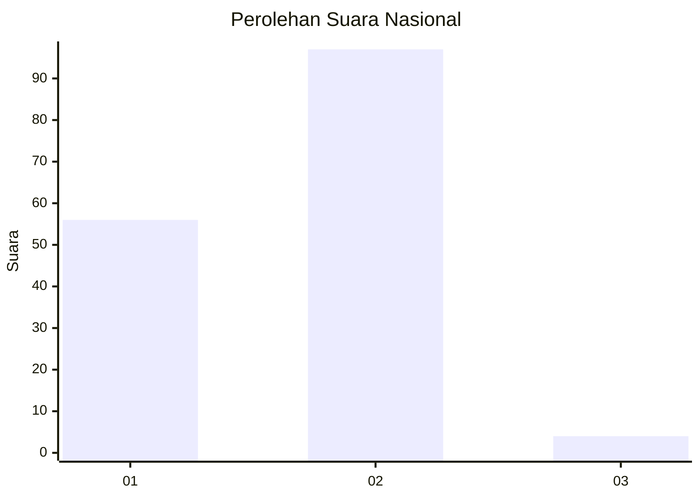
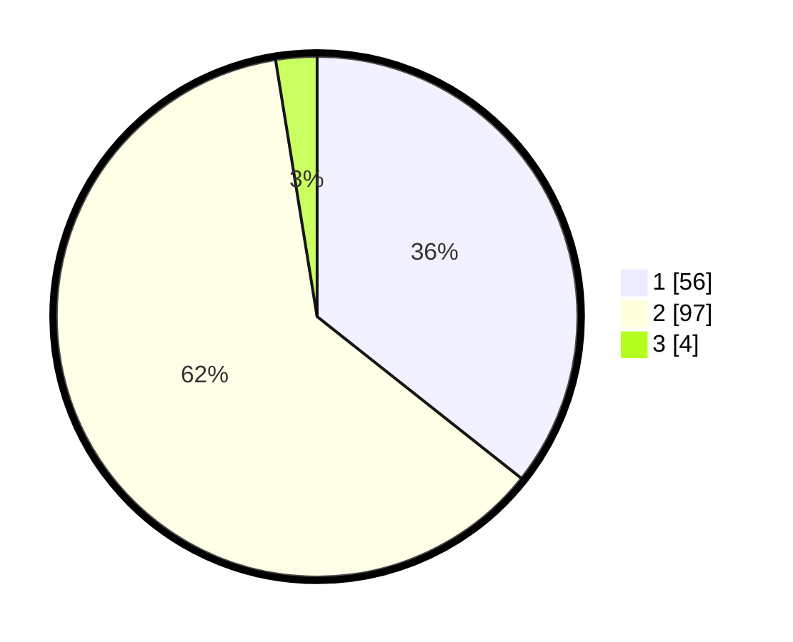

# Hasil

## Grafik

## Tabel

| No. | Nama Paslon    | Suara | Suara (raw) | Persentase |
|:--- |:-------------- | -----:| -----------:| ----------:|
| 1   | ANIES MUHAIMIN | 56    | [56][p-1]   | 35,67      |
| 2   | PRABOWO GIBRAN | 97    | [97][p-2]   | 61,78      |
| 3   | GANJAR MAHFUD  | 4     | [4][p-3]    | 2,55       |

[p-1]: https://github.com/gigit-pemilu/pemilu-2024/blob/main/pilpres/hitung-suara/sub/21-kepulauan-riau/sub/04-lingga/sub/09-singkep-selatan/sub/2001-marok-kecil/sub/005-tps/sub/paslon-1.txt
[p-2]: https://github.com/gigit-pemilu/pemilu-2024/blob/main/pilpres/hitung-suara/sub/21-kepulauan-riau/sub/04-lingga/sub/09-singkep-selatan/sub/2001-marok-kecil/sub/005-tps/sub/paslon-2.txt
[p-3]: https://github.com/gigit-pemilu/pemilu-2024/blob/main/pilpres/hitung-suara/sub/21-kepulauan-riau/sub/04-lingga/sub/09-singkep-selatan/sub/2001-marok-kecil/sub/005-tps/sub/paslon-3.txt

## Foto C Plano

https://sirekap-obj-formc.kpu.go.id/6ba6/pemilu/ppwp/21/04/09/20/01/2104092001005-20240215-030925--fa98f07b-9500-4d4e-9a17-027db3ac62ff.jpg

https://sirekap-obj-formc.kpu.go.id/6ba6/pemilu/ppwp/21/04/09/20/01/2104092001005-20240215-024801--d82af651-7c48-4e53-8e17-6f9ccdd587e2.jpg

https://sirekap-obj-formc.kpu.go.id/6ba6/pemilu/ppwp/21/04/09/20/01/2104092001005-20240215-000033--8a73315f-275f-4aa3-85d3-1c60b4e22af6.jpg

## Metadata

| Key        | Value               |
| ---------- | ------------------- |
| Time Stamp | 2024-02-15 12:00:28 |

