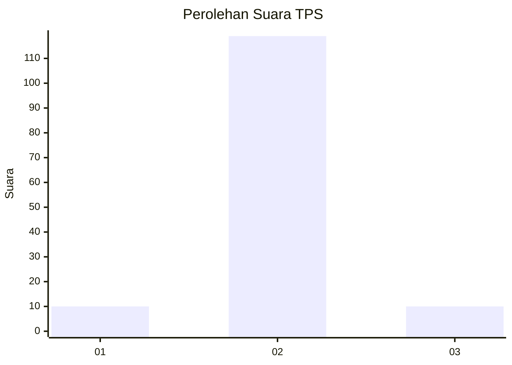
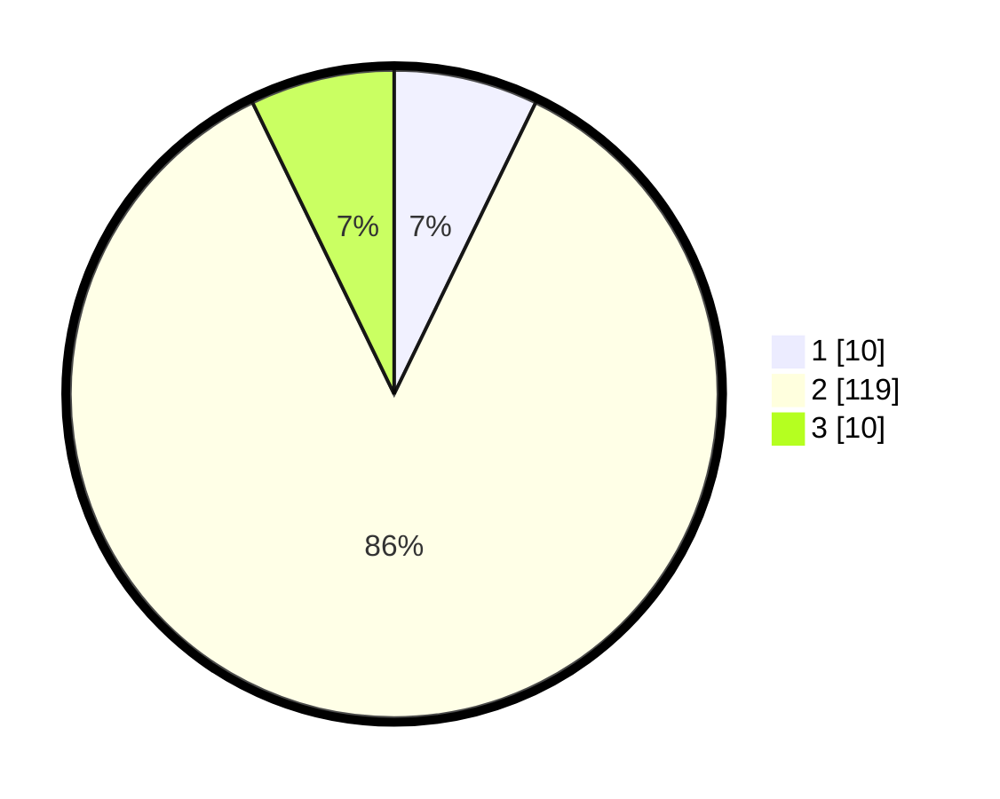

# Hasil

## Grafik

## Tabel

| No. | Nama Paslon    | Suara | Suara (raw) | Persentase |
|:--- |:-------------- | -----:| -----------:| ----------:|
| 1   | ANIES MUHAIMIN | 10    | [10][p-1]   | 7,19       |
| 2   | PRABOWO GIBRAN | 119   | [119][p-2]  | 85,61      |
| 3   | GANJAR MAHFUD  | 10    | [10][p-3]   | 7,19       |

[p-1]: https://github.com/gigit-pemilu/pemilu-2024-21-kepulauan-riau/blob/main/pilpres/hitung-suara/sub/21-kepulauan-riau/sub/04-lingga/sub/10-kepulauan-posek/sub/2002-posek/sub/001-tps/sub/paslon-1.txt
[p-2]: https://github.com/gigit-pemilu/pemilu-2024-21-kepulauan-riau/blob/main/pilpres/hitung-suara/sub/21-kepulauan-riau/sub/04-lingga/sub/10-kepulauan-posek/sub/2002-posek/sub/001-tps/sub/paslon-2.txt
[p-3]: https://github.com/gigit-pemilu/pemilu-2024-21-kepulauan-riau/blob/main/pilpres/hitung-suara/sub/21-kepulauan-riau/sub/04-lingga/sub/10-kepulauan-posek/sub/2002-posek/sub/001-tps/sub/paslon-3.txt

## Foto C Plano

https://sirekap-obj-formc.kpu.go.id/81df/pemilu/ppwp/21/04/10/20/02/2104102002001-20240214-195419--444f1e3a-f4a7-4b14-b41d-5c75de7f163c.jpg

https://sirekap-obj-formc.kpu.go.id/81df/pemilu/ppwp/21/04/10/20/02/2104102002001-20240214-195702--8d8bc8f5-9258-4622-b8d8-ec79da371704.jpg

https://sirekap-obj-formc.kpu.go.id/81df/pemilu/ppwp/21/04/10/20/02/2104102002001-20240214-195936--8beeaae7-5cb1-44e5-a79c-1dc9ae5ac1ef.jpg

## Metadata

| Key        | Value               |
| ---------- | ------------------- |
| Time Stamp | 2024-02-14 21:46:01 |

