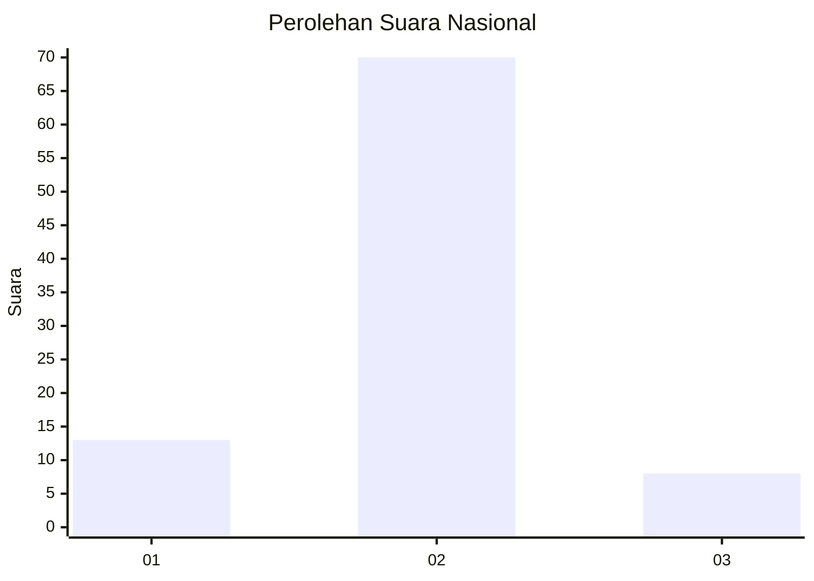
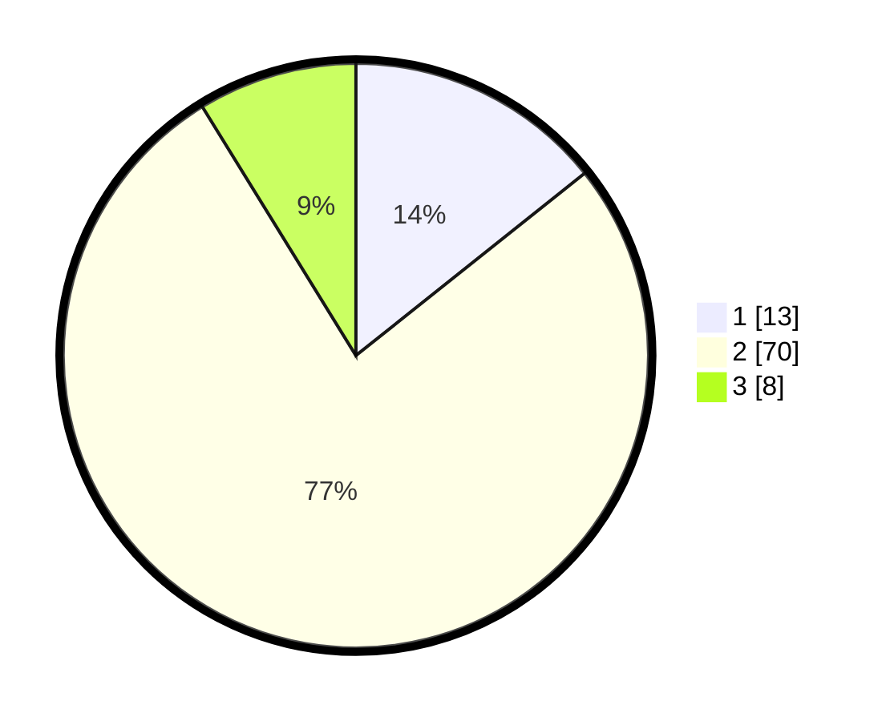

# Hasil

## Grafik

## Tabel

| No. | Nama Paslon    | Suara | Suara (raw) | Persentase |
|:--- |:-------------- | -----:| -----------:| ----------:|
| 1   | ANIES MUHAIMIN | 13    | [13][p-1]   | 14,29      |
| 2   | PRABOWO GIBRAN | 70    | [70][p-2]   | 76,92      |
| 3   | GANJAR MAHFUD  | 8     | [8][p-3]    | 8,79       |

[p-1]: https://github.com/gigit-pemilu/pemilu-2024/blob/main/pilpres/hitung-suara/sub/21-kepulauan-riau/sub/04-lingga/sub/10-kepulauan-posek/sub/2002-posek/sub/003-tps/sub/paslon-1.txt
[p-2]: https://github.com/gigit-pemilu/pemilu-2024/blob/main/pilpres/hitung-suara/sub/21-kepulauan-riau/sub/04-lingga/sub/10-kepulauan-posek/sub/2002-posek/sub/003-tps/sub/paslon-2.txt
[p-3]: https://github.com/gigit-pemilu/pemilu-2024/blob/main/pilpres/hitung-suara/sub/21-kepulauan-riau/sub/04-lingga/sub/10-kepulauan-posek/sub/2002-posek/sub/003-tps/sub/paslon-3.txt

## Foto C Plano

https://sirekap-obj-formc.kpu.go.id/8cf9/pemilu/ppwp/21/04/10/20/02/2104102002003-20240214-141658--7f32c467-dd38-49a5-b250-d2c195b05bee.jpg

https://sirekap-obj-formc.kpu.go.id/8cf9/pemilu/ppwp/21/04/10/20/02/2104102002003-20240214-141454--537a72c9-55ef-4e63-a3cd-ee4eb6077c43.jpg

https://sirekap-obj-formc.kpu.go.id/8cf9/pemilu/ppwp/21/04/10/20/02/2104102002003-20240214-141547--e4197bdc-10de-455d-b7a6-baf18055825a.jpg

## Metadata

| Key        | Value               |
| ---------- | ------------------- |
| Time Stamp | 2024-02-15 21:30:27 |

