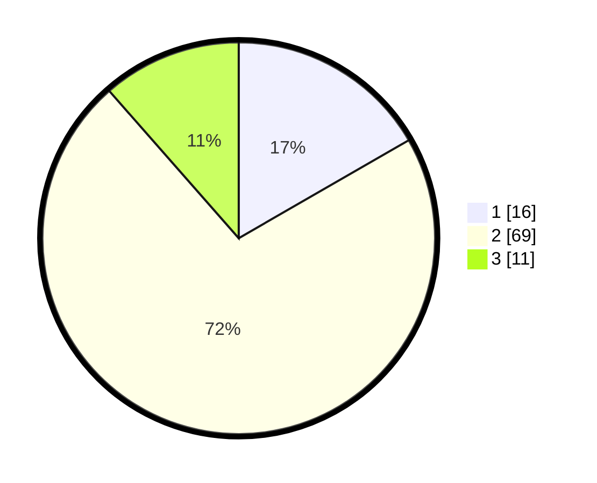

# Hasil

## Grafik

## Tabel

| No. | Nama Paslon    | Suara | Suara (raw) | Persentase |
|:--- |:-------------- | -----:| -----------:| ----------:|
| 1   | ANIES MUHAIMIN | 16    | [16][p-1]   | 16,67      |
| 2   | PRABOWO GIBRAN | 69    | [69][p-2]   | 71,88      |
| 3   | GANJAR MAHFUD  | 11    | [11][p-3]   | 11,46      |

[p-1]: https://github.com/gigit-pemilu/pemilu-2024-21-kepulauan-riau/blob/main/pilpres/hitung-suara/sub/21-kepulauan-riau/sub/04-lingga/sub/11-katang-bidare/sub/2001-benan/sub/004-tps/sub/paslon-1.txt
[p-2]: https://github.com/gigit-pemilu/pemilu-2024-21-kepulauan-riau/blob/main/pilpres/hitung-suara/sub/21-kepulauan-riau/sub/04-lingga/sub/11-katang-bidare/sub/2001-benan/sub/004-tps/sub/paslon-2.txt
[p-3]: https://github.com/gigit-pemilu/pemilu-2024-21-kepulauan-riau/blob/main/pilpres/hitung-suara/sub/21-kepulauan-riau/sub/04-lingga/sub/11-katang-bidare/sub/2001-benan/sub/004-tps/sub/paslon-3.txt

## Foto C Plano

https://sirekap-obj-formc.kpu.go.id/5e05/pemilu/ppwp/21/04/11/20/01/2104112001004-20240221-222913--9e017789-5bfa-4d0d-85c4-829966c548b5.jpg

https://sirekap-obj-formc.kpu.go.id/5e05/pemilu/ppwp/21/04/11/20/01/2104112001004-20240214-141018--5ad7bc34-561a-472f-9a62-cb7b2262ec6b.jpg

https://sirekap-obj-formc.kpu.go.id/5e05/pemilu/ppwp/21/04/11/20/01/2104112001004-20240221-222914--63ffe331-2df1-438c-a033-b78f68638b5b.jpg

## Metadata

| Key        | Value               |
| ---------- | ------------------- |
| Time Stamp | 2024-02-21 23:00:00 |

## DATA PEMILIH TETAP

Jumlah pemilih dalam DPT: **124**.
 * L: **65**.
 * P: **59**.

## DATA PENGGUNA HAK PILIH

Jumlah pengguna hak pilih dalam DPT: **96**.
 * L: **50**.
 * P: **46**.

Jumlah pengguna hak pilih dalam DPTb: **2**.
 * L: **2**.
 * P: **0**.

Jumlah pengguna hak pilih dalam DPK: **0**.
 * L: **0**.
 * P: **0**.

Jumlah pengguna hak pilih: **98**.
 * L: **52**.
 * P: **46**.

## JUMLAH SUARA SAH DAN TIDAK SAH

JUMLAH SELURUH SUARA SAH: **96**.

JUMLAH SUARA TIDAK SAH: **2**.

JUMLAH SELURUH SUARA SAH DAN SUARA TIDAK SAH: **98**.

