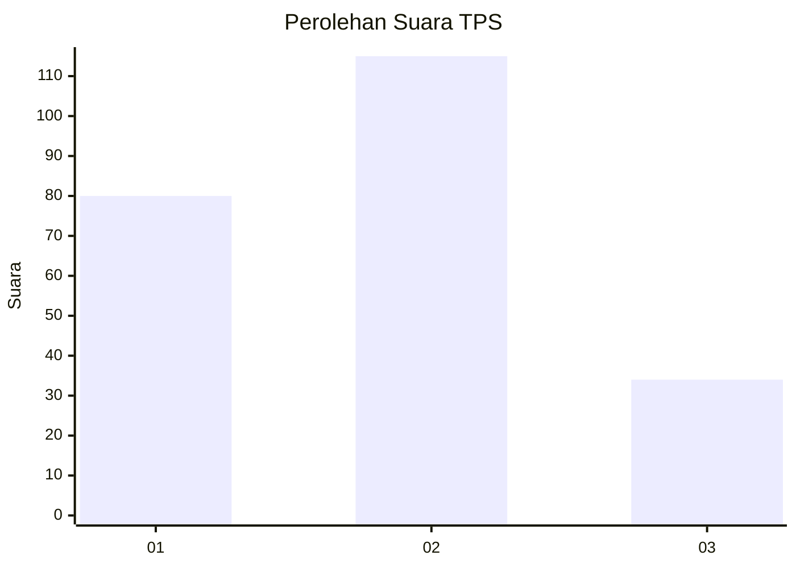
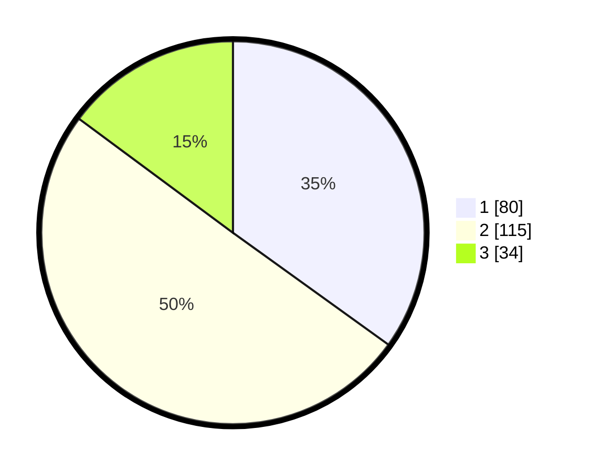

# Hasil

## Grafik

## Tabel

| No. | Nama Paslon    | Suara | Suara (raw) | Persentase |
|:--- |:-------------- | -----:| -----------:| ----------:|
| 1   | ANIES MUHAIMIN | 80    | [80][p-1]   | 34,93      |
| 2   | PRABOWO GIBRAN | 115   | [115][p-2]  | 50,22      |
| 3   | GANJAR MAHFUD  | 34    | [34][p-3]   | 14,85      |

[p-1]: https://github.com/gigit-pemilu/pemilu-2024-21-kepulauan-riau/blob/main/pilpres/hitung-suara/sub/21-kepulauan-riau/sub/04-lingga/sub/13-bakung-serumpun/sub/2001-batu-belubang/sub/005-tps/sub/paslon-1.txt
[p-2]: https://github.com/gigit-pemilu/pemilu-2024-21-kepulauan-riau/blob/main/pilpres/hitung-suara/sub/21-kepulauan-riau/sub/04-lingga/sub/13-bakung-serumpun/sub/2001-batu-belubang/sub/005-tps/sub/paslon-2.txt
[p-3]: https://github.com/gigit-pemilu/pemilu-2024-21-kepulauan-riau/blob/main/pilpres/hitung-suara/sub/21-kepulauan-riau/sub/04-lingga/sub/13-bakung-serumpun/sub/2001-batu-belubang/sub/005-tps/sub/paslon-3.txt

## Foto C Plano

https://sirekap-obj-formc.kpu.go.id/8ec7/pemilu/ppwp/21/04/13/20/01/2104132001005-20240215-030450--a36b4ba9-c552-4c9a-925a-0242ac9b3e42.jpg

https://sirekap-obj-formc.kpu.go.id/8ec7/pemilu/ppwp/21/04/13/20/01/2104132001005-20240215-030517--cac08015-5409-413a-ac10-a2be73909b3e.jpg

https://sirekap-obj-formc.kpu.go.id/8ec7/pemilu/ppwp/21/04/13/20/01/2104132001005-20240215-030534--3866880b-71fa-4b5d-870e-5e9aac0b2a07.jpg

## Metadata

| Key        | Value               |
| ---------- | ------------------- |
| Time Stamp | 2024-02-15 12:00:28 |

