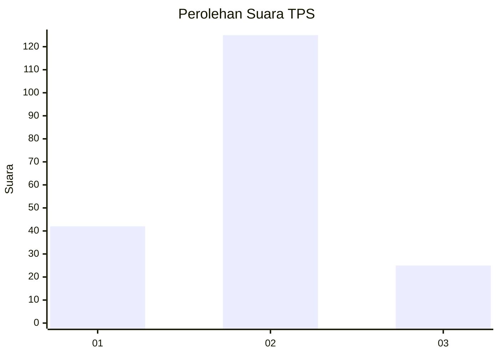
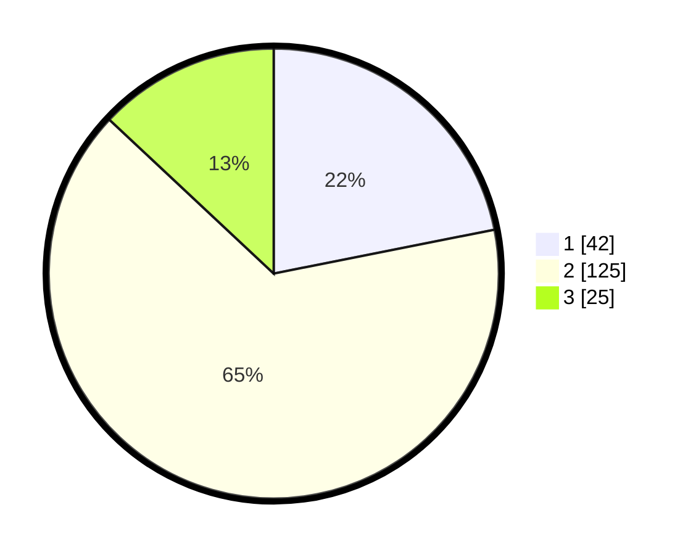

# Hasil

## Grafik

## Tabel

| No. | Nama Paslon    | Suara | Suara (raw) | Persentase |
|:--- |:-------------- | -----:| -----------:| ----------:|
| 1   | ANIES MUHAIMIN | 42    | [42][p-1]   | 21,88      |
| 2   | PRABOWO GIBRAN | 125   | [125][p-2]  | 65,10      |
| 3   | GANJAR MAHFUD  | 25    | [25][p-3]   | 13,02      |

[p-1]: https://github.com/gigit-pemilu/pemilu-2024-21-kepulauan-riau/blob/main/pilpres/hitung-suara/sub/21-kepulauan-riau/sub/04-lingga/sub/13-bakung-serumpun/sub/2002-cempa/sub/001-tps/sub/paslon-1.txt
[p-2]: https://github.com/gigit-pemilu/pemilu-2024-21-kepulauan-riau/blob/main/pilpres/hitung-suara/sub/21-kepulauan-riau/sub/04-lingga/sub/13-bakung-serumpun/sub/2002-cempa/sub/001-tps/sub/paslon-2.txt
[p-3]: https://github.com/gigit-pemilu/pemilu-2024-21-kepulauan-riau/blob/main/pilpres/hitung-suara/sub/21-kepulauan-riau/sub/04-lingga/sub/13-bakung-serumpun/sub/2002-cempa/sub/001-tps/sub/paslon-3.txt

## Foto C Plano

https://sirekap-obj-formc.kpu.go.id/5c2b/pemilu/ppwp/21/04/13/20/02/2104132002001-20240215-011722--936bff32-2759-4cc0-809c-0dd79dd6b484.jpg

https://sirekap-obj-formc.kpu.go.id/5c2b/pemilu/ppwp/21/04/13/20/02/2104132002001-20240215-011806--e9ec9468-ac76-4346-9018-c1073cdff119.jpg

https://sirekap-obj-formc.kpu.go.id/5c2b/pemilu/ppwp/21/04/13/20/02/2104132002001-20240215-011854--90460c30-7de6-4c0c-bd91-cdbc75276276.jpg

## Metadata

| Key        | Value               |
| ---------- | ------------------- |
| Time Stamp | 2024-02-15 06:00:23 |

