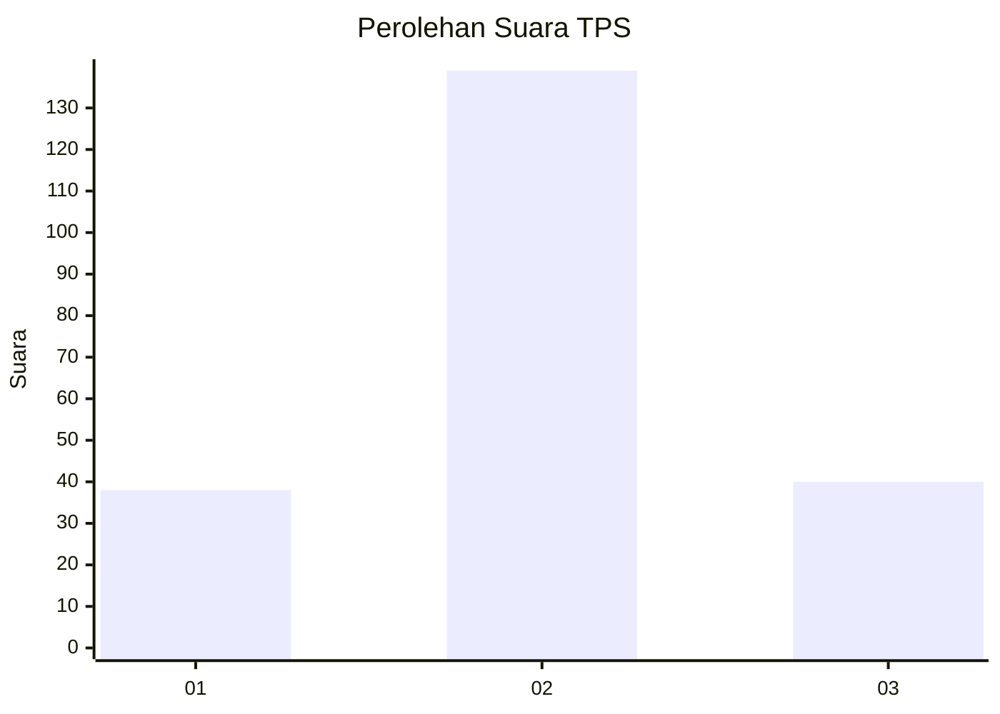
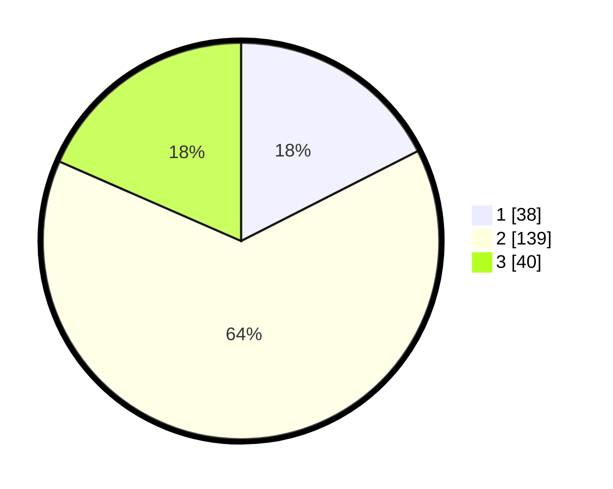

# Hasil

## Grafik

## Tabel

| No. | Nama Paslon    | Suara | Suara (raw) | Persentase |
|:--- |:-------------- | -----:| -----------:| ----------:|
| 1   | ANIES MUHAIMIN | 38    | [38][p-1]   | 17,51      |
| 2   | PRABOWO GIBRAN | 139   | [139][p-2]  | 64,06      |
| 3   | GANJAR MAHFUD  | 40    | [40][p-3]   | 18,43      |

[p-1]: https://github.com/gigit-pemilu/pemilu-2024-21-kepulauan-riau/blob/main/pilpres/hitung-suara/sub/21-kepulauan-riau/sub/04-lingga/sub/13-bakung-serumpun/sub/2002-cempa/sub/002-tps/sub/paslon-1.txt
[p-2]: https://github.com/gigit-pemilu/pemilu-2024-21-kepulauan-riau/blob/main/pilpres/hitung-suara/sub/21-kepulauan-riau/sub/04-lingga/sub/13-bakung-serumpun/sub/2002-cempa/sub/002-tps/sub/paslon-2.txt
[p-3]: https://github.com/gigit-pemilu/pemilu-2024-21-kepulauan-riau/blob/main/pilpres/hitung-suara/sub/21-kepulauan-riau/sub/04-lingga/sub/13-bakung-serumpun/sub/2002-cempa/sub/002-tps/sub/paslon-3.txt

## Foto C Plano

https://sirekap-obj-formc.kpu.go.id/8e50/pemilu/ppwp/21/04/13/20/02/2104132002002-20240215-032416--f277579f-208e-4b27-bf8e-468c04a2f648.jpg

https://sirekap-obj-formc.kpu.go.id/8e50/pemilu/ppwp/21/04/13/20/02/2104132002002-20240215-032803--f6462746-56d0-4b3a-b820-34d75fe770fe.jpg

https://sirekap-obj-formc.kpu.go.id/8e50/pemilu/ppwp/21/04/13/20/02/2104132002002-20240215-032947--e2522677-d776-47bf-8770-67887e7acd25.jpg

## Metadata

| Key        | Value               |
| ---------- | ------------------- |
| Time Stamp | 2024-02-15 21:30:27 |

