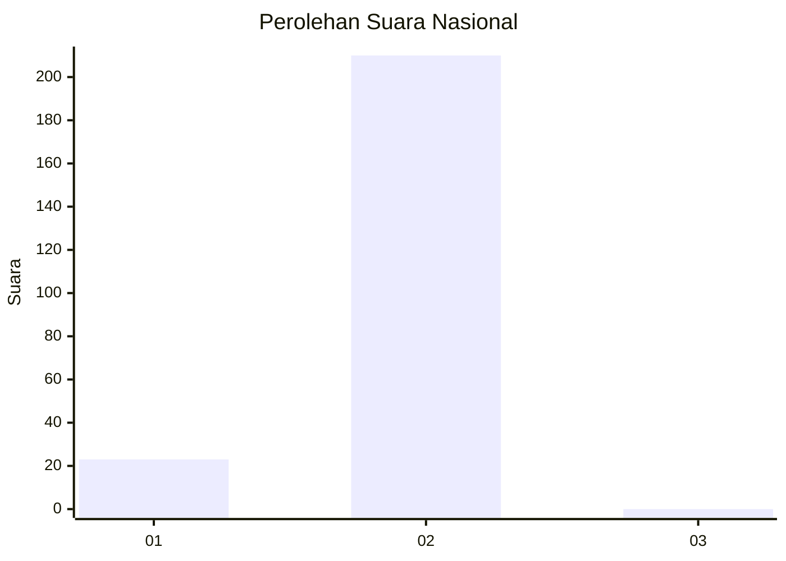
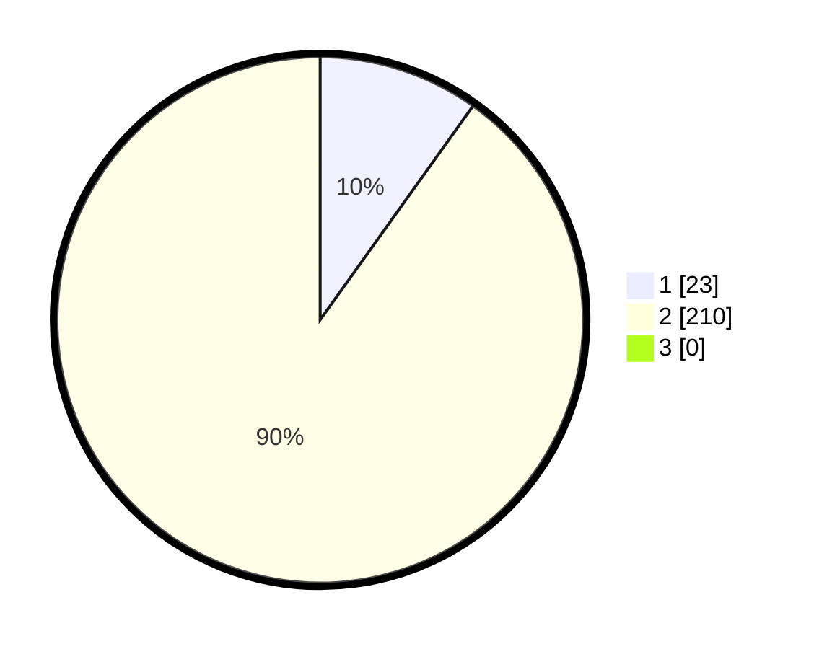

# Hasil

## Grafik

## Tabel

| No. | Nama Paslon    | Suara | Suara (raw) | Persentase |
|:--- |:-------------- | -----:| -----------:| ----------:|
| 1   | ANIES MUHAIMIN | 23    | [23][p-1]   | 9,87       |
| 2   | PRABOWO GIBRAN | 210   | [210][p-2]  | 90,13      |
| 3   | GANJAR MAHFUD  | 0     | [0][p-3]    | 0,00       |

[p-1]: https://github.com/gigit-pemilu/pemilu-2024/blob/main/pilpres/hitung-suara/sub/21-kepulauan-riau/sub/04-lingga/sub/13-bakung-serumpun/sub/2003-pasir-panjang/sub/002-tps/sub/paslon-1.txt
[p-2]: https://github.com/gigit-pemilu/pemilu-2024/blob/main/pilpres/hitung-suara/sub/21-kepulauan-riau/sub/04-lingga/sub/13-bakung-serumpun/sub/2003-pasir-panjang/sub/002-tps/sub/paslon-2.txt
[p-3]: https://github.com/gigit-pemilu/pemilu-2024/blob/main/pilpres/hitung-suara/sub/21-kepulauan-riau/sub/04-lingga/sub/13-bakung-serumpun/sub/2003-pasir-panjang/sub/002-tps/sub/paslon-3.txt

## Foto C Plano

https://sirekap-obj-formc.kpu.go.id/9551/pemilu/ppwp/21/04/13/20/03/2104132003002-20240217-222452--49b70827-2c0e-4592-b10a-4f7f755852f4.jpg

https://sirekap-obj-formc.kpu.go.id/9551/pemilu/ppwp/21/04/13/20/03/2104132003002-20240217-222508--7c61c2e8-96c8-4711-b18a-6f78e6c1af15.jpg

https://sirekap-obj-formc.kpu.go.id/9551/pemilu/ppwp/21/04/13/20/03/2104132003002-20240217-222556--343157e4-7fa9-41fc-b1bf-c71a11f15aa0.jpg

## Metadata

| Key        | Value               |
| ---------- | ------------------- |
| Time Stamp | 2024-02-20 15:00:00 |

