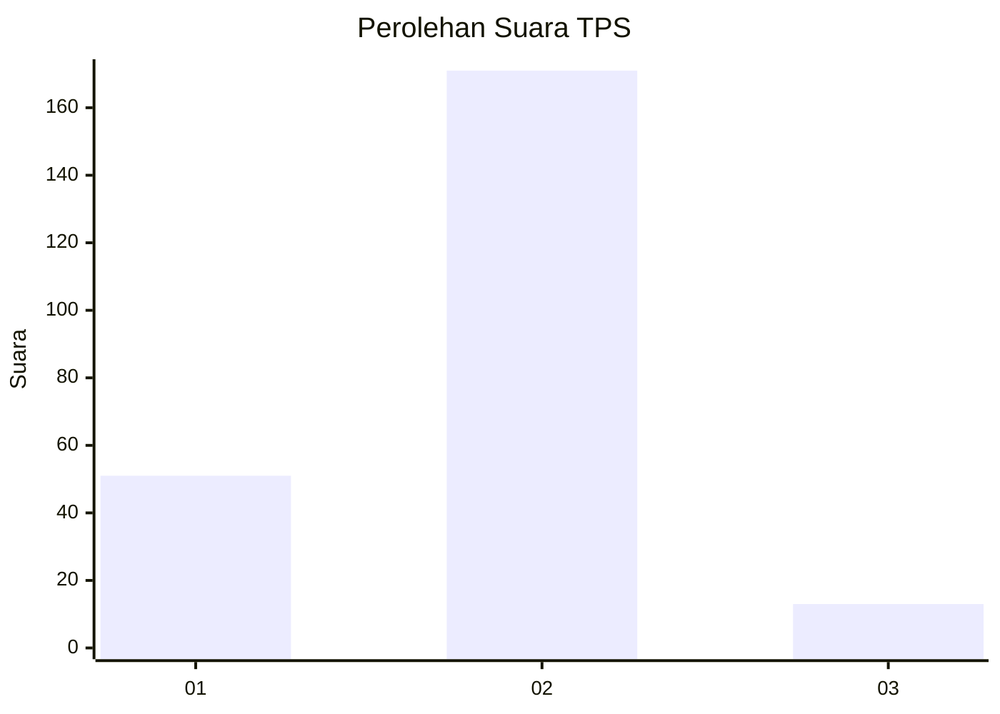
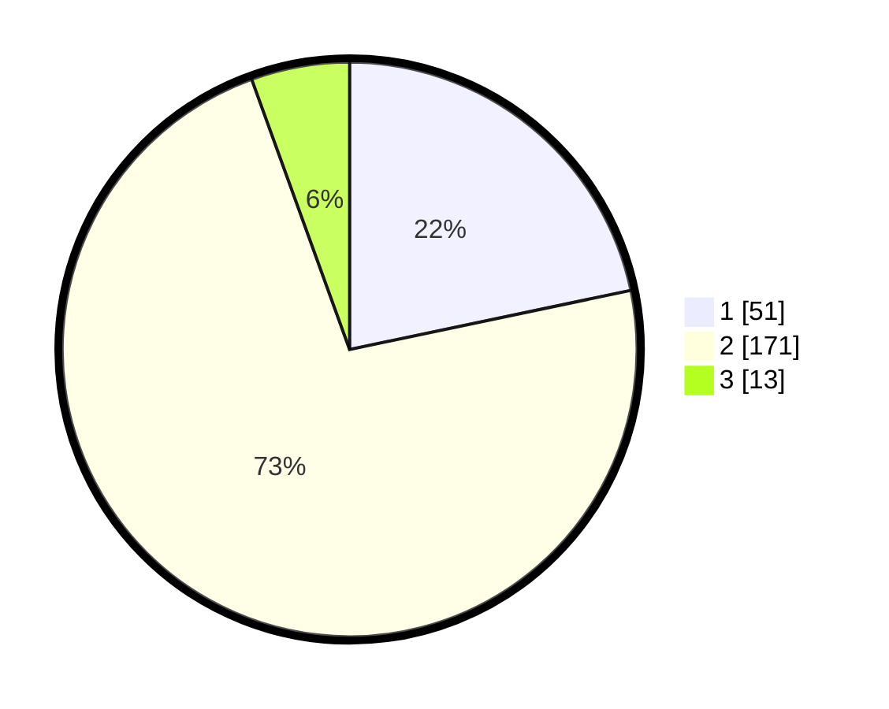

# Hasil

## Grafik

## Tabel

| No. | Nama Paslon    | Suara | Suara (raw) | Persentase |
|:--- |:-------------- | -----:| -----------:| ----------:|
| 1   | ANIES MUHAIMIN | 51    | [51][p-1]   | 21,70      |
| 2   | PRABOWO GIBRAN | 171   | [171][p-2]  | 72,77      |
| 3   | GANJAR MAHFUD  | 13    | [13][p-3]   | 5,53       |

[p-1]: https://github.com/gigit-pemilu/pemilu-2024-21-kepulauan-riau/blob/main/pilpres/hitung-suara/sub/21-kepulauan-riau/sub/04-lingga/sub/13-bakung-serumpun/sub/2004-tanjung-kelit/sub/001-tps/sub/paslon-1.txt
[p-2]: https://github.com/gigit-pemilu/pemilu-2024-21-kepulauan-riau/blob/main/pilpres/hitung-suara/sub/21-kepulauan-riau/sub/04-lingga/sub/13-bakung-serumpun/sub/2004-tanjung-kelit/sub/001-tps/sub/paslon-2.txt
[p-3]: https://github.com/gigit-pemilu/pemilu-2024-21-kepulauan-riau/blob/main/pilpres/hitung-suara/sub/21-kepulauan-riau/sub/04-lingga/sub/13-bakung-serumpun/sub/2004-tanjung-kelit/sub/001-tps/sub/paslon-3.txt

## Foto C Plano

https://sirekap-obj-formc.kpu.go.id/6305/pemilu/ppwp/21/04/13/20/04/2104132004001-20240215-113338--5a2562f7-ddf6-443c-91ea-12e053926efc.jpg

https://sirekap-obj-formc.kpu.go.id/6305/pemilu/ppwp/21/04/13/20/04/2104132004001-20240215-112208--e2f11da5-ab4c-4834-9a8f-6130f67f0eb8.jpg

https://sirekap-obj-formc.kpu.go.id/6305/pemilu/ppwp/21/04/13/20/04/2104132004001-20240215-112453--ce6fe0a1-9e0b-48ba-9905-b297ac334653.jpg

## Metadata

| Key        | Value               |
| ---------- | ------------------- |
| Time Stamp | 2024-02-15 21:30:27 |

