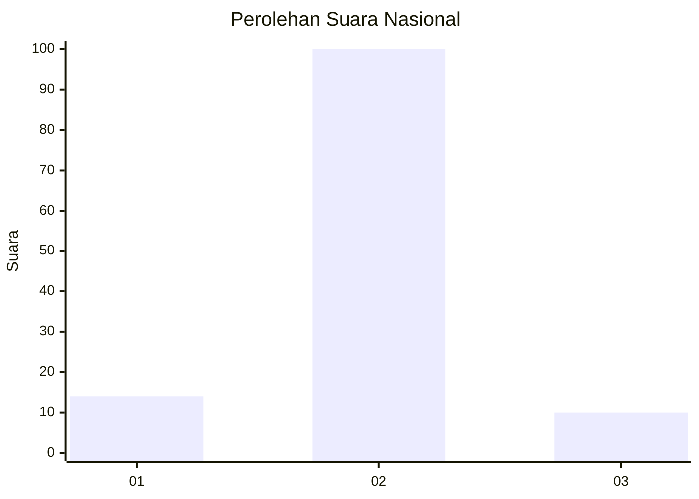
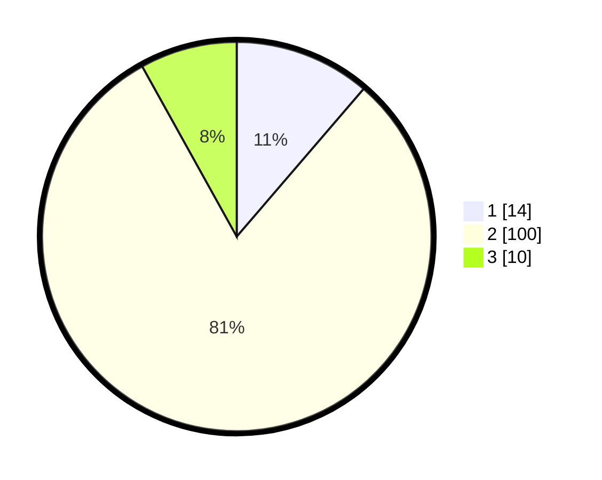

# Hasil

## Grafik

## Tabel

| No. | Nama Paslon    | Suara | Suara (raw) | Persentase |
|:--- |:-------------- | -----:| -----------:| ----------:|
| 1   | ANIES MUHAIMIN | 14    | [14][p-1]   | 11,29      |
| 2   | PRABOWO GIBRAN | 100   | [100][p-2]  | 80,65      |
| 3   | GANJAR MAHFUD  | 10    | [10][p-3]   | 8,06       |

[p-1]: https://github.com/gigit-pemilu/pemilu-2024/blob/main/pilpres/hitung-suara/sub/21-kepulauan-riau/sub/04-lingga/sub/13-bakung-serumpun/sub/2004-tanjung-kelit/sub/005-tps/sub/paslon-1.txt
[p-2]: https://github.com/gigit-pemilu/pemilu-2024/blob/main/pilpres/hitung-suara/sub/21-kepulauan-riau/sub/04-lingga/sub/13-bakung-serumpun/sub/2004-tanjung-kelit/sub/005-tps/sub/paslon-2.txt
[p-3]: https://github.com/gigit-pemilu/pemilu-2024/blob/main/pilpres/hitung-suara/sub/21-kepulauan-riau/sub/04-lingga/sub/13-bakung-serumpun/sub/2004-tanjung-kelit/sub/005-tps/sub/paslon-3.txt

## Foto C Plano

https://sirekap-obj-formc.kpu.go.id/5db1/pemilu/ppwp/21/04/13/20/04/2104132004005-20240215-095729--485b2b0b-8235-4cbf-bd3a-8813ca4a20bc.jpg

https://sirekap-obj-formc.kpu.go.id/5db1/pemilu/ppwp/21/04/13/20/04/2104132004005-20240215-095811--c7b1ba3c-7b48-468a-adad-34d9ab194153.jpg

https://sirekap-obj-formc.kpu.go.id/5db1/pemilu/ppwp/21/04/13/20/04/2104132004005-20240215-095826--4273eec9-64dc-4065-8ec5-8b76eb510835.jpg

## Metadata

| Key        | Value               |
| ---------- | ------------------- |
| Time Stamp | 2024-02-15 21:30:27 |

