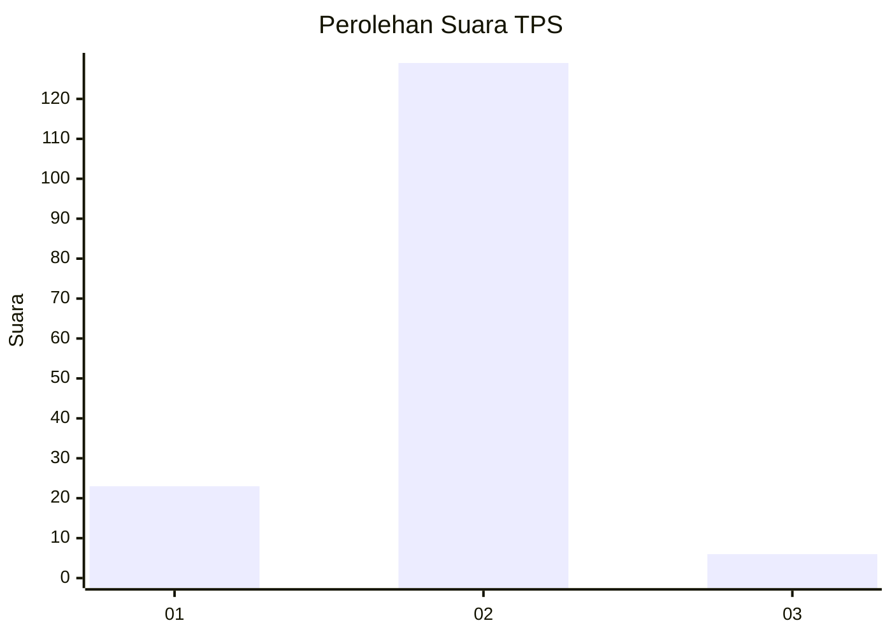
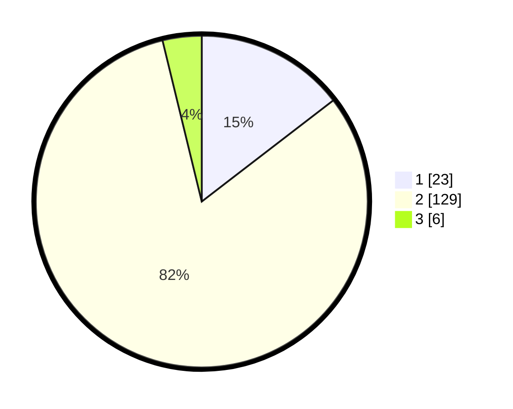

# Hasil

## Grafik

## Tabel

| No. | Nama Paslon    | Suara | Suara (raw) | Persentase |
|:--- |:-------------- | -----:| -----------:| ----------:|
| 1   | ANIES MUHAIMIN | 23    | [23][p-1]   | 14,56      |
| 2   | PRABOWO GIBRAN | 129   | [129][p-2]  | 81,65      |
| 3   | GANJAR MAHFUD  | 6     | [6][p-3]    | 3,80       |

[p-1]: https://github.com/gigit-pemilu/pemilu-2024-21-kepulauan-riau/blob/main/pilpres/hitung-suara/sub/21-kepulauan-riau/sub/04-lingga/sub/13-bakung-serumpun/sub/2005-tanjung-lipat/sub/002-tps/sub/paslon-1.txt
[p-2]: https://github.com/gigit-pemilu/pemilu-2024-21-kepulauan-riau/blob/main/pilpres/hitung-suara/sub/21-kepulauan-riau/sub/04-lingga/sub/13-bakung-serumpun/sub/2005-tanjung-lipat/sub/002-tps/sub/paslon-2.txt
[p-3]: https://github.com/gigit-pemilu/pemilu-2024-21-kepulauan-riau/blob/main/pilpres/hitung-suara/sub/21-kepulauan-riau/sub/04-lingga/sub/13-bakung-serumpun/sub/2005-tanjung-lipat/sub/002-tps/sub/paslon-3.txt

## Foto C Plano

https://sirekap-obj-formc.kpu.go.id/10b7/pemilu/ppwp/21/04/13/20/05/2104132005002-20240215-045446--fb587b9f-3fe8-424a-9ac9-cca739382f30.jpg

https://sirekap-obj-formc.kpu.go.id/10b7/pemilu/ppwp/21/04/13/20/05/2104132005002-20240215-045644--4d049f1d-ad2a-4c64-bf94-c4349a04e6a6.jpg

https://sirekap-obj-formc.kpu.go.id/10b7/pemilu/ppwp/21/04/13/20/05/2104132005002-20240215-045952--2dbc496d-46ce-44df-91c5-88f04df9e8a1.jpg

## Metadata

| Key        | Value               |
| ---------- | ------------------- |
| Time Stamp | 2024-02-15 21:30:27 |

